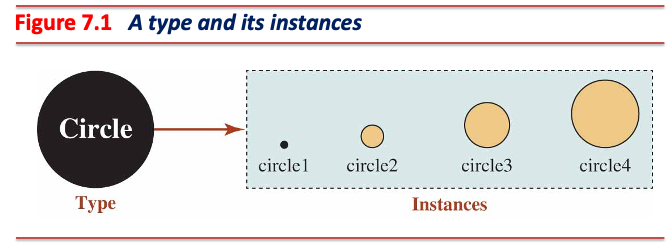
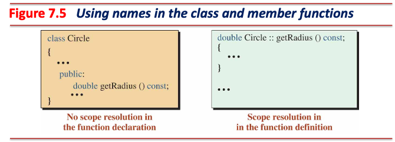

# 클래스와 생성자

## 형과 인스턴스

* 형 (*type*)을 이용해 인스턴스 (*instance*) 생성
  * 인스턴스는 `class`로부터 생성된 객체
* 형은 추상화된 것이고 인스턴스는 형을 실체화한 것
  * e.g., **개**는 동물 분류 **형**이며, **내 반려견**은 실체이므로 **인스턴스**
* 형과 객체는 일대다 (*one-to-many*) 관계
  * 하나의 형으로부터 여러 개의 객체 생성 가능



---

## 추상화 (*Abstraction*)

* 실세계에 있는 객체를 최대한 유사하게 프로그래밍 세계에 표현하는 것
* 추상화를 통해 객체의 속성 (*attribute*)과 행위 (*behavior*) 추출
  * **내 반려견**의 속성은 **품종**, **나이**, **체중**
  * **내 반려견**의 행위는 **짖기**, **뛰기**, **먹기**


---

## 클래스 (*Class*)

* 실세계 객체를 추상화하여 그 속성과 행위를 프로그래밍 언어로 표현하는 데 사용
* C++에 추가된 **사용자 정의 자료형**
  * 일반 형으로부터 실체화한 객체는 변수
  * **클래스 형으로부터 실체화한 객체는 인스턴스**
* 속성은 데이터 멤버 (*data members*)로 표현
* 행위는 멤버 함수 (*member functions*)로 표현


---

## 클래스 정의

* 헤더 (*header*), 본문 (*body*), 세미콜론 (`;`) 세 부분으로 구분
  * 헤더는 `class CLASS_NAME` 형태이며, 클래스 형만을 선언할 때 사용

  ```cpp
  // Forward declaration of the Circle class
  class Circle;
  ```

  * 클래스 정의 시 클래스 헤더 뒤 본문 (*block*)에 데이터 멤버와 멤버 함수 작성

  ```cpp
  // Definition of the Circle class
  class Circle {
   private:
    // Data members of classes, both static and non-static, are named like
    // ordinary nonmember variables, but with a trailing underscore.
    double radius_;  // data members or variables

   public:
    void set_radius(double radius);  // member functions or methods
  };  // A semicolon is needed at the end of class definition
  ```

  * 세미콜론은 클래스 정의를 마치는 구분자 (delimiter)

---

## 접근 지정자 (Access Specifiers)


* 접근 제한자 (access modifiers)라고도 불림
* 데이터 멤버와 멤버 함수에 대한 접근 권한 설정
  * 클래스의 기본 멤버 접근 제한자는 `private`
  * `private` 접근 제한자 멤버는 인스턴스 내부에서만 접근 가능

|*Modifier*  |Access from the same class|Access from the subclass|Access from anywhere|
|------------|--------------------------|------------------------|--------------------|
|`private`   | Yes                      | **No**                 | **No**             |
|`protected` | Yes                      | Yes                    | **No**             |
|`public`    | Yes                      | Yes                    | Yes                |

---

## 멤버 함수 (메서드, *Method*) 정의



---

### 멤버 함수 정의 예시

* 클래스 정의 시 멤버 함수를 같이 정의

```cpp
class Circle {
 private:
  double radius_;  // Data member

 public: // Member functions
  void set_radius(double radius) { radius_ = radius; }
  double get_radius() const { return radius_; }
};  // A semicolon is needed at the end of class definition
```

* 클래스 정의 시 멤버 함수 선언 후 외부 전역 공간에서 `::` 연산자를 사용해 정의
  * **클래스 내 선언된 멤버 함수와 멤버 변수는 해당 클래스의 이름영역 안에 속함**

```cpp
class Circle {
 private:
  double radius_;  // Data member

 public: // Member functions
  void set_radius (double radius);
  double get_radius() const;
};  // A semicolon is needed at the end of class definition

double Circle::get_radius() const { return radius_; }

void Circle::set_radius(double r) { radius_ = r; }
```

---

### 실습 - 인스턴스 사용

* 객체가 사용할 수 있는 멤버는 `public` 접근 지정자가 사용된 식별자
  * `set_radius`, `get_radius`
* 멤버 사용은 멤버 선택 연산자 (`.`, *member selection operator*) 사용
  * e.g., `circle.get_radius()`
* 객체는 `private` 접근 지정자가 사용된 식별자 (e.g., `radius_`)에 접근 불가
  * 멤버 함수를 통해 간접적으로 접근 및 수정 가능
  * 클래스의 멤버 함수는 해당 클래스의 이름영역 안에 속함 (access from the same class)

```cpp
#include <iostream>

class Circle {
  double radius_;  // Data member (using the default access specifier - private)

 public:  // Member functions
  void set_radius(double radius);
  double get_radius() const;
};  // A semicolon is needed at the end of class definition

double Circle::get_radius() const { return radius_; }

void Circle::set_radius(double r) { radius_ = r; }

int main() {
  Circle circle;
  circle.set_radius(10);
  std::cout << circle.get_radius() << std::endl;
  return 0;
}
```

---

## [접근자 (*Accessor*)와 변경자 (*Mutator*)](https://google.github.io/styleguide/cppguide.html#Function_Names)

### 이름 규칙

> Accessors and mutators (get and set functions) may be named like variables.

### 접근자 메서드 (Getter)

* 메서드를 호출한 객체 (호스트 객체, *host object*)의 데이터 멤버 값을 읽어오는 메서드
* `const` 한정자를 사용해 메서드가 데이터 멤버를 변경하지 않음을 명시
  * `const` 한정자를 사용하는 메서드 내에서 데이터 멤버 수정 시 컴파일 에러 발생

```cpp
double Circle::get_radius() const { return radius_; }
```

### 변경자 메서드 (Setter)

* 메서드를 호출한 객체의 데이터 멤버 값을 수정하는 메서드
  * 데이터 멤버 외에 다른 부수 효과 (*side effects*)가 발생하지 않아야 함

```cpp
void Circle::set_radius(double r) { radius_ = r; }
```

---

## [인라인 (`inline`)](https://en.cppreference.com/w/cpp/language/inline)

* 함수 (객체의 메서드 포함) 호출 대신 함수의 코드를 호출 지점에 복사
  * 함수 호출의 오버헤드를 줄여 성능 향상

  ```cpp
  inline int add(int a, int b) { return a + b; }

  int main() {
    int result = add(3, 5);
  }
  ```

  * 위 코드는 아래와 같이 변환됨

  ```cpp
  int main() {
    int result = 3 + 5;
  }
  ```

* 인라인 함수는 **반드시 인라인화되는 것은 아님**
  * `inline` 키워드는 함수의 인라인화를 **제안**하는 용도
  * `inline` 키워드가 사용되었음에도 컴파일러가 인라인화를 수행하지 않을 수 있음
* 컴파일러는 코드 복잡도, 최적화, 성능 등을 고려해 함수의 인라인화를 결정
* 컴파일러는 일반적으로 짧고 간결하며 빈번히 호출되는 함수를 **암묵적으로** 인라인화 수행

---

### 암묵적 (*Implicit*) 인라인 함수

* 클래스 내부에 정의된 모든 멤버 함수는 **암묵적인** 인라인 함수

  ```cpp
  class Circle {
   private:
    double radius_;  // Data member

   public: // Member functions
    void set_radius(double radius) { radius_ = radius; }
    double get_radius() const { return radius_; }
  };  // A semicolon is needed at the end of class definition
  ```

  * 위 코드는 아래처럼 `inline` 키워드가 자동으로 추가되어 컴파일 수행

  ```cpp
  class Circle {
   private:
    double radius_;  // Data member

   public: // Member functions
    inline void set_radius(double radius) { radius_ = radius; }
    inline double get_radius() const { return radius_; }
  };  // A semicolon is needed at the end of class definition
  ```

---

### 명시적 (*Explicit*) 인라인 함수

* 일반 함수에 대한 명시적 인라인 함수

```cpp
inline int add(int a, int b) { return a + b; }
```

* 멤버 함수에 대한 명시적 인라인 함수

```cpp
class Circle {
 private:
  double radius_;  // Data member

 public:  // Member functions
  void set_radius(double radius);
  double get_radius() const;
};  // A semicolon is needed at the end of class definition

inline double Circle::get_radius() const { return radius_; }

inline void Circle::set_radius(double r) { radius_ = r; }
```

---

## [구조체 vs. 클래스](https://google.github.io/styleguide/cppguide.html#Structs_vs._Classes)

> Use a struct only for passive objects that carry data; everything else is a class.

* 클래스 내 기본 접근 지정자는 `private`, 구조체 내 기본 접근 지정자는 `public`
* **행위 없이** (*passive*) 데이터만을 표현하는 사용자 정의 형 생성 시 구조체 사용
* 행위가 포함되면서 데이터를 같이 표현하는 사용자 정의 형 생성 시 클래스 사용
  * **C++ 구조체는 멤버 함수를 선언 및 정의해 사용할 수 있으나, 사용하지 않음을 권장**

```cpp
struct Person {
  // Data members of structs, both static and non-static, are named like
  // ordinary non-member variables. They do not have the trailing underscores
  // that data members in classes have.
  char first_name[32];
  char middle_name[32];
  char last_name[32];
};
```

* 위 코드를 클래스로 변경하면 아래와 같음

```cpp
class Person {
  // Data members of classes, both static and non-static, are named like
  // ordinary non-member variables, but with a trailing underscore.
 public:
  char first_name_[32];
  char middle_name_[32];
  char last_name_[32];
};
```

---

## 함수 오버로딩 (*Function Overloading*)

* 함수의 이름이 같더라도 함수 매개변수의 형태가 다르면 서로 다른 함수로 간주
* 이름이 같은 함수를 여러 개 사용 가능

```cpp
#include <iostream>

// Volume of a cube.
int Volume(int s) { return s * s * s; }

// Volume of a cylinder.
double Volume(double r, int h) { return 3.1415926 * r * r * h; }

// Volume of a cuboid.
long Volume(long l, int b, int h) { return l * b * h; }

int main() {
  std::cout << Volume(10) << std::endl;
  std::cout << Volume(2.5, 8) << std::endl;
  std::cout << Volume(100l, 75, 15) << std::endl;
  return 0;
}
```

* 아래 코드는 함수 이름이 같고 함수 매개변수의 형태도 같으므로 이름 충돌 발생 (컴파일 오류)

```cpp
int GetRadius() { return 10; }
double GetRadius() { return 20.0; }
```

---

### [함수 오버로딩 해석 (*Function Overload Resolution*)](https://en.cppreference.com/w/cpp/language/overload_resolution)

* 전달인자의 형태와 함수 매개변수의 형태가 일치하지 않으면, 아래 순서에 따라 매개변수 형태 변환
  * 변환 과정 중 가장 적합한 함수를 찾아 호출하기 위함
  * **변환 과정을 통해 후보 함수가 2개 이상 발견될 경우 모호성 문제가 발생하여 컴파일 오류 발생**

#### [Ranking of Implicit Conversion Sequences](https://en.cppreference.com/w/cpp/language/overload_resolution#Ranking_of_implicit_conversion_sequences)

1. Exact match (no conversion required)
2. Promotion: integer promotion (e.g., `bool`, `char`, `short` → `int`), floating-point promotion (e.g., `float` → `double`)
3. Conversion: integral conversion, floating-point conversion, floating-integral conversion, ...

```cpp
#include <iostream>

void Print(int i) { std::cout << i << std::endl; }
void Print(double d) {std::cout << d << std::endl; }

int main() {
  Print('a');   // promoted (char -> int) and it matches Print(int)
  Print(true);  // promoted (bool -> int) and it matches Print(int)
  Print(4.5f);  // promoted (float -> double) and it matches Print(double)
  return 0;
}
```

---

* 아래의 경우는 모호성 문제가 발생하여 오류

```cpp
#include <iostream>

void Print(int i) { std::cout << i << std::endl; }
void Print(double d) {std::cout << d << std::endl; }

int main() {
  Print(5L);  // 5L: long type

              // Converting long to int could potentially cause data loss.

              // Converting long to double is a safer conversion. Nevertheless,
              // even converting to double can still involve some degree of
              // potential loss of precision.
  return 0;
}
```

```shell
error C2668: 'Print': ambiguous call to overloaded function
message : could be 'void Print(double)'
message : or       'void Print(int)'
message : while trying to match the argument list '(long)'
```

---

## 생성자 (*Constructor*)와 소멸자 (*Destructor*)


* 생성자는 객체 생성 시 자동 호출되는 특별한 멤버 함수
* 소멸자는 객체 소멸 시 자동 호출되는 특별한 멤버 함수

---

### 생성자

> A constructor is a member function that creates an object when it is called and can initialize the data members of an object when it is executed.

#### 생성자 특징

* 생성자 선언 시 반환형을 사용하지 않음
  * 반환값이 없음
* 함수 이름은 클래스 이름과 같음
* `const` 한정자를 사용 불가
  * 데이터 멤버 생성 과정에서 부수 효과 발생

#### 생성자 종류

```cpp
class Circle {
 public:
  Circle(double radius);         // Parameter Constructor
  Circle();                      // Default Constructor
  Circle(const Circle& circle);  // Copy Constructor

// skipped …
};
```

* 매개변수 생성자는 필요에 따라 오버로딩하여 여러 개 사용 가능
* 기본 생성자와 복사 생성자는 오버로딩 불가

---

### 초기화 목록 (*Initialization List*)

* 생성자 호출 시 데이터 멤버의 초기화 값 지정 가능

```cpp

class Circle {
 public:
  Circle(double radius) : radius_(radius), pi_(3.14) {}  // Initialization list

// skipped …

 private:
  double radius_;
  const double pi_;  // Constant value for Pi
};
```

* 초기화 목록에 선언된 데이터 멤버는 초기화 값으로 객체 할당
  * `radius_(radius)` 부분은 `double radius_ = radius`로 평가됨
* 초기화 목록에 선언되지 않은 데이터 멤버는 초기화하지 않은 객체만 할당
  * 쓰레기 값이 들어 있으므로, 생성자 본문에서 직접 초기화해야 함
* **`const` 데이터 멤버 초기화는 반드시 초기화 목록을 사용해야 함**

---

### 소멸자

> A destructor is guaranteed to be automatically called and executed by the system when the object instantiated from the class goes out of scope.

#### 소멸자 특징

* 소멸자 선언 시 반환형을 사용하지 않음
  * 반환값이 없음
* 함수 이름은 클래스 이름과 같으나, 함수 이름 앞에 `~` 기호 사용
* `const` 한정자를 사용 불가
  * 데이터 멤버 소멸 과정에서 부수 효과 발생
* 생성자는 3가지 종류가 있는 반면, 소멸자는 한 가지만 존재
  * 매개변수 미사용

```cpp
class Circle {
 public:
  Circle(double radius);         // Parameter Constructor
  Circle();                      // Default Constructor
  Circle(const Circle& circle);  // Copy Constructor

  ~Circle();  // destructor
// skipped …
};
```

* 소멸자는 오버로딩 불가

---

## 클래스 필수 멤버 함수


1. 클래스에는 기본 생성자나 매개변수 생성자 중 적어도 하나 존재해야 한다. 존재하지 않으면 컴파일러는 암묵적으로 기본 생성자 (*synthesized default constructor*, 아무런 동작을 수행하지 않는 빈 생성자)를 생성한다.

2. 클래스에는 복사 생성자가 반드시 존재해야 한다. 존재하지 않으면 컴파일러는 암묵적으로 복사 생성자 (*synthesized copy constructor*, 대상 객체의 데이터를 단순 복사하는 생성자)를 생성한다.

3. 클래스에는 소멸자가 반드시 존재해야 한다. 존재하지 않면 컴파일러는 암묵적으로 소멸자 (*synthesized destructor*, 아무런 동작을 수행하지 않는 빈 소멸자)를 생성한다.

---

* `default`
  * 컴파일러가 생성하는 암묵적인 생성자 혹은 소멸자 사용
* `delete`
  * 생성자 혹은 소멸자를 제거해야 할 경우 사용

```cpp
#include <iostream>

class Foo {
 public:
  // Default constructor - explicitly defined as default
  Foo() = default;

  // Copy constructor - deleted to prevent copying
  Foo(const Foo& other) = delete;

  // Destructor - explicitly defined as default
  ~Foo() = default;
};

int main() {
  Foo obj1;  // Default constructor
  // Foo obj2(obj1);  // Error: Copy constructor is deleted

  return 0;
}

```

---

### 실습 - 생성자와 소멸자를 사용하는 인스턴스

```cpp
#include <iostream>

class Circle {
 public:
  Circle(double radius) : radius_(radius), pi_(3.14) {
    std::cout << "Parameterized constructor called. Radius: " << radius_
              << std::endl;
  }
  Circle() : radius_(1.0), pi_(3.14) {  // Initialize radius to 1.0
    std::cout << "Default constructor called. Radius: " << radius_ << std::endl;
  }
  Circle(const Circle& circle) : radius_(circle.radius_), pi_(circle.pi_) {
    std::cout << "Copy constructor called. Radius: " << radius_ << std::endl;
  }

  ~Circle() {
    std::cout << "Destructor called for Circle with Radius: " << radius_
              << std::endl;
  }

 private:
  double radius_;
  const double pi_;  // Constant value for Pi
};

int main() {
  Circle c1;       // Calls default constructor
  Circle c2(5.0);  // Calls parameterized constructor
  Circle c3(c2);   // Calls copy constructor
  return 0;
}
```

---

### 실습 - C++ 동적 할당으로 인스턴스 생성

```cpp
#include <iostream>

class Circle {
 public:
  Circle(double radius) : radius_(radius), pi_(3.14) {
    std::cout << "Parameterized constructor called. Radius: " << radius_
              << std::endl;
  }
  Circle() : radius_(1.0), pi_(3.14) {  // Initialize radius to 1.0
    std::cout << "Default constructor called. Radius: " << radius_ << std::endl;
  }
  Circle(const Circle& circle) : radius_(circle.radius_), pi_(circle.pi_) {
    std::cout << "Copy constructor called. Radius: " << radius_ << std::endl;
  }

  ~Circle() {
    std::cout << "Destructor called for Circle with Radius: " << radius_
              << std::endl;
  }

 private:
  double radius_;
  const double pi_;  // Constant value for Pi
};

int main() {
  Circle* c1 = new Circle();     // Calls default constructor
  Circle* c2 = new Circle(5.0);  // Calls parameterized constructor
  Circle* c3 = new Circle(*c2);  // Calls copy constructor

  delete c1;  // Calls destructor for c1
  delete c2;  // Calls destructor for c2
  delete c3;  // Calls destructor for c3
  return 0;
}
```

---

## 인스턴스 데이터 멤버 (*Instance Data Members*)

* 객체의 속성을 표현하는 데 사용


* 객체들 간 데이터 멤버는 독립적임
  * 서로 다른 메모리 영역에 할당
* 데이터 멤버는 캡슐화 (*encapsulation*)되어야 함
  * 항상 데이터 멤버는 `private`으로 지정해야 함
    * [OOP 원칙 (Principles of Object-Oriented Programming)](https://en.wikipedia.org/wiki/Object-oriented_programming)

---

## 인스턴스 멤버 함수 (*Instance Member Functions*)

* 객체의 행위를 표현하는 데 사용


* 멤버 함수는 하나의 메모리 공간에 위치 ([Code segment](https://en.wikipedia.org/wiki/Code_segment))
* 여러 접근 지정자를 사용할 수 있음
  * 객체는 오직 `public` 멤버 함수를 통해서만 데이터 멤버를 조회 및 조작해야 함
  * 정의된 메서드만을 사용하여 `private` 데이터 멤버로의 잘못된 접근 및 연산 억제 목적

---

### 인스턴스 멤버 함수 선택자


* 객체로부터 멤버 함수를 선택할 경우 `.` 연산자 사용
* 객체를 가리키는 포인터로부터 멤버 함수를 선택할 경우 `->` 연산자 사용
* 두 연산자의 결합 방향은 왼쪽에서 오른쪽 (→)

---

### Locking and Unlocking

* 멤버 함수는 객체 수와 관계 없이 오직 하나의 메모리 공간에 위치
* 여러 개의 객체가 멤버 함수를 사용하기 위한 동작 메커니즘


* 객체가 멤버 함수를 호출하면 락킹 상태가 되고, 호출된 멤버 함수가 종료되면 언락킹 상태가 됨
* **락킹과 언락킹은 멤버 함수 내 특별한 포인터 (`this`)를 사용**

---

### `this` 포인터

* 컴파일러에 의해 멤버 함수마다 암묵적으로 생성되는 특별한 포인터

```cpp
// Written by the user
double Circle::get_radius() const { return radius_; }

// call a member function using a member selector operator
circle1.get_radius();
```

* 위 코드는 컴파일러에 의해 아래와 같이 변경:

```cpp
// Changed by the compiler
double Circle::get_radius(Circle* this) const { return this->radius_; }

// call a member function using a member selector operator
Circle* this = &circle1;
circle1.get_radius(this);
```

* 모든 멤버 함수는 호스트 객체 (`this` 포인터가 가리키는 대상)를 가짐

---

#### `this` 포인터 활용

* 멤버 함수의 매개변수 이름과 데이터 멤버의 이름이 서로 비슷한 경우

```cpp
// Without using this pointer
void Circle::set_radius(double radius) { radius_ = radius; }
```

* `this` 포인터를 사용해 매개변수 이름과 데이터 멤버의 이름을 구분할 수 있음

```cpp
void Circle::set_radius(double radius) { this->radius_ = radius; }
```

---

## 클래스 불변 속성 (*Class Invariants*)

* 객체가 항상 유지해야 하는 상태나 규칙
  * 클래스 메서드를 호출하였을 때 불변 속성이 깨지지 않아야 함
  * e.g., 사각형의 가로 길이와 세로 길이는 항상 양수여야 함

   ```cpp
   Rectangle::Rectangle(double len, double hgt) : length_(len), height_(hgt) {
     if (length_ <= 0.0 || height_ <= 0.0) {
       std::cout << "No rectangle can be made!" << std::endl;
       assert(false);
     }
   }
   ```

---

## 분할 컴파일 (*Seperate Compilation*)

* 클래스 정의는 헤더 파일 (선언부, *interface*)에 작성
  * 클래스 멤버 함수는 선언형태
  * 간단한 수준의 멤버 함수는 선언이 아닌 정의를 하기도 함 (e.g., 변경자, 접근자)
* 클래스 멤버 함수의 정의는 소스코드 파일 (구현부, *implementation*)에 작성


---

### 분할 컴파일 과정


```shell
g++ -c circle.cpp                 # get a circle.o
g++ -c app.cpp                    # get an app.o
g++ -o application circle.o app.o # get an application

# The above processes can be simply used with one command as shown below.
g++ -o application circle.cpp app.cpp

# If there are too many files to list in the compiler:
g++ -o application *.cpp
```

* 분할 컴파일 시 반드시 헤더 가드 (*header guard*) 필요

---

### 헤더 가드

#### C 언어 헤더 가드

```cpp
#ifndef HEADER_GUARD_SYMBOL
#define HEADER_GUARD_SYMBOL

// contents of this header file

#endif
```

* 헤더 파일의 내용이 컴파일 시 여러 번 포함되는 것을 방지하는 기법
* 헤더 가드 심볼은 일반적으로 해당 파일의 경로와 해당 파일의 이름 조합으로 작성
  * 만약 `/foo/bar` 경로에 위치한 `qux.h` 파일의 헤더 가드 심볼은 `__FOO_BAR_QUX_H__`

#### C++ 헤더 가드 ([`#pragma once`](https://en.wikipedia.org/wiki/Pragma_once))

```cpp
#pragma once

// contents of this header file
```

* **비표준**이므로 몇몇 환경에서는 이를 지원하지 않을 수 있음
* 모던 C++(`-std=c++11` 이후)를 빌드할 수 있는 컴파일러는 이를 **대부분** 지원함

---

### 분할 컴파일 활용 예시 - SDK (Software Development Kit) 배포

* SDK 배포 시 주로 인터페이스는 헤더 파일로, 구현물은 라이브러리 형태로 배포
  * 라이브러리 (*libraries*)는 여러 개의 목적 파일 (`.o`)을 하나로 묶어놓은 파일

다음과 같은 시나리오가 있다.

1. `Foo` 클래스를 개발한 회사 `A`와 이를 필요로 하는 회사 `B`가 있다.
2. `Foo` 클래스의 일부 멤버 함수는 회사 `A`만의 독자적인 알고리즘을 기반으로 구현되어 있으며, 회사 `A`는 이를 외부에 노출하고 싶지 않다.
3. `Foo` 클래스를 정의한 헤더 파일과 `Foo` 클래스의 멤버 함수를 정의한 소스코드 파일을 그대로 전달할 경우 모든 내용이 공개될 것이다.

해결 방안:

1. 클래스 정의는 헤더파일에, 클래스 멤버 함수 정의는 소스코드 파일에 저장한다.
2. 컴파일러를 사용해 소스코드 파일을 라이브러리 (`.a` 또는 `.so`) 형태로 변환 후 전달한다 (컴파일 과정은 **단방향**이며, **컴파일러를 사용해 변환된 결과물은 원본 형태로 다시 되돌릴 수 없다**).
3. 따라서 회사 `A`는 자사 기술을 보호할 수 있음과 동시에 회사 `B`는 회사 `A`의 `Foo` 클래스 사용이 가능하다.

---

### 실습 - 불변 속성을 지키는 클래스 분할 컴파일

* `rectangle.hpp`

```cpp
#pragma once

class Rectangle {
 public:
  Rectangle(double length, double height);
  Rectangle(const Rectangle& rect);
  ~Rectangle();

  void print() const;
  double get_area() const;
  double get_perimeter() const;

 private:
  double length_;
  double height_;
};
```

---

* `rectangle.cc`

```cpp
#include "rectangle.hpp"

#include <iostream>
#include <cassert>

Rectangle::Rectangle(double len, double hgt) : length_(len), height_(hgt) {
  if (length_ <= 0.0 || height_ <= 0.0) {
    std::cout << "No rectangle can be made!" << std::endl;
    assert(false);
  }
}

Rectangle::Rectangle(const Rectangle& rect)
    : length_(rect.length_), height_(rect.height_) {}

Rectangle::~Rectangle() {}

void Rectangle::print() const {
  std::cout << "A rectangle of " << length_ << " by " << height_ << std::endl;
}

double Rectangle::get_area() const { return length_ * height_; }

double Rectangle::get_perimeter() const { return 2 * (length_ + height_); }
```

---

* `main.cc`

```cpp
#include <iostream>

#include "rectangle.hpp"

int main() {
  Rectangle rect1(3.0, 4.2), rect2(5.1, 10.2), rect3(rect2);

  std::cout << "Rectangle 1: ";
  rect1.print();
  std::cout << "Area: " << rect1.get_area() << std::endl;
  std::cout << "Perimeter: " << rect1.get_perimeter() << std::endl << std::endl;

  std::cout << "Rectangle 2: ";
  rect2.print();
  std::cout << "Area: " << rect2.get_area() << std::endl;
  std::cout << "Perimeter: " << rect2.get_perimeter() << std::endl << std::endl;

  std::cout << "Rectangle 3: ";
  rect3.print();
  std::cout << "Area: " << rect3.get_area() << std::endl;
  std::cout << "Perimeter: " << rect3.get_perimeter() << std::endl << std::endl;
  return 0;
}
```

---

## 정적 멤버 (*Static Members*)


* 인스턴스 멤버는 인스턴스 영역 (*instance territory*)에 속함
  * 데이터 멤버
  * 멤버 함수
* 정적 멤버는 정적 영역 (*static territory*)에 속함
  * 정적 데이터 멤버
  * 정적 멤버 함수
* **클래스는 인스턴스 멤버와 정적 멤버를 가질 수 있음**

---

### 정적 데이터 멤버 (*Static Data Members*)

* **모든 인스턴스가 공유할 수 있는 데이터 멤버**
* `static` 키워드를 사용해 클래스 내에 선언 (*declaration*)
* 선언된 `static` 객체들은 범위지정연산자를 사용해 전역 공간에서 명시적 정의 필요

  ```cpp
  class Rectangle {
   private:
    static int count_;  // static data member
  
   public:
    // skipped ... 
  };

  int Rectangle::count_ = 0;  // initialization of static data member                      
  ```

  * 전역 공간에 명시적 정의하는 이유:
    1. `static` 객체는 프로그램 실행시 `.bss` 또는 `.data` 영역에 할당됨
    2. 전역 객체 또한 프로그램 실행시 `.bss` 또는 `.data` 영역에 할당됨
    3. 클래스 정적 멤버는 선언만 이루어진 상태이며, 아직 정의되지 않음
    4. 전역 공간에 클래스 정적 멤버를 명시적 정의함으로써 사용할 수 있는 상태가 됨
* 정적 데이터 멤버는 인스턴스에 속하는 것이 아닌 별도의 메모리 영역에서 관리
  * **생성자로 초기화 불가**

---

### 정적 멤버 함수 (*Static Member Functions*)

* `static` 키워드를 사용해 클래스 내부에 선언 혹은 정의할 수 있음

```cpp
class Rectangle {
 private:
  static int count_;  // static data member

 public:
  static int get_count();  // static member function 
};

int Rectangle::get_count() { return count_; }
```

---

#### 정적 멤버 함수 호출

* 정적 멤버 함수는 두 가지 형태로 호출 가능
  * 정적 멤버들은 인스턴스가 없어도 사용 가능

```cpp
// 1. Calling through the class name
int count = Rectangle::get_count();

// 2. Calling through an object
Rectangle rect;
int count = rect.get_count();
```

* 정적 멤버 함수는 **`this` 포인터가 없음**
  * 정적 멤버 함수는 인스턴스 데이터 멤버 접근 불가
  * 인스턴스 멤버 함수는 정적 데이터 멤버로 접근 가능
    * 정적 데이터 멤버는 프로그램 실행 시 메모리에 할당됨
    * **인스턴스를 사용할 시점에는 정적 데이터 멤버는 항상 준비되어 있음**
* 인스턴스 데이터 멤버 접근 시 인스턴스 멤버 함수 사용 권장
* 정적 데이터 멤버 접근 시 정적 멤버 함수 사용 권장

---

### 실습 - 정적 멤버가 추가된 클래스

* `rectangle.hpp`

```cpp
#pragma once

class Rectangle {
 public:
  Rectangle(double length, double height);
  Rectangle(const Rectangle& rect);
  ~Rectangle();

  static int get_count();
  void print() const;
  double get_area() const;
  double get_perimeter() const;

 private:
  static int count_;
  double length_;
  double height_;
};
```

---

* `rectangle.cc`

```cpp
#include "rectangle.hpp"

#include <iostream>
#include <cassert>

int Rectangle::count_ = 0;

Rectangle::Rectangle(double len, double hgt) : length_(len), height_(hgt) {
  if (length_ <= 0.0 || height_ <= 0.0) {
    std::cout << "No rectangle can be made!" << std::endl;
    assert(false);
  }
  ++count_;
}

Rectangle::Rectangle(const Rectangle& rect)
    : length_(rect.length_), height_(rect.height_) { ++count_; }

Rectangle::~Rectangle() { --count_; }

int Rectangle::get_count() { return count_; }

void Rectangle::print() const {
  std::cout << "A rectangle of " << length_ << " by " << height_ << std::endl;
}

double Rectangle::get_area() const { return length_ * height_; }

double Rectangle::get_perimeter() const { return 2 * (length_ + height_); }
```

---

* `main.cc`

```cpp
#include <iostream>

#include "rectangle.hpp"

int main() {
  std::cout << "Count of objects: " << Rectangle::get_count() << std::endl;

  Rectangle rect1(3.0, 4.2);
  std::cout << "Rectangle 1: ";
  rect1.print();
  std::cout << "Area: " << rect1.get_area() << std::endl;
  std::cout << "Perimeter: " << rect1.get_perimeter() << std::endl << std::endl;
  std::cout << "Count of objects: " << rect1.get_count() << std::endl;
  {
    Rectangle rect2(3.2, 1.2), rect3(rect1);
    std::cout << "Count of objects: " << rect2.get_count() << std::endl;
  }
  std::cout << "Count of objects: " << Rectangle::get_count() << std::endl;
  return 0;
}
```
