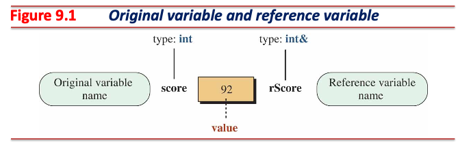
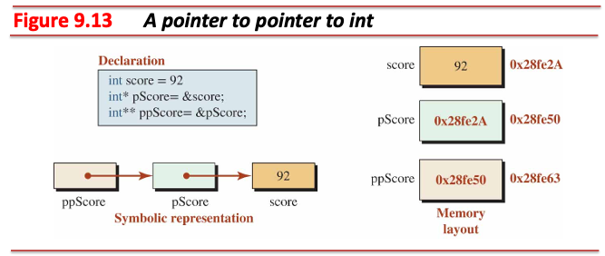

# 참조와 포인터

## 레퍼런스

* 이미 존재하는 객체에 새로운 별명 부여

```cpp
int score = 92;        // Declaring and initializing score 
int& r_score = score;  // Declaring r_score and binding it to score
```



* 레퍼런스는 복합 자료형 (*compound type*)
  * `score` 자료형은 `int`
  * `r_score` 자료형은 `int&`
* `T&` 자료형은 `T` 자료형 객체만 레퍼런스 가능

---

* 레퍼런스 대상은 상수 관계 (*constant relation*)


```cpp
int score = 92;
int& r_score = score;
int num = 80;
r_score = num;  // now, score is 80
```

---

* 한 객체에 여러 개의 레퍼런스 지정 가능
  * 참조 다중성 (*multiplicity*)


* **한 레퍼런스가 여러 개의 객체를 지정할 순 없음**
  * 레퍼런스는 상수 포인터이므로 레퍼런스 지정 시 가리키는 하나의 대상과 상수 관계 형성


---

* 레퍼런스는 *l-value* 레퍼런스
  * *r-value* 레퍼런스 불가

```cpp
int& x = 92;  // Error: no binding to values
```

* *r-value*를 레퍼런스하려면 `const` 한정자 필요
  * `const T&` 형태는 *l-value*, *r-value* 레퍼런스 가능

```cpp
int temp = 100;
int& ref1 = temp;      // l-value reference
const int& ref2 = 92;  // r-value reference
```

---

### 레퍼런스에서의 `const` 한정자 적용법


|Case|Data Variable            |Reference Variable         |Status|
|----|-------------------------|---------------------------|------|
|1   |`int name = value;`      |`int& r_name = name;`      |Ok    |
|2   |`const int name = value;`|`int& r_name = name;`      |Error |
|3   |`int name = value;`      |`const int& r_name = name;`|Ok    |
|4   |`const int name = value;`|`const int& r_name = name;`|Ok    |

---

#### Case 1: `int name = value; int& r_name = name;`

* 레퍼런스와 레퍼런스의 대상 객체는 수정 가능

```cpp
name = 20;
r_name = 30;
```

#### Case 2: `const int name = value; int& r_name = name;`

* **컴파일 오류**
  * 레퍼런스는 수정 가능하나, 레퍼런스의 대상 객체는 읽기 전용이므로 모순

#### Case 3: `int name = value; const int& r_name = name;`

* 레퍼런스는 읽기 전용이며, 레퍼런스의 대상 객체는 수정 가능

```cpp
name = 20;
// r_name = 30;  // Compile error
```

#### Case 4: `const int name = value; const int& r_name = name;`

* 레퍼런스와 레퍼런스의 대상 객체는 읽기 전용

```cpp
// name = 20;    // Compile error
// r_name = 30;  // Compile error
```

---

### *Pass-By-Reference*


* 전달인자를 함수 쪽으로 전달할 때 효율적으로 전달 가능
* 상황에 따른 매개변수:
  1. 매개변수가 함수 내에서 읽기 전용인 경우 `const T&` 형태 (e.g., 복사 생성자)를 사용한다. 만약 매개변수의 자료형이 기본 자료형이라면 *pass-by-value* 형태도 사용 가능하다.
  2. 매개변수가 함수 내에서 *side-effect*가 발생하는 경우 `T*` 형태를 사용한다.
  3. **되도록 `const` 한정자 없는 레퍼런스는 사용하지 않는 것을 권장한다.**

---

### *Return-By-Reference*

* 함수로부터 반환되는 결과를 효율적으로 전달 가능
* Dangling reference가 발생하지 않도록 주의
  * 레퍼런스 반환 대상은 함수가 종료되어도 유지되어야 함

```cpp
int& larger(const int& x, const int& y) { return x > y ? x : y; }

int main() {
  int x = 10;
  int y = 20;
  int z = larger(x, y);
  return 0;
}
```

---

## 포인터

* 메모리 주소를 표현하는 복합 자료형

### 메모리의 주소 (*Addresses in Memory*)


* 컴퓨터 메모리는 바이트의 연속
  * 컴퓨터의 메모리 (RAM) 용량이 1 KB라면, 메모리는 $2^{10}$ 바이트로 구성되어 있음

* 메모리 각 바이트는 주소가 있음
  * 주소는 일반적으로 16진수로 표현

---

### 객체의 주소 (*Address of a Variable*)

* 프로그램에서 실체화되는 각 객체들은 자료형에 따라 필요한 만큼의 바이트를 차지
  * `char` 형 객체는 1 바이트, `int` 형 객체는 일반적으로 4 바이트
* 실체화된 객체가 *n* 바이트를 차지할 경우, *n* 바이트의 첫 바이트 (가장 낮은 메모리 주소)를 객체의 주소로 사용


---

### 포인터 형과 포인터 변수


* 포인터 변수에 리터럴을 대입할 수 없음
  * 리터럴은 컴파일 시 계산되므로 메모리에 할당되지 않음

```cpp
double* p_average = 0x12341234;  // Error, No literal addresses
```

* C++는 타입 안전 (type safety) 언어이므로, 포인터 형과 다른 객체를 가리킬 수 없음
  * C 언어는 이를 허용하되, 컴파일 시 경고 출력

```cpp
int num = 100;
double* p_num = &num;  // Error, Variable p_num is of type double*
```

---

### 포인터 단항 연산자

* `&` (address-of)
  * 객체의 주소 반환
  * 결합 방향은 오른쪽에서 왼쪽 (←)

* `*` (indirection)
  * 포인터 변수가 가리키는 주소로 객체 참조
  * 결합 방향은 오른쪽에서 왼쪽 (←)


```cpp
int num = 100;
int* p = &num;    // address-of
int result = *p;  // indirection
```

---

### 문맥에 따른 `&` (Ampersand) 기호와 `*` (Asterisk) 기호의 쓰임

|Symbol|Type Definition|Unary Operator|Binary Operator|
|------|---------------|--------------|---------------|
|`&`   | `T&`          | `&var`       | `var1 & var2` |
|`*`   | `T*`          | `*var`       | `var1 * var2` |

```cpp
#include <iostream>

int main() {
  int x = 8, y = 7;
  int& ref = x;  // type definition (&)
  int* p = &x;   // type definition (*)

  std::cout << "p: " << p << std::endl;
  std::cout << "&ref: " << &ref << std::endl;  // unary operator (&)
  std::cout << "*p: " << *p << std::endl;      // unary operator (*)
  std::cout << "ref: " << ref << std::endl;
  std::cout << "x & y: " << (x & y) << std::endl;  // binary operator (&)
  std::cout << "x * y: " << (x * y) << std::endl;  // binary operator (*)

  return 0;
}
```

---

### 포인터에서의 `const` 한정자 적용법


|Case|Data Variable            |Pointer Variable           |Status|
|----|-------------------------|---------------------------|------|
|1   |`int name = value;`      |`int* p_name = name;`      |Ok    |
|2   |`const int name = value;`|`int* p_name = name;`      |Error |
|3   |`int name = value;`      |`const int* p_name = name;`|Ok    |
|4   |`const int name = value;`|`const int* p_name = name;`|Ok    |

---

#### Case 1: `int name = value; int* p_name = name;`

* 포인터를 통한 객체와 포인터가 가리키는 객체는 수정 가능

```cpp
name = 30;
*p_name = 40;
```

#### Case 2: `const int name = value; int* p_name = name;`

* **컴파일 오류**
  * 포인터를 통한 객체는 수정 가능하나, 포인터가 가리키는 객체는 읽기 전용이므로 모순

#### Case 3: `int name = value; const int* p_name = name;`

* 포인터를 통한 객체는 읽기 전용이며, 포인터가 가리키는 객체는 수정 가능

```cpp
name = 30;
// *p_name = 40; //  Compile error
```

#### Case 4: `const int name = value; const int* p_name = name;`

* 포인터를 통한 객체와 포인터가 가리키는 객체는 읽기 전용

```cpp
// name = 30;    // Compile error
// *p_name = 40; // Compile error
```

---

#### 상수 포인터

* 포인터에서의 `const` 한정자 적용법에서 구분한 4가지 경우와 조합하여 상수 포인터 사용 가능


* *Any-of-four-previous-cases* `p_name = &name;`
  * 포인터 변수의 값 (주소) 수정 가능

* *Any-of-four-previous-cases* `const p_name = &name;`
  * **포인터 변수의 값 (주소) 수정 불가**

---

### 포인터의 포인터

* 포인터 변수를 가리키는 복합 자료형
* 포인터 변수 또한 객체이므로, 이를 가리키는 포인터 변수 또한 사용 가능



---

### 특별한 포인터

* 널 포인터 (pointer to nowhere)
  * `nullptr`을 가리키는 포인터
    * `nullptr` (`0x00`)은 일반 사용자가 접근할 수 없는 시스템이 사용하는 주소
  * `nullptr`을 가리키는 포인터 변수는 **아무런 곳을 가리키지 않음을 의미**
    * 만약 `nullptr`을 가리키는 포인터를 역참조할 경우 오류에 의해 프로그램이 중단됨
  * `nullptr`은 `0`을 의미하므로, 조건문에서 포인터 유효성 검사에 활용될 수 있음

```cpp
int x = 7;
int* p = &x;
if (p) { /* ... */ }     // The pointer p is valid (p is not null)
p = nullptr;
if (!p) { /* ... */ }    // The pointer p is invalid (p is null)
```

* 제네릭 포인터 (pointer to void)
  * 모든 객체를 가리킬 수 있지만, **역참조는 불가**
    * 가리키는 객체의 형에 대한 정보 없이 단순히 객체의 주소만 갖고 있는 상태

```cpp
void* p;  // Declaring a void pointer
int x = 10;
p = &x;  // Make p to point to an int type
double y = 23.4;
p = &y;  // Make p to point to a double type
```

---

### *Pass-By-Pointer*


* *Pass-by-value*와 동작은 동일하나, 매개변수는 객체의 주소값을 복사
* 상황에 따른 매개변수:
  1. 매개변수가 함수 내에서 읽기 전용인 경우 `const T&` 형태 (e.g., 복사 생성자)를 사용한다. 만약 매개변수의 자료형이 기본 자료형이라면 *pass-by-value* 형태도 사용 가능하다.
  2. 매개변수가 함수 내에서 *side-effect*가 발생하는 경우 `T*` 형태를 사용한다.
  3. **되도록 `const` 한정자 없는 레퍼런스는 사용하지 않는 것을 권장한다.**

---

### *Return-By-Pointer*

* 함수로부터 반환되는 포인터를 복사하여 전달
* Dangling pointer가 발생하지 않도록 주의
  * 반환될 포인터가 가리키는 대상은 함수가 종료되어도 유지되어야 함

```cpp
int* larger(int* x, int* y) { return *x > *y ? x : y; }

int main() {
  int x = 10;
  int y = 20;
  int z = *larger(&x, &y);
  return 0;
}
```

---

## 배열과 포인터

* 배열의 이름은 배열의 첫 번째 요소를 가리키는 **상수 포인터**
  * 자료형이 `T`, 길이가 *n*인 배열을 선언하면 메모리 상에 `T` 형 객체가 *n*개 연속 할당됨
  * e.g., `int`형 객체는 4 바이트를 필요로 하며, *n*이 5일 경우 총 20 바이트 차지


---

## 포인터에 허용된 산술 연산

### 포인터의 정수 덧셈과 뺄셈 (`+`, `-`)


---

### 포인터의 정수 덧셈과 뺄셈 2 (`++`, `--`)


---

### 포인터의 정수 덧셈과 뺄셈 3 (`+=`, `-=`)


---

### 두 포인터 간 뺄셈

* **두 포인터는 반드시 동일한 배열의 요소를 가리켜야 함**
* 두 포인터가 가리키는 요소 간의 요소 개수 반환


---

### 두 포인터 간 비교

* **두 포인터는 반드시 동일한 배열의 요소를 가리켜야 함**
* 두 포인터가 가리키는 요소 간의 상대적인 위치 비교


### 그 외 연산들

* **사용할 수 없음**

---

## 함수로의 배열 전달

* 아래 두 표현 사용 가능:

```cpp
int GetSum(const array[], int size);  // Using array
int GetSum(const int* p, int size);   // Using pointer
```

```cpp
#include <iostream>

int GetSum(const int* p, int size) {
  int sum = 0;
  for (int i = 0; i < size; ++i) sum += *(p++);
  return sum;
}

int main() {
  int arr[5] = {10, 11, 12, 13, 14};
  std::cout << "Sum of elements: " << GetSum(arr, 5);
  return 0;
}
```

---

## 함수의 배열 반환

* 실제로 메모리 수준의 배열을 복사 반환하는 것이 아닌, 이미 생성된 배열 객체의 시작 주소를 반환하는 것
* **Dangling pointer**가 발생하지 않도록 유의할 것

```cpp
#include <iostream>

int* CreateArray(const int size) {
  int* arr = new int[size];  // Dynamically allocate an array
  for (int i = 0; i < size; ++i) arr[i] = i * 10;

  // The memory is allocated on the heap, so it will not be destroyed
  // when the function scope ends. The caller is responsible for freeing
  // the allocated memory using delete[] to prevent memory leaks.
  // There is no risk of a dangling pointer as the array is not destroyed
  // when the function returns.
  return arr;  // Return the pointer to the dynamically allocated array
}

int main() {
  int size = 5;
  int* my_array = CreateArray(size);
  std::cout << "Array elements: ";
  for (int i = 0; i < size; ++i) std::cout << my_array[i] << " ";
  std::cout << std::endl;

  // Free the dynamically allocated memory
  delete[] my_array;
  return 0;
}
```

---

## 메모리 관리 (*Memory Management*)

* C++ 런타임은 프로그램 실행 시 메모리를 다섯 영역으로 구분하여 관리


---

### 코드 영역 (*Code Memory*)

* 실행될 프로그램의 코드가 저장되는 영역
  * 함수, 컴파일 단계에서 계산된 리터럴들, etc.
* 프로그램 실행 시 CPU는 코드 영역에 보관되어 있는 문장을 순차 실행
* 이 영역에는 객체가 저장될 수 없음
* 프로그램 종료 시 코드 영역은 소멸됨

### 정적 영역 (*Static Memory*)

* Static 영역은 내부에서 두 영역으로 구분:
  * `.bss`: 초기화되지 않은 전역 혹은 정적 객체
  * `.data`: 초기화된 전역 혹은 정적 객체
* 프로그램 실행 시 전역 및 정적 객체는 정적 영역에 생성됨
* 프로그램 종료 시 정적 영역은 소멸됨

---

### 스택 영역 (*Stack Memory*)

* 지역 객체 혹은 함수의 매개변수가 보관되는 영역
* *Last-in, first-out* 컨테이너:
  * 지역 객체와 함수 매개변수들을 관리하는 데 가장 적합한 컨테이너
* 스택 영역은 보관중인 객체가 범위를 벗어나면 해당 객체를 즉시 소멸


---

#### 스택 영역의 한계

1. 스택 영역 객체들은 반드시 이름이 있어야 하며, 이는 컴파일 시간에 결정되어야 한다. 즉, **이름 없는 객체는 스택 영역에 할당될 수 없다**.
2. **객체의 크기는 컴파일 시간에 결정되어야 한다**. 스칼라 객체 (a single object)는 타입으로부터 크기를 결정하며, 벡터 객체 (a list of objects)는 컴파일 시간에 계산 가능한 크기 (e.g., 정수형 리터럴)를 명시해야 한다.

```cpp
#include <iostream>

int main() {
  int size;
  std::cin >> size;
  // Variable Length Arrays (VLAs) are not part of the C++ standard and
  // therefore are not supported in standard-compliant C++ code.
  double array[size];  // Compilation error
  return 0;
}
```

---

### 힙 영역 (*Heap Memory*)

* 앞선 영역들과는 달리, 런타임 때 객체를 동적으로 생성할 수 있는 영역
  * 스칼라 객체와 벡터 객체를 런타임 때 생성 가능
* **이름 없는 객체를 할당 및 보관하는 영역**
  * 동적 할당한 객체를 사용하려면 이를 가리키는 포인터를 통해 간접적으로 사용해야 함


---

#### 동적 할당 연산자 (`new`, `delete`)


* 단항 연산자이며, 결합 방향은 오른쪽에서 왼쪽 (←)

|Name           |Operator  |Expression    |
|---------------|----------|--------------|
|Allocate Object|`new`     |`new T`       |
|Allocate Array |`new[]`   |`new T[SIZE]` |
|Delete Object  |`delete`  |`delete ptr`  |
|Delete Array   |`delete[]`|`delete[] ptr`|
---

* `new` (*allocate object*)
  * 힙 영역에 객체 생성 시 사용하는 연산자
  * 생성하려는 객체가 클래스 형 객체라면, 생성자가 호출됨
  * 만약 벡터 객체를 할당해야 한다면 `new[]` (*allocate array*) 연산자 사용
  * 생성된 객체는 사용자가 `delete` 연산을 하기 전 혹은 프로그램 종료 시까지 유지됨
    * 더 이상 불필요한 동적 객체는 `delete` 연산을 통해 명시적으로 소멸해야 함
    * `Memory leak` 발생에 유의할 것

    ```cpp
    int* p = new int;  // Dynamically allocate memory for an int

    p = new int;  // Memory leak: the original memory allocated is not freed
                  // before p is reassigned.
    ```

---

* `delete` (*delete object*)
  * 힙 영역에 생성된 객체 소멸 시 사용하는 연산자
    * 아래의 경우들을 유의할 것:
      * 다른 영역 객체를 소멸하면 undefined behavior

      ```cpp
      double x = 23.4;
      double* p_x = &x;
      delete p_x;  // UB
      ```

      * 이미 소멸된 객체를 다시 소멸하면 undefined behavior

      ```cpp
      int *p = new int;
      delete p;
      delete p;  // UB
      ```

      * 이미 소멸된 객체를 사용하려고 하면 undefined behavior (dangling pointer)

      ```cpp
      int *p = new int;
      delete p;
      *p = 100;  // UB (dangling pointer)
      ```

  * 소멸하려는 객체가 클래스 형 객체라면, 소멸자가 호출됨
  * 만약 벡터 객체를 소멸해야 한다면 `delete[]` (*delete array*) 연산자 사용

---

#### 1차원 배열 동적할당


```cpp
#include <iostream>

int main() {
  int size;
  do {
    std::cout << "Enter the array size (larger than zero): ";
    std::cin >> size;
  } while (size <= 0);

  int* p_array = new int[size];
  for (int i = 0; i < size; ++i) p_array[i] = i * 10;
  for (int i = 0; i < size; ++i) std::cout << *(p_array + i) << ' ';
  delete[] p_array;
  return 0;
}
```

---

#### 2차원 배열 동적할당

* 2차원 배열의 행 크기를 미리 알고 있는 경우
  * 스택 영역에 행을 가리키는 포인터를 생성하고, 각 행의 열을 힙 영역에 동적 할당


---

* 행의 크기를 미리 알고 있을 때의 2차원 배열 구현 방법 1:

```cpp
#include <iostream>

int main() {
  int col_nums;
  std::cin >> col_nums;

  int* arr[4];
  for (int i = 0; i < 4; ++i) arr[i] = new int[col_nums];

  // do something ...

  for (int i = 0; i < row_nums; ++i) delete[] arr[i];
  return 0;
}
```

---

* 행의 크기를 미리 알고 있을 때의 2차원 배열 구현 방법 2:

```cpp
#include <iostream>

int main() {
  int col_nums;
  std::cin >> col_nums;

  int* data = new int[4 * col_nums];
  int* arr[4];
  for (int i = 0; i < 4; ++i) arr[i] = &data[i * col_nums];

  // do something...

  delete[] data;
  return 0;
}
```

* **앞선 방법보다 효율적인 방법이나, 배열의 요소가 많을 때 동적 할당에 실패할 수 있음**

---

* 2차원 배열의 행 크기를 모르는 경우
  * 스택 영역에 2차원 배열을 가리키는 포인터를 생성하고, 2차원 배열을 힙 영역에 동적 할당


---

* 행의 크기를 모를 때의 2차원 배열 구현 방법 1:

```cpp
#include <iostream>

int main() {
  int row_nums, col_nums;
  std::cin >> row_nums >> col_nums;

  int** arr = new int*[row_nums];
  for (int i = 0; i < row_nums; ++i) arr[i] = new int[col_nums];
  for (int i = 0; i < row_nums; ++i) {
    for (int j = 0; j < col_nums; ++j) {
      arr[i][j] = i * j + i + j;
    }
  }

  // do something ...

  for (int i = 0; i < row_nums; ++i) delete[] arr[i];
  delete[] arr;
  return 0;
}
```

---

* 행의 크기를 모를 때의 2차원 배열 구현 방법 2:

```cpp
#include <iostream>

int main() {
  int row_nums, col_nums;
  std::cin >> row_nums >> col_nums;

  int* data = new int[row_nums * col_nums];
  int** arr = new int*[row_nums];
  for (int i = 0; i < row_nums; ++i) arr[i] = &data[i * col_nums];
  for (int i = 0; i < row_nums; ++i) {
    for (int j = 0; j < col_nums; ++j) arr[i][j] = i * j + i + j;
  }

  // do something ...

  delete[] arr;
  delete[] data;
  return 0;
}

```

* **앞선 방법보다 효율적인 방법이나, 배열의 요소가 많을 때 동적 할당에 실패할 수 있음**

---

* 래기드 (*ragged*)
  * 각 행마다 서로 다른 길이의 1차원 배열을 가리키는 경우

* 파스칼 삼각형 (*Pascal's triangle*)
  * 래기드 배열의 한 형태
  * *x + y* 형태의 이항식 (binomial)을 *n* 제곱하여 전개하였을 때의 계수 (coefficients)를 표현한 것


---

```cpp
#include <iomanip>
#include <iostream>

int main() {
  int n, max_power = 10;
  do {
    std::cout << "Enter the power of binomial : ";
    std::cin >> n;
  } while (n < 0 || n > max_power);

  int** pascal = new int*[n + 1];
  for (int i = 0; i <= n; ++i) pascal[i] = new int[i + 1];
  for (int i = 0; i <= n; i++) {
    for (int j = 0; j <= i; j++) {
      pascal[i][j] =
          j == 0 || i == j ? 1 : pascal[i - 1][j - 1] + pascal[i - 1][j];
    }
  }

  std::cout << std::endl;
  std::cout << "Coefficients for (x + y)^" << n << " are:";
  for (int i = 0; i <= n; i++) std::cout << std::setw(5) << pascal[n][i];
  std::cout << std::endl;

  for (int i = 0; i <= n; i++) delete[] pascal[i];
  delete[] pascal;
  return 0;
}
```
