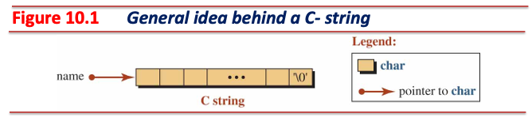
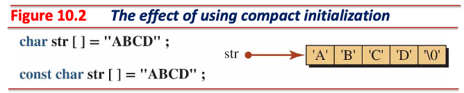
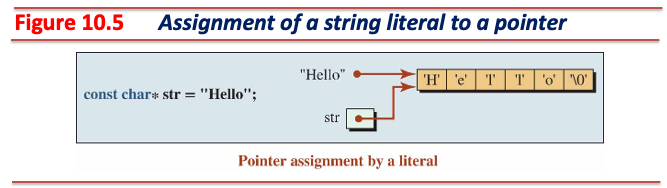
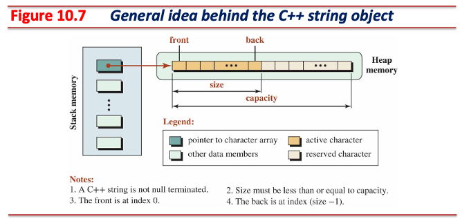
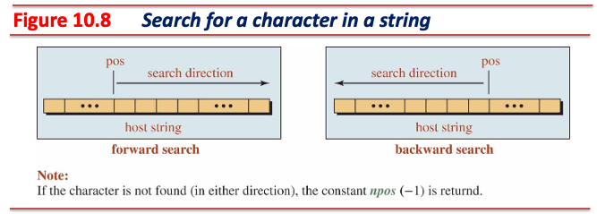
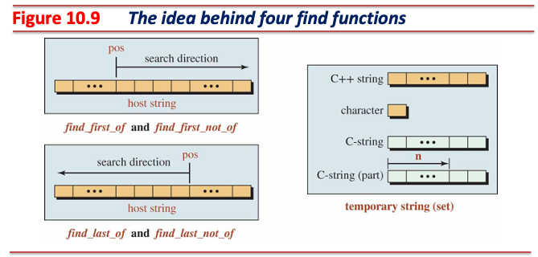
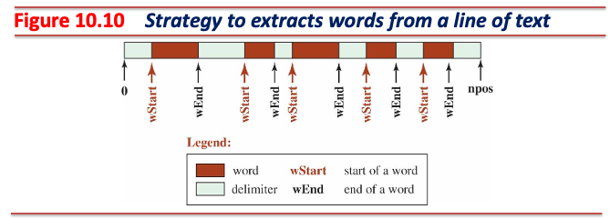
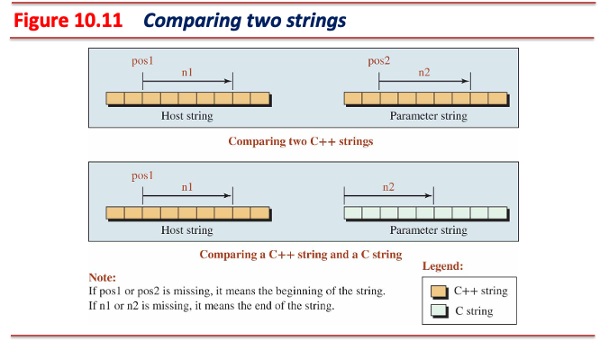
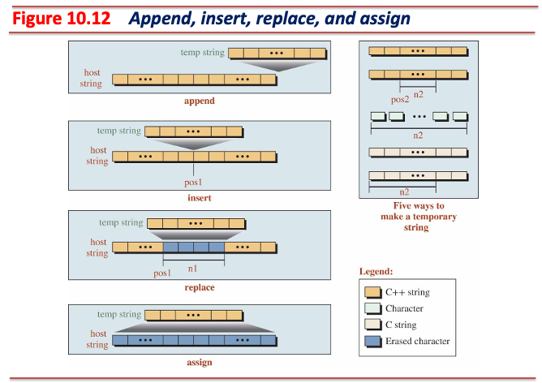

# 문자열

## C-문자열 (C-Strings)

* `char`형 배열을 사용해 문자열 기록
  * `char`형 배열 마지막 요소에는 문자열 끝을 표현하는 널 문자 (`\0`) 저장



* 문자열 선언 시 축약 표현 (shorthand) 사용 가능



```cpp
char str1[] = {'A','B','C','D','\0'};        // Non-constant
char str2[] = "ABCD";                        // Non-constant compact
const char str3[] = {'A','B','C','D','\0'};  // Constant
const char str4[] = "ABCD";                  // Constant compact
```

---

### 문자열 리터럴

* **정적 영역**에 할당되는 **이름 없는 상수 객체**
  * 정적 영역에는 정적 객체, 전역 객체, 상수 데이터가 저장됨
  * 힙 영역처럼 이름 없는 객체 허용
* 이름 없는 상수 객체이므로 포인터를 통해 리터럴을 가리켜야 함



```cpp
char* str = "Hello";        // Error: Literal is a constant
const char* str = "Hello";  // OK
```

---

### C-문자열 한계

#### 메모리 관리

```cpp
// Memory Management:
// C-strings require manual memory management, which can lead to issues like
// memory leaks or buffer overflows.
char *str = (char *) malloc(10);
strcpy(str, "Hello, World!");  // Buffer overflow!
free(str);
```

---

#### 문자열 길이 계산

```cpp
// String Length and Size:
// You need to traverse the entire string to compute its length.

/* strlen: return length of string s */
int strlen(char *s)
{
  char *p = s;

  while (*p)
    p++;

  return p - s;
}

char str[] = "Hello";
int len = strlen(str);  // Traverse the entire string
```

---

#### 문자열 연결

```cpp
// String Concatenation:
// In C-strings, to concatenate, you need to ensure there's enough space and use
// the strcat function.
char buffer[20] = "Hello";
strcat(buffer, ", World!");  // Always ensure buffer has enough space
```

---

#### 부분 문자열 (Substring) 추출

```cpp
// Substring Extraction:
// You need to ensure there's enough space and use the strncpy function.
char str[] = "Hello, World!";
char substring[6];
strncpy(substring, str + 7, 5);  // Extract "World"
substring[5] = '\0';  // Add null terminator
```

---

#### 문자열의 특정 부분 교체

```cpp
// Replacing a Specific Part of a String:
// For C-strings, complex logic is required:
char str[] = "I love cats!";
char replacement[] = "dogs";
char *pos = strstr(str, "cats");  // Find the position of "cats"
if (pos) {
  strncpy(pos, replacement, strlen(replacement));
  pos[strlen(replacement)] = '\0';  // Handle end of string (if you need)
}
```

---

## [C++ 문자열](https://cplusplus.com/reference/string/string/)

* 표준 문자열 제공
  * `<string>` 헤더 파일 포함 시 사용 가능

### C++ 문자열 설명

* 클래스로 구현되어 있음
* 힙 영역에 문자열 저장
* **문자열 저장 시 널 문자를 포함하지 않음**
* 문자열 크기 (*size*)와 용량 (*capacity*) 개념 사용



---

### C++ 문자열 데이터 멤버

* 포인터
  * 힙 영역에 기록되어 있는 문자열을 가리킴
* 크기
  * 문자열 객체의 문자열 길이
* 용량
  * 문자열 객체가 **저장할 수 있는** 문자열의 길이

#### 크기와 용량을 구분하여 사용하는 목적

* **잦은 힙 메모리 영역 재할당을 최대한 억제하여 성능을 개선할 수 있음**
* 크기가 $l$, 용량이 $c$인 문자열 객체에 크기가 $l'$인 문자열 객체를 연결하는 경우:
  * $c \geq l + l'$ 인 경우
    * 힙 영역에 **재할당 없이** 문자열 연결 가능
  * $c < l + l' \leq 2 \cdot c$ 인 경우
    * 힙 영역에 $2 \cdot c + \alpha$ 크기로 **재할당 후** 문자열 연결
  * $2 \cdot c \leq l + l'$ 인 경우
    * 힙 영역에 $l + l' + \alpha$ 크기로 **재할당 후** 문자열 연결

---

* 문자열 객체의 크기가 3, 용량이 6인 경우

```cpp
std::string str = "abc";
// mem: ['a']['b']['c']['?']['?']['?']
```

* 해당 문자열 객체에 길이가 2인 문자열을 연결하는 경우:
  * 힙 영역 재할당 없이 문자열 연결

```cpp
str += "de";
// mem: ['a']['b']['c']['d']['e']['?']
```

* 해당 문자열 객체에 길이가 2인 문자열을 다시 한 번 연결하는 경우:
  * 힙 영역 재할당 후 문자열 연결

```cpp
str += "fg";
// mem: ['a']['b']['c']['d']['e']['f']['g']['?']['?']['?']['?']['?']
```

---

### 간단한 C++ 문자열 클래스 구현

* `mystring.hpp`

```cpp
#pragma once

class MyString {
  char* string_;
  int length_;
  int capacity_;

 public:
  explicit MyString(int cap);
  MyString(const char* str);
  MyString(const MyString& str);
  ~MyString();

  MyString& Insert(int pos, const MyString& str);
  MyString& Insert(int pos, const char* str);
  MyString& Erase(int pos, int num);

  int length() const;
  int capacity() const;
  void reserve(int size);
  void println() const;
};
```

---

* `mystring.cc - 1`

```cpp
#include "mystring.hpp"

#include <cstring>
#include <iostream>

MyString::MyString(int capacity)
    : string_(new char[capacity]), length_(0), capacity_(capacity) {}

MyString::MyString(const char* str)
    : string_(new char[std::strlen(str)]),
      length_(std::strlen(str)),
      capacity_(std::strlen(str)) {
  for (int i = 0; i != length_; ++i) string_[i] = str[i];
}

MyString::MyString(const MyString& str)
    : string_(new char[str.length_]),
      length_(str.length_),
      capacity_(str.length_) {
  for (int i = 0; i != length_; ++i) string_[i] = str.string_[i];
}

MyString::~MyString() { delete[] string_; }

```

---

* `mystring.cc - 2`

```cpp
MyString& MyString::Insert(int pos, const MyString& str) {
  if (pos < 0 || pos > length_) return *this;

  if (length_ + str.length_ > capacity_) {
    int new_capacity;
    if (capacity_ * 2 > length_ + str.length_)
      new_capacity = capacity_ * 2;
    else
      new_capacity = length_ + str.length_;

    char* prev_string = string_;
    string_ = new char[new_capacity];

    int idx = 0;
    while (idx < pos) {
      string_[idx] = prev_string[idx];
      ++idx;
    }

    for (int i = 0; i < str.length_; ++i) string_[idx + i] = str.string_[i];

    while (idx < length_) {
      string_[idx + str.length_] = prev_string[idx];
      ++idx;
    }

    delete[] prev_string;
    capacity_ = new_capacity;  // update capacity
  } else {
    for (int i = length_ - 1; i >= pos; --i)
      string_[i + str.length_] = string_[i];
    for (int i = 0; i < str.length_; ++i) string_[i + pos] = str.string_[i];
  }
  length_ += str.length_;

  return *this;
}
```

---

* `mystring.cc - 3`

```cpp
MyString& MyString::Insert(int pos, const char* str) {
  MyString temp(str);
  return Insert(pos, temp);
}

MyString& MyString::Erase(int pos, int num) {
  if (num < 0 || pos < 0 || pos >= length_) return *this;

  if (pos + num > length_) num = length_ - pos;
  for (int i = pos + num; i < length_; i++) string_[i - num] = string_[i];
  length_ -= num;
  return *this;
}

int MyString::length() const { return length_; }

int MyString::capacity() const { return capacity_; }

void MyString::reserve(int size) {
  // If the reserved size is less than the current capacity,
  // nothing needs to be done.
  if (size > capacity_) {
    char* prev_string = string_;
    string_ = new char[size];
    capacity_ = size;
    for (int i = 0; i != length_; ++i) string_[i] = prev_string[i];
    delete[] prev_string;
  }
}

void MyString::println() const {
  for (int i = 0; i != length_; ++i) std::cout << string_[i];
  std::cout << std::endl;
}
```

---

* `main.cc`

```cpp
#include <iostream>

#include "mystring.hpp"

int main() {
  MyString str1("Hello C++ strings!");
  str1.println();

  MyString str2 = str1;  // '=' symbol is invoking the copy constructor of the
                         // MyString and the compiler will treat this sentence
                         // as MyString str2(str1);
  str2.println();

  MyString str3 = "implicit conversion example";
  str3.println();

  MyString str4(10);  // MyString str4 = 10; is forbidden
  str4.Insert(0, "Hello, World!").Insert(0, "C++! ");
  str4.println();
  std::cout << "length: " << str4.length() << std::endl;
  std::cout << "capacity: " << str4.capacity() << std::endl;

  str4.Erase(0, 5);
  str4.println();
  std::cout << "length: " << str4.length() << std::endl;
  std::cout << "capacity: " << str4.capacity() << std::endl;
  return 0;
}
```

---

### Shallow Copy vs. Deep Copy

* 기본 복사 생성자는 얕은 복사 (shallow copy) 수행
  * 새로 생성되는 객체의 데이터 멤버 값은 복사할 객체의 데이터 멤버 값으로 설정

#### 얕은 복사의 한계

```cpp
#include <cstring>

class ShallowCopy {
  char* data_;

 public:
  explicit ShallowCopy(const char* s) : data_(new char[std::strlen(s) + 1]) {
    std::strncpy(data_, s, std::strlen(s));
  }
  // NOTICE: Group 2(Copy constructor) is missing,
  // so the system will create a default copy constructor (shallow copy)
  ~ShallowCopy() { delete[] data_; }
};

int main() {
  ShallowCopy obj1("Hello");
  ShallowCopy obj2 = obj1;  // shallow copy occurs here
  return 0;
  // obj2 shares the same memory with obj1, so delete[] gets called
  // multiple times (it leads to memory issues)
}
```

```shell
free(): double free detected in tcache 2
Aborted
```

---

#### 깊은 복사

* 인스턴스 복사 시 동적 할당된 데이터 멤버는 명시적으로 깊은 복사를 해야 함

```cpp
#include <cstring>

// Deep copy copies what a pointer points to so that the two pointers now refer
// to distinct objects. We define copy constructors and copy assignments when we
// want deep copy for objects of our classes.
class DeepCopy {
  char* data_;

 public:
  explicit DeepCopy(const char* s) : data_(new char[std::strlen(s) + 1]) {
    std::strncpy(data_, s, std::strlen(s));
  }
  // Copy constructor (deep copy)
  DeepCopy(const DeepCopy& str) {
    data_ = new char[strlen(str.data_) + 1];
    strncpy(data_, str.data_, strlen(str.data_));
  }
  ~DeepCopy() { delete[] data_; }
};

int main() {
  DeepCopy obj1("Hello");
  DeepCopy obj2 = obj1;  // deep copy occurs here
  DeepCopy obj3 = obj1;  // another deep copy
  return 0;
}
```

---

### 참조를 반환하는 멤버 함수

```cpp
class MyString {
  char* string_;
  int length_;
  int capacity_;

 public:
  // ... skipped ...
  MyString& Insert(int pos, const MyString& str);
  MyString& Insert(int pos, const char* str);
  // ... skipped ...
};

int main() {
  MyString str(10);
  str.Insert(0, "Hello, World!").Insert(0, "C++! ");
  return 0;
}
```

* 참조 반환의 이점:
  1. 값 반환이 아니므로 **불필요한 메모리 관련 비용 및 연산을 아낄 수 있다**.
  2. **메서드 호출을 연속적으로 할 수 있다**. 코드가 더욱 간결해지고 가독성을 높인다.

---

### `explicit`

* 암묵적 변환 (*implicit conversion*)을 불허하고자 할 때 사용

```cpp
class MyString {
  char* string_;
  int length_;
  int capacity_;

 public:
  explicit MyString(int cap);
  // ... skipped ...
};

int main() {
  MyString str(10);  // MyString str = 10; is forbidden
  return 0;
}
```

* `MyString` 클래스의 `explicit` 키워드를 제거하면 `MyString str = 10` 표현이 가능해짐
  * **문자열 객체에 10을 대입하는 표현은 모호하고 불명확함**
    * 문자열 객체에 10이라는 수를 문자열로 저장하라는 것인지?
    * 문자열 객체의 용량을 10으로 설정하는 것인지?
    * ...
* 모호한 표현을 사용하지 못하도록 강제함으로써 코드 가독성을 높일 수 있음

---

### C++ 문자열 연습

* Testing functions related to size and capacity

```cpp
#include <iostream>
#include <string>

int main() {
  // Creating a string object
  std::string greeting("Hello my friends");

  // Test size, maximum size, and capacity
  std::cout << "Size: " << greeting.size() << std::endl;
  std::cout << "Maximum size: " << greeting.max_size() << std::endl;
  std::cout << "Capacity: " << greeting.capacity() << std::endl;
  std::cout << "Empty? " << std::boolalpha << greeting.empty() << std::endl;
  std::cout << std::endl;

  // Making a reservation and testing again
  greeting.reserve(20);
  std::cout << "Size: " << greeting.size() << std::endl;
  std::cout << "Maximum size: " << greeting.max_size() << std::endl;
  std::cout << "Capacity: " << greeting.capacity() << std::endl;
  std::cout << "Empty? " << std::boolalpha << greeting.empty() << std::endl;
  return 0;
}
```

---

* Using input/output operators

```cpp
#include <iostream>
#include <string>

int main() {
  // Constructing a default object
  std::string input_str;

  // Inputting and outputting values for the input_str object
  std::cout << "Input the string: ";
  std::cin >> input_str;
  std::cout << input_str << std::endl;
  return 0;
}
```

---

* Using [`getline`](https://en.cppreference.com/w/cpp/string/basic_string/getline) for input

```cpp
#include <iostream>
#include <string>

int main() {
  // Constructing a default object
  std::string input_str;

  // Creating a string made of a single line
  std::cout << "Enter a line of characters: " << std::endl;
  std::getline(std::cin, input_str);
  std::cout << input_str << std::endl << std::endl;

  // Creating a string made of multiple lines
  std::cout << "Enter lines of characters ended with $: " << std::endl;
  std::getline(std::cin, input_str, '$');
  std::cout << input_str;
  return 0;
}
```

---

* Retrieving and changing characters

```cpp
#include <iostream>
#include <string>

int main() {
  // Construction of a string
  std::string str("c++ programming");

  // Retrieving and changing a character at index 0
  std::cout << "Character at index 0: " << str[5] << std::endl;
  str[0] = 'C';
  std::cout << str << std::endl;
  // Retrieving and changing a character at index 4
  std::cout << "Character at index 4: " << str.at(4) << std::endl;
  str.at(4) = 'P';
  std::cout << str << std::endl;
  // -> Both [] and at() expression can be evaluated to l-value and r-value

  // This case is an undefined behavior:
  std::cout << "Character out of index range: " << str[100] << std::endl;
  // This case occurs a runtime error:
  try {
    std::cout << "Character out of index range: " << str.at(100) << std::endl;
  } catch (const std::out_of_range& e) {
    std::cout << "std::out_of_range error" << std::endl;
  }

  return 0;
}
```

---

* Retrieving two substrings ([`substr`](https://en.cppreference.com/w/cpp/string/basic_string/substr))

```cpp
#include <iostream>
#include <string>

int main() {
  // Construction of a string
  std::string sentence("The C++ language is fun to work with.");

  // Retrieving two substrings
  std::cout << sentence.substr(8)
            << std::endl;  // language is fun to work with.
  std::cout << sentence.substr(4, 12) << std::endl;  // C++ language
  return 0;
}
```

---

#### Forward and Backward Search for a Given Character



---

* Forward search ([`find`](https://en.cppreference.com/w/cpp/string/basic_string/find))

```cpp
#include <iostream>
#include <string>

int main() {
  // String to perform searches on
  const char search_char = 'C';
  std::string sentence("The C++ language is fun to work with.");
  std::size_t forward_pos;

  // Forward search
  forward_pos = sentence.find(search_char);  // find from the index 0
  if (forward_pos != std::string::npos) {
    std::cout << "Forward search: '" << search_char << "' found at position "
              << forward_pos << std::endl;
  } else {
    std::cout << "Forward search: '" << search_char << "' not found"
              << std::endl;
  }

  forward_pos = sentence.find(search_char, 5);  // find from the index 5
  if (forward_pos != std::string::npos) {
    std::cout << "Forward search: '" << search_char << "' found at position "
              << forward_pos << std::endl;
  } else {
    std::cout << "Forward search: '" << search_char << "' not found"
              << std::endl;
  }
  return 0;
}
```

---

* Backward search ([`rfind`](https://en.cppreference.com/w/cpp/string/basic_string/rfind))

```cpp
#include <iostream>
#include <string>

int main() {
  // String to perform searches on
  const char search_char = '+';
  std::string sentence("The C++ language is fun to work with.");
  std::size_t backward_pos;

  // Backward search
  backward_pos =
      sentence.rfind(search_char);  // find from the index sentence.size() - 1
  if (backward_pos != std::string::npos) {
    std::cout << "Backward search: '" << search_char << "' found at position "
              << backward_pos << std::endl;
  } else {
    std::cout << "Backward search: '" << search_char << "' not found"
              << std::endl;
  }

  backward_pos = sentence.rfind(search_char, 4);  // find from the index 4
  if (backward_pos != std::string::npos) {
    std::cout << "Backward search: '" << search_char << "' found at position "
              << backward_pos << std::endl;
  } else {
    std::cout << "Backward search: '" << search_char << "' not found"
              << std::endl;
  }
  return 0;
}
```

---

#### Forward or Backward Search for a Character Belonging to a Set



---

* Search for a character from set
  * Forward: ([`find_first_of`](https://en.cppreference.com/w/cpp/string/basic_string/find_first_of))
  * Backward: ([`find_last_of`](https://en.cppreference.com/w/cpp/string/basic_string/find_last_of))

```cpp
#include <iostream>
#include <string>

int main() {
  // String to perform searches on
  std::string sentence("The C++ language is fun to work with.");
  std::string set("aeiou");  // Vowels set for testing

  // Forward search for first character from set
  std::size_t pos_first_of = sentence.find_first_of(set);
  if (pos_first_of != std::string::npos) {
    std::cout << "Forward search (first of set): found '"
              << sentence[pos_first_of] << "' at position " << pos_first_of
              << std::endl;
  } else {
    std::cout << "Forward search (first of set): no character found"
              << std::endl;
  }

  // Backward search for last character from set
  std::size_t pos_last_of = sentence.find_last_of(set);
  if (pos_last_of != std::string::npos) {
    std::cout << "Backward search (last of set): found '"
              << sentence[pos_last_of] << "' at position " << pos_last_of
              << std::endl;
  } else {
    std::cout << "Backward search (last of set): no character found"
              << std::endl;
  }
  return 0;
}
```

---

* Search for a character not from set
  * Forward: ([`find_first_not_of`](https://en.cppreference.com/w/cpp/string/basic_string/find_first_not_of))
  * Backward: ([`find_last_not_of`](https://en.cppreference.com/w/cpp/string/basic_string/find_last_not_of))

```cpp
#include <iostream>
#include <string>

int main() {
  // String to perform searches on
  std::string sentence("The C++ language is fun to work with.");
  std::string set("aeiou");  // Vowels set for testing

  // Forward search for first character not from set
  std::size_t pos_first_not_of = sentence.find_first_not_of(set);
  if (pos_first_not_of != std::string::npos) {
    std::cout << "Forward search (first not of set): found '"
              << sentence[pos_first_not_of] << "' at position "
              << pos_first_not_of << std::endl;
  } else {
    std::cout << "Forward search (first not of set): no character found"
              << std::endl;
  }

  // Backward search for last character not from set
  std::size_t pos_last_not_of = sentence.find_last_not_of(set);
  if (pos_last_not_of != std::string::npos) {
    std::cout << "Backward search (last not of set): found '"
              << sentence[pos_last_not_of] << "' at position "
              << pos_last_not_of << std::endl;
  } else {
    std::cout << "Backward search (last not of set): no character found"
              << std::endl;
  }
  return 0;
}
```

---

* Using `find` and `rfind` to check if a string contains a substring

```cpp
#include <iostream>
#include <string>

int main() {
  std::string strg = "The quick brown fox jumps over the lazy dog";
  std::string search_str = "fox";

  // Using find to check if the string contains the substring (forward search)
  if (strg.find(search_str) != std::string::npos) {
    std::cout << "Found '" << search_str << "' using find." << std::endl;
  } else {
    std::cout << "Did not find '" << search_str << "' using find." << std::endl;
  }

  // Using rfind to check if the string contains the substring (backward search)
  if (strg.rfind(search_str) != std::string::npos) {
    std::cout << "Found '" << search_str << "' using rfind." << std::endl;
  } else {
    std::cout << "Did not find '" << search_str << "' using rfind."
              << std::endl;
  }
  return 0;
}
```

---

#### Tokenizing



---

* Retrieving words from a line of text

```cpp
#include <iostream>
#include <string>

// Program to find and extract words in a line of text
int main() {
  // Declaration of variables, types, and constants
  std::string text, word;
  std::string delimiter = " \n";  // ' ', '\n'
  std::string::size_type start, end;

  // Input a line of text from the keyboard
  std::cout << "Enter a line of text: " << std::endl;
  std::getline(std::cin, text);

  // Search, find, and print words
  std::cout << "Words in the text:" << std::endl;
  end = 0;
  while ((start = text.find_first_not_of(delimiter, end)) !=
         std::string::npos) {
    end = text.find_first_of(delimiter, start);
    if (end == std::string::npos)
      end = text.size();  // Handle the last word correctly
    std::cout << text.substr(start, end - start) << std::endl;
  }
  return 0;
}
```

---

#### Comparing Two Strings



* $return=0$ : 두 문자열이 일치하는 경우
* $return<0$ : 문자열 객체가 비교하는 값보다 사전순으로 앞에 위치하는 경우
  * e.g., `'A'` $-$ `'B'` $<0$
* $return>0$ : 문자열 객체가 비교하는 값보다 사전순으로 뒤에 위치하는 경우
  * e.g., `'B'` $-$ `'A'` $>0$

---

* Integral comparison of strings ([`compare`](https://en.cppreference.com/w/cpp/string/basic_string/compare))

```cpp
#include <iostream>
#include <string>

int main() {
  // Declaration of two C++ strings
  std::string strg1("Hello my friends");
  std::string strg2("Hello friends");

  // Comparing two C++ strings
  std::cout << strg1 << " compared with " << strg2 << ": ";
  std::cout << strg1.compare(strg2) << std::endl;

  // Comparing part of the two C++ strings
  std::cout << "Hello compared with Hello: ";
  std::cout << strg1.compare(0, 5, strg2, 0, 5) << std::endl;

  // Comparing part of the first C++ string and a C-string
  std::cout << "Hello compared with Hello: ";
  std::cout << strg1.compare(0, 5, "Hello") << std::endl;

  // Comparing part of a C++ string and part of a C-string
  std::cout << "Hel compared with Hell: ";
  std::cout << strg2.compare(0, 3, "Hello", 4) << std::endl;
  return 0;
}
```

---

* Using logical operators to compare strings

```cpp
#include <iostream>
#include <string>

int main() {
  // Creation of four C++ strings
  std::string strg1;
  std::string strg2(5, 'a');  // "aaaaa"
  std::string strg3("Hello Friends");
  std::string strg4("Hi People", 4);  // "Hi P"

  // Using six logical operators (relational and equality)
  std::cout << "strg1 > strg2 : " << std::boolalpha << (strg1 > strg2);
  std::cout << std::endl;

  std::cout << "strg2 <= strg3: " << std::boolalpha << (strg2 <= strg3);
  std::cout << std::endl;

  std::cout << "strg1 != strg2: " << std::boolalpha << (strg1 != strg2);
  std::cout << std::endl;

  std::cout << "\"Hi P\" == strg4: " << std::boolalpha << ("Hi P" == strg4);
  std::cout << std::endl;
  return 0;
}
```

---

#### C++ String Modifying Member Functions - [`append`](https://en.cppreference.com/w/cpp/string/basic_string/append), [`insert`](https://en.cppreference.com/w/cpp/string/basic_string/insert), [`replace`](https://en.cppreference.com/w/cpp/string/basic_string/replace), [`assign`](https://en.cppreference.com/w/cpp/string/basic_string/assign)



---

* Modifying C++ string - 1

```cpp
#include <iostream>
#include <string>

int main() {
  // Append character at the end of a string
  std::string strg("Hello");
  char c = '!';
  strg.push_back(c);
  std::cout << "After push_back: " << strg << std::endl;

  // Append a complete C++ string
  std::string temp(" World");
  strg.append(temp);
  std::cout << "After append: " << strg << std::endl;
  return 0;
}
```

---

* Modifying C++ string - 2

```cpp
#include <iostream>
#include <string>

int main() {
  std::string strg("Hello!");
  std::string temp(" Wonderful");

  // Insert at a specific position
  strg.insert(5, temp);
  std::cout << "After insert: " << strg << std::endl;

  // Replace part of the string
  strg.replace(6, 9, "Beautiful");
  std::cout << "After replace: " << strg << std::endl;

  // Assign a new string
  std::string new_strg;
  new_strg.assign(temp);
  std::cout << "After assign: " << new_strg << std::endl;
  return 0;
}
```

---

* Modifying C++ string - 3

```cpp
#include <iostream>
#include <string>

int main() {
  std::string strg("This is a sample string.");

  // Clear the entire string
  strg.clear();
  std::cout << "After clear: \"" << strg << "\"" << std::endl;

  // Create a new string and erase part of it
  strg = "Another example string";
  strg.erase(8, 8);  // Erase "example "
  std::cout << "After erase: " << strg << std::endl;

  // Assignment and addition
  std::string strg1 = "Hello", strg2 = " World";
  strg1 += strg2;
  std::cout << "After compound assignment: " << strg1 << std::endl;
  return 0;
}
```

---

* Printing the full name of a person

```cpp
#include <iostream>
#include <string>

int main() {
  // Declarations
  std::string first, last;
  char initial;

  // Input first, last, and initial
  std::cout << "Enter first name: ";
  std::cin >> first;
  std::cout << "Enter last name: ";
  std::cin >> last;
  std::cout << "Enter initial: ";
  std::cin >> initial;

  // Printing the full name in one format
  std::cout << std::endl;
  std::cout << "Full name in first format: ";
  std::cout << first + " " + initial + ". " + last << std::endl;

  // Printing the full name in another format
  std::cout << std::endl;
  std::cout << "Full name in second format: ";
  std::cout << last + ", " + first + " " + initial + "." << std::endl;
  return 0;
}
```

---

* String to character array and C-string conversion

```cpp
#include <iostream>
#include <string>

int main() {
  // Declaration of a C++ string
  std::string strg = "Hello, World!";

  // Conversion to a character array using data()
  // Since C++11, data() includes a null terminator
  const char* arr = strg.data();
  std::cout << "Character array (using data()): " << arr << std::endl;

  // Conversion to a C-string using c_str()
  // c_str() guarantees a null-terminated C-string
  const char* str = strg.c_str();
  std::cout << "C-string (using c_str()): " << str << std::endl;
  return 0;
}
```
