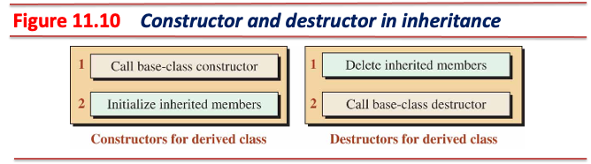
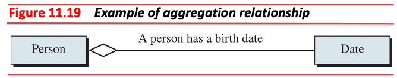

# 클래스 간의 관계

> A program normally uses several classes with different relationships between them.

* 관계는 상속 (inheritance), 연관 (association), 의존 (dependency)이 있음
  * 소유 (aggregation), 구성 (composition)은 연관의 특별한 형태
  * 소유와 구성은 연관의 부분 집합 (subset)


---

## [UML (Unified Modeling Language)](https://en.wikipedia.org/wiki/Unified_Modeling_Language)


* 소프트웨어 시스템의 구조와 동작을 시각적으로 표현하기 위한 표준화된 모델링 언어
* 정의된 문법 (syntax)과 의미론 (semantics)을 갖춘 언어
  * 표준화된 기호와 규칙을 통해 일관된 방식으로 시스템을 표현하고 이해할 수 있음
  * 다이어그램을 통해 시스템의 의미를 정확하게 파악할 수 있음
* 프로그래밍 언어가 코드로 시스템을 표현하듯, UML은 시각적 다이어그램으로 시스템을 표현
  * UML을 통해 개발자 간의 효과적인 의사소통 가능
* 시스템의 이해도를 높이고 개발 효율을 높일 수 있음

---

## 클래스 다이어그램

* UML 다이어그램 중 클래스 간의 관계 설명을 위한 다이어그램
  * 문법
    * 박스는 클래스를 표현하며, 박스 안에 클래스 명 기재
    * 실선으로 된 화살표는 관계 중 상속을 의미
  * 의미론
    * A horse is an animal.
    * A circle is a shape.
    * A student is a person.


---

## 상속 (Inheritance)


* 두 클래스는 *is-a* 관계로 표현됨
  * A horse *is an* animal.
  * `Animal` 은 기반 클래스 (일반적인 의미)
  * `Horse` 는 기반 클래스로부터 구체화된 파생 클래스 (구체적인 의미)
* 파생 클래스(derived class)는 기반 클래스 (base class)로부터 구체화한 결과물
* 클래스 다이어그램에서 상속 표현 시 두 클래스 사이에 실선으로 된 화살표를 사용
  * 파생 클래스 (`Horse`)가 기반 클래스 (`Animal`)를 가리킴
* 클래스 다이어그램으로 상속 표현 시 파생 클래스가 기반 클래스를 가리키도록 화살표 표현
* 기반 클래스를 슈퍼클래스 (superclass), 파생 클래스를 서브클래스 (subclass)라고 부르기도 함

---

### 상속 특징

* **파생 클래스는 기반 클래스의 모든 멤버를 사용할 수 있음**
  * 기반 클래스의 생성자, 소멸자, 할당 연산자는 예외로 상속되지 않음
* 파생 클래스는 기반 클래스에서 상속받은 내용에 필요에 따라 데이터 멤버 또는 멤버 함수 추가 가능
* 상속은 세 가지 형태로 할 수 있음
  * 접근 지정자는 생략될 수 있으며, 생략 시 `private` 상속 (the default inheritance)


* 기본 상속 형태는 `private`이지만, 일반적으로 사용하는 상속은 `public` 상속

---

### 상속 관계 예시


* A student *is a* person.
  * `Person` 클래스는 기반 클래스, `Student` 클래스는 파생 클래스
  * `Person` 클래스는 주민등록번호를 저장할 데이터 멤버 (`identity`) 필요
  * `Student` 클래스는 주민등록번호와 학점을 저장할 데이터 멤버 (`identity`, `gpa`) 필요
    * `identity` 는 기반 클래스로부터 상속됨
    * `Student` 클래스에 `gpa`만 추가하면 됨

---

* 클래스 기호 (class symbol)는 세 영역으로 구분됨
  * 클래스 이름을 나타내는 상단 부분
  * 속성을 나타내는 중간 부분
    * 클래스의 데이터 멤버
  * 메서드를 나타내는 하단 부분
    * 클래스의 멤버 함수
  * 중간 부분과 하단 부분에서 클래스 멤버의 가시성 표기법 (visibility notation):
    * `+` :  `public`
    * `-` :  `private`
    * `#` :  `protected`
* 클래스 기호에서의 속성 형식

```text
[visibility_notation] attribute_name: type
```

* 클래스 기호에서의 메서드 형식

```text
[visibility_notation] method_name(parameter_name: parameter_type): return_type
```

---

* `Person` 클래스와 `Student` 클래스의 클래스 기호를 다시 작성하면 아래와 같음
  * 일반적으로 생성자, 소멸자 등은 예외로 상속하지 않으므로 클래스 다이어그램에 미표현


---

```cpp
#include <cassert>
#include <iostream>

class Person {
  int64_t id_;

 public:
  void set_id(int64_t id) {
    id_ = id;
    assert(id_ >= 1e8 && id_ < 1e9);
  }
  int64_t get_id() const { return id_; }
};

class Student : public Person {
  double gpa_;

 public:
  void set_gpa(double gpa) {
    gpa_ = gpa;
    assert(gpa_ >= 0 && gpa_ <= 4.0);
  }
  double get_gpa() const { return gpa_; }
};

int main() {
  Person person;
  person.set_id(123456789L);
  std::cout << "Person’s ID: " << person.get_id() << std::endl << std::endl;
  Student student;
  student.set_id(987654321L);
  student.set_gpa(3.9);
  std::cout << "Student’s ID: " << student.get_id() << std::endl;
  std::cout << "Student’s GPA: " << student.get_gpa() << std::endl;
  return 0;
}
```

---

### Private 데이터 멤버

> A private member in the base class becomes an inaccessible (hidden) member in the derived class.


* 기반 클래스 객체는 `identity` 를 가짐
* 파생 클래스 객체는 `gpa` 와 상속 받은 기반 클래스 멤버인 `identity`를 가짐
* `identity`는 `private`이므로, 기반 클래스 범위 (base class scope)에서만 접근 가능
* **파생 클래스 객체는 파생 클래스 범위 (derived class scope)**
  * 파생 클래스 메서드는 `identity`에 접근 불가

---

### Public 멤버 함수

> A public member in the base class becomes a public member in the derived class.


* 파생 클래스 객체는 기반 클래스의 `public` 메서드들을 사용할 수 있음
  * 파생 클래스 객체가 파생 클래스의 `public` 메서드를 호출하면 파생 클래스 범위가 됨
  * 파생 클래스 객체가 기반 클래스의 `public` 메서드를 호출하면 기반 클래스 범위가 됨
* 파생 클래스 객체는 기반 클래스 멤버를 통해 기반 클래스의 `private` 멤버에 접근 가능

---

### 오버라이드 함수 (Overridden Member Functions)

* 클래스 멤버 함수는 오버로드 (overloaded) 또는 오버라이드 (overridden)될 수 있음

#### 멤버 함수 오버로드

* 함수 이름은 같지만 함수 시그니처가 다른 경우
* 상속과 관계 없음

```cpp
void set(long id);
void set(double gpa);
```

#### 멤버 함수 오버라이드

* 기반 클래스와 파생 클래스에 이름과 함수 시그니처가 같은 함수가 존재하는 경우
* **상속과 관계 있음**

```cpp
// Person class
long get();

// Student class
double get();
```

---

### 클래스 범위 (Class Scope)


* 기반 클래스와 파생 클래스는 각각 독립적인 멤버와 범위를 가짐
* 파생 클래스는 기반 클래스의 범위를 확장한 개념
  * 기반 클래스의 멤버를 상속받아 자신의 멤버와 함께 사용
* 파생 클래스는 파생 클래스 범위와 기반 클래스 범위 둘 다 접근 가능
  * 파생 클래스는 기반 클래스의 멤버 (`private`이 아닌 멤버)에 접근 가능
* **기반 클래스는 파생 클래스의 멤버에 접근 불가**

---

* 다음은 컴파일러가 멤버 함수를 어떻게 호출하는지에 대한 규칙이며, 이때 클래스 범위가 활용됨
  1. 컴파일러는 함수를 호출한 객체의 클래스에 속하는 함수 중에서 이름과 매개변수를 사용하여 일치하는 함수를 찾으려고 시도한다.
  2. 일치하는 함수가 없다면 컴파일러는 상위 클래스에서 상속된 함수들을 확인한다.
  3. 여전히 일치하는 함수가 없다면 기반 클래스에 도달할 때까지 2번 과정을 반복한다.
  4. 기반 클래스에 도달하였음에도 호출된 함수와 일치하는 함수를 못 찾으면 컴파일 오류가 발생한다.

* 멤버 함수는 호스트 객체를 사용해야 하며, 호스트 객체는 자신의 클래스 범위를 갖고 있음

```cpp
// Using a Person instance
person.set(111111111L);  // try to invoke a `set` function of the Person class
person.get();            // try to invoke a `get` function of the Person class

// Using a Student instance
student.set(3.7);  // try to invoke a `set` function of the Student class
student.get();     // try to invoke a `get` function of the Student class
```

---

### 오버라이드 함수 활용 - 작업 위임 (Delegation of Duty)

* 파생 클래스는 오버라이드 함수를 활용해 작업 일부를 상위 클리스로 위임할 수 있음
  * 아래 예시는 클래스 별로 구현한 접근자와 변경자를 하나의 공통된 이름으로써 사용하는 예시

```cpp
// Using a Person instance
void Person::set(long id) { identity_ = id; }
void Person::print() { std::cout << name << std::endl; }

// Using a Student instance
// Note that the Student class is derived from the Person class, so the scope of
// the Person class is accessible.
void Student::set(long id, double gpa) {
  Person::set(id);  // Delegation
  gpa_ = gpa;
}

void Student::print() {
  Person::print();  // Delegation
  std::cout << gpa << std::endl;
}
```

---

### 상속되지 않는 멤버

> Constructors, destructor, and assignment operators are not inherited; they need to be redefined.

* 다음 다섯 개의 멤버 함수는 파생 클래스로 상속되지 않음
  1. 기본 생성자
  2. 매개변수 생성자
  3. 복사 생성자
  4. 소멸자
  5. 대입 연산자 (연산자 오버로딩 학습 시 소개)

* 따라서 파생 클래스의 생성자는 기반 클래스의 데이터 멤버 초기화 불가
  * 일반적으로 클래스는 데이터 멤버를 `private` 으로 지정 (캡슐화)
  * 기반 클래스의 데이터 멤버는 기반 클래스 범위에서만 접근 가능
* 마찬가지로 파생 클래스의 소멸자는 기반 클래스의 데이터 멤버 소멸 불가

---

### 상속에서의 생성과 소멸



* 파생 클래스의 생성자는 기반 클래스의 생성자를 먼저 호출한 뒤 파생 클래스 데이터 멤버를 초기화
  * 파생 클래스의 생성자에서 기반 클래스의 생성자를 명시적으로 호출해야 함
  * 만약 호출하지 않는다면 컴파일러에 의해 기반 클래스의 **기본 생성자**가 자동 호출됨
* 파생 클래스의 소멸자는 파생 클래스 데이터 멤버를 먼저 소멸한 뒤 기반 클래스 소멸자 호출
  * 소멸자는 객체 소멸 시점에 시스템에 의해 자동 호출되는 멤버 함수
  * 파생 클래스 객체 소멸 시 파생 클래스의 소멸자와 기반 클래스의 소멸자가 순차적으로 호출됨
* **생성자와 소멸자의 처리 순서는 역순임의 유의**

---

#### 상속에서의 생성과 소멸 예시


* person.hpp

```cpp
#pragma once

#include <cassert>
#include <iostream>  // int64_t

class Person {
  int64_t id_;

 public:
  Person() : id_(0) {}
  explicit Person(int64_t id) : id_(id) { assert(id_ >= 1e8 && id_ < 1e9); }

  void print() const { std::cout << "Identity: " << id_ << std::endl; }
};
```

---

* student.hpp

```cpp
#pragma once

#include <cassert>
#include <iomanip>
#include <iostream>  // int64_t

#include "person.hpp"
class Student : public Person {
  double gpa_;

 public:
  Student() : Person(), gpa_(0.0) {}
  Student(int64_t id, double gpa) : Person(id), gpa_(gpa) {
    assert(gpa_ >= 0.0 && gpa_ <= 4.0);
  }

  void print() const {
    Person::print();
    std::cout << "GPA: " << std::fixed << std::setprecision(2) << gpa_
              << std::endl;
  }
};
```

---

* main.cc

```cpp
#include <iostream>

#include "student.hpp"

int main() {
  Person person(123456789L);
  std::cout << "Information about person: " << std::endl;
  person.print();
  std::cout << std::endl;

  Student student(987654321L, 3.9);
  std::cout << "Information about student: " << std::endl;
  student.print();
  std::cout << std::endl;
  return 0;
}
```

---

### Protected 멤버


* 파생 클래스에 정의된 함수는 기반 클래스의 `private` 멤버에 접근 불가
  * 다음과 같은 추가적인 코드 필요:

  ```cpp
  // Calling the inherited function
  void Derived::set(int y) { Base::set(y); }
  ```

* `protected` 멤버는 이를 상속 받는 모든 클래스에서 접근 가능
  * 파생 클래스에 정의된 함수는 기반 클래스의 `protected` 멤버에 접근 가능

---

#### Protected 데이터 멤버와 Private 데이터 멤버의 장단점

* `private` 데이터 멤버는 캡슐화가 적용되지만, 추가적인 코드 작성이 요구됨 (e.g., 작업 위임)
* `protected` 데이터 멤버는 코드가 간결해지지만, 캡슐화 원칙에 위배됨

### 상속 막기 (Blocking Inheritance)

* `final` 키워드를 사용한 클래스는 상속할 수 없음

```cpp
class First final { /* ... */ };

// It's not allowed:
// class Second : public First { /* ... */ };
```

* 파생 클래스에 `final` 키워드를 적용해 해당 파생 클래스를 상속할 수 없도록 제한할 수 있음

```cpp
class First { /* ... */ };
class Second final : public First { /* ... */ };
// It's not allowed:
// class Third : public Second { /* ... */ };
```

---

### 상속 원칙 - 리스코프 치환 원칙 (Liskov Substitution Principle)

> This principle says that an object of a superclass must always be substitutable by an object of a subclass without altering any of the properties of the superclass.

* Barbara Liskov에 의해 개발된 설계 원칙 중 하나
* 슈퍼클래스와 서브클래스는 서로 *is-a* 관계로 표현되어야 함
  * A student *is a* person.
* LSP를 잘 지킨 예: `Animal` 슈퍼클래스와 `Bird` 서브클래스
  * 두 클래스는 *is-a* 관계로 표현 가능
    * 두 클래스 모두 `move`라는 메서드가 있다고 가정
    * `Animal` 객체로 `move` 동작을 수행하던 것을 `Bird` 객체로 대체해도 문제 없음
* LSP를 지키지 못한 예: `Rectangle` 슈퍼클래스와 `Square` 서브클래스
  * 두 클래스는 *is-a* 관계로 표현 불가
    * 두 클래스 모두 `set_width`, `set_height`, `area` 메서드가 있다고 가정
    * `Rectangle` 클래스는 데이터 멤버로 높이와 너비를 가짐
    * `Square` 클래스도 데이터 멤버로 높이와 너비를 가지지만, **높이와 너비는 항상 같음**
    * `Rectangle` 객체를 `Square` 객체로 변경 시 완전히 대체할 수 없음

---

### 상속 트리


* 하나의 기반 클래스로부터 여러 개의 파생 클래스가 생성될 수 있음
  * A student *is a* person.
  * An employee *is a* person.

---

### 상속의 세 가지 유형


* 대부분 `public` 상속 (*is-a* 관계)을 사용하지만, 다른 유형으로도 상속 가능

---

#### Public 상속

* 가장 많이 사용하는 유형
* 기반 클래스와 파생 클래스를 *is-a* 관계로 표현할 때 사용

#### Protected 상속

* 거의 사용하지 않음
  * 기반 클래스의 `public` 멤버들은 파생 클래스 객체에서 사용 불가능한 상태가 됨

  ```cpp
  class Base {
   public:
    void foo() { /*...*/ }
  };

  class Derived : protected Base {
    // foo() is accessible within Derived but not via an instance of Derived.
  };

  int main() {
    Derived d;
    // d.foo();  // Compilation error!
  }
  ```

---

#### Private 상속

* 상속 시 접근 지정자를 생략할 경우 적용되는 유형
* 기반 클래스의 구현을 재사용하되, 기반 클래스 구현을 외부에 노출시키고 싶지 않을 때 사용
  * 이러한 상속 관계를 *is-implemented-using* 관계라고 함
  * 구성 (composition) 관계 혹은 `public` 상속 후 작업 위임 형태로도 구현 가능

```cpp
class Timer {
 public:
  void Start() { /*...*/ }
  void Stop() { /*...*/ }
};

// Stopwatch wants to use the functionality of Timer. However, Stopwatch is
// not a subtype of Timer.
class Stopwatch : private Timer {
 public:
  void StartLap() { Timer::Start(); }
  void EndLap() { Timer::Stop(); }
};

int main() {
  Stopwatch s;
  s.StartLap();
  // s.Start();  // Compilation error! Timer's start() is invisible.
  s.EndLap();
}
```

---

## 연관 (Association)


* 연관 관계는 두 클래스를 *is-related-to* 관계로 표현
  * A person *lives at* an address and the address **is occupied by** a person
  * 사람과 주소는 *is-a* 관계가 될 수 없음
  * 사람은 거주지 주소가 있고, 거주지는 거주자가 점유함
  * 서로 연관되는 관계이므로 *is-related-to* 관계임
* 클래스 다이어그램에서 연관을 표현하는 방법
  1. 양방향 연관은 실선으로 표현한다.
  2. 단방향 연관은 주체가 되는 클래스로부터 연관 되는 클래스를 향하여 화살표로 표현한다.
  3. 필요하다면 역할 이름 (role name, e.g., `lives at →`)을 표현한다.

---

### 다중성 (Multiplicity)

* 클래스 다이어그램 표현 시 연관 관계에 참여하는 객체의 수를 표현

|Key|Interpretation|
|-|-|
|`n`|Exactly *n* objects|
|`*`|Any number of objects including none|
|`0..1`|Zero or one object|
|`n..m`|A range from *n* to *m* objects|
|`n, m`|*n* or *m* objects|

---

#### 다중성 예시


* A student can *take between 0 and 5* courses.
* A course can *be taken by between 0 and 40* students.

---

### 연관 관계 예시

* A student can *take between 0 and 5* courses.

```cpp
#include <string>

class Course;  // forward declaration

class Student {
  static const int kMaxCourse = 5;
  std::string name_;
  Course* course_[kMaxCourse] = {nullptr};

 public:
  Student(const std::string& n) : name_(n) {}

  void add_course(Course* course) {
    for (int i = 0; i < kMaxCourse; ++i) {
      if (course_[i]) continue;
      course_[i] = course;
      break;
    }
  }
};
```

---

* A course can *be taken by between 0 and 40* students.

```cpp
#include <string>

class Student;  // forward declaration

class Course {
  static const int kMaxStudent = 40;
  std::string title_;
  Student* student_[kMaxStudent] = {nullptr};

 public:
  Course(const std::string& t) : title_(t) {}

  void add_student(Student* student) {
    for (int i = 0; i < kMaxStudent; ++i) {
      if (student_[i]) continue;
      student_[i] = student;
      student->add_course(this);
      break;
    }
  }
};
```

---

## 소유 (Aggregation)

> An aggregation is a special kind of association in which the relationship involves ownership.



* 소유 관계는 두 클래스를 *has-a* 관계로 표현
  * A person *has a* birth date.
  * 소유하는 클래스는 주체 혹은 소유자 (aggregator)
  * 소유되는 클래스는 대상 혹은 소유물 (aggregatee)
  * 사람은 소유자이며, 생일은 소유물
* 클래스 다이어그램에서의 흰색 다이아몬드는 소유 관계에서의 소유자를 의미함
  * `Person` 클래스는 `Date` 객체를 데이터 멤버로 가짐

---

### 소유 특징

* 소유 관계는 *has-a* 관계이자 *one-to-many* 관계
  * 소유자는 다른 클래스의 여러 객체와 *has-a* 관계를 가질 수 있음
    * A person *has a* birth date.
    * A person *has multiple* email addresses.
    * A person *has multiple* addresses.
* **소유 관계에서 소유물의 생애 주기 (lifetime)는 소유자의 생애 주기와 독립적**
  * 소유자와 소유물은 서로 독립적으로 생성되고 소멸될 수 있음

---

### 소유 관계 예시

* date.hpp

```cpp
#pragma once

class Date {
  int month_;
  int day_;
  int year_;

 public:
  Date(int month, int day, int year);

  void print() const;
};
```

---

* date.cc

```cpp
#include "date.hpp"

#include <cassert>
#include <iostream>

Date::Date(int m, int d, int y) : month_(m), day_(d), year_(y) {
  if (month_ < 1 || month_ > 12) {
    std::cerr << "Month is out of range!";
    assert(false);
  }
  static int day_in_month[13] = {0,  // 1-based
                                 31, 28, 31, 30, 31, 30,
                                 31, 31, 30, 31, 30, 31};
  if (day_ < 1 || day_ > day_in_month[month_]) {
    std::cout << "Day out of range!";
    assert(false);
  }
  if (year_ < 1900 || year_ > 2099) {
    std::cout << "Year out of range!";
    assert(false);
  }
}

void Date::print() const {
  std::cout << month_ << "/" << day_ << "/" << year_ << std::endl;
}
```

---

* person.hpp

```cpp
#pragma once

#include <cassert>
#include <iostream>  // int64_t

#include "date.hpp"

class Person {
  int64_t id_;
  Date birth_date_;

 public:
  Person(int64_t id, const Date& birth_date)
      : id_(id), birth_date_(birth_date) {
    assert(id_ >= 1e8 && id_ < 1e9);
  }

  void print() const {
    std::cout << "Person Identity: " << id_ << std::endl;
    std::cout << "Person date of birth: ";
    birth_date_.print();
    std::cout << std::endl;
  }
};
```

---

* main.cc

```cpp
#include "person.hpp"

int main() {
  // Here's the instantiation part
  // Notice that the lifetime of the aggregatee is INDEPENDENT of the lifetime
  // of the aggregator.
  Date date1(5, 6, 1980);
  Person person1(123456789L, date1);
  Date date2(4, 23, 1978);
  Person person2(987654321L, date2);

  person1.print();
  person2.print();
  return 0;
}
```

---

## 구성 (Composition)

> A composition is a special kind of aggregation in which the lifetime of the containee depends on the lifetime of the container.


* 구성 관계는 두 클래스를 *consists-a* 관계로 표현
  * An employee *consists a* name.
  * 구성하는 클래스는 주체 혹은 구성체 (container)
  * 구성되는 클래스는 대상 혹은 구성요소 (containee)
  * 직원은 구성체이며, 이름은 구성 요소
* 클래스 다이어그램에서의 검은색 다이아몬드는 구성 관계에서의 구성체를 의미함
  * `Employee` 클래스는 `Name` 객체를 데이터 멤버로 가짐

---

### 구성 특징

* 구성 관계는 *consists-a* 관계이자 *one-to-many* 관계
  * 구성체는 다른 클래스의 여러 객체와 *consists-a* 관계를 가질 수 있음
    * An employee *consists a* name.
    * An employee *consists a* SSN (Social Security Number).
    * An employee *consists a* personal record.
* **구성 관계에서 구성요소의 생애 주기는 구성체의 생애 주기와 종속적**
  * 구성체 생성 시 구성체의 구성요소도 같이 생성
  * 구성체 소멸 시 구성체의 구성요소도 같이 소멸

---

### 구성 관계 예시

* name.hpp

```cpp
#pragma once

#include <string>

class Name {
  std::string first_;
  std::string init_;
  std::string last_;

 public:
  Name(const std::string& first, const std::string& init,
       const std::string& last);
  void print() const;
};
```

---

* name.cc

```cpp
#include "name.hpp"

#include <cassert>
#include <iostream>

Name::Name(const std::string& fst, const std::string& i, const std::string& lst)
    : first_(fst), init_(i), last_(lst) {
  assert(init_.size() == 1);
  std::toupper(first_[0]);
  std::toupper(init_[0]);
  std::toupper(last_[0]);
}

// Print member function
void Name::print() const {
  std::cout << "Emplyee name: " << first_ << " " << init_ << ". ";
  std::cout << last_ << std::endl;
}
```

---

* employee.hpp

```cpp
#pragma once

#include <cassert>
#include <iostream>
#include <string>

#include "name.hpp"

class Employee {
  Name name_;
  double salary_;

 public:
  Employee(const std::string& first, const std::string& init,
           const std::string& last, double salary)
      : name_(first, init, last), salary_(salary) {
    assert(salary_ > 0.0 && salary_ < 100000.0);
  }

  void print() const {
    name_.print();
    std::cout << "Salary: " << salary_ << std::endl << std::endl;
  }
};
```

---

* main.cc

```cpp
#include "employee.hpp"

int main() {
  Employee employee1("Mary", "B", "White", 22120.00);
  Employee employee2("William", "S", "Black", 46700.00);
  Employee employee3("Ryan", "A", "Brown", 12500.00);

  employee1.print();
  employee2.print();
  employee3.print();
  return 0;
}
```

---

## 의존 (Dependency)


* 의존 관계는 두 클래스를 *uses-a* 관계로 표현
* 상속 혹은 연관 (연관의 특별한 형태인 소유와 구성을 포함)보다 약한 관계
* 다음 경우들은 의존 관계:
  1. 한 클래스의 멤버 함수가 다른 클래스 형 객체를 매개변수로 받는다.
  2. 한 클래스의 멤버 함수 반환형이 다른 클래스 형이다.
  3. 한 클래스의 멤버 함수 내에 다른 클래스 형 객체를 지역 변수로 사용한다.
  4. 한 클래스의 멤버 함수가 다른 클래스의 멤버 함수 혹은 정적 멤버 함수를 호출한다.
* 클래스 다이어그램에서의 수직선이 점선인 경우 의존 관계를 의미

---

### 의존 관계 예시

* `MessageSender` *uses a* `User`.

```cpp
#include <iostream>
#include <string>

// User class
class User {
  std::string name_;

 public:
  explicit User(const std::string& name) : name_(name) {}

  std::string name() const { return name_; }
};

// MessageSender class
class MessageSender {
 public:
  void SendMessage(const std::string& message, const User& user) {
    // Message sending logic
    std::cout << "Sending message to " << user.name() << ": " << message
              << std::endl;
  }
};

int main() {
  User user("Ben");
  MessageSender sender;
  sender.SendMessage("Hello!", user);
  return 0;
}
```

---

## 시퀀스 다이어그램 (Sequence Diagram)

* UML 다이어그램 중 객체 간의 상호작용을 설명하는 다이어그램


1. `main` 함수가 호출되고, `first` 객체와 `second` 객체가 순차적으로 실체화된다.
2. `main` 함수에서 `second` 객체의 멤버 함수 `funny`를 호출한다. 이때 `first` 객체를 전달인자로 넘겨준다.
3. `funny` 함수 내부에서 매개변수 `first`를 호스트 객체로 사용해 멤버 함수 `fun`을 호출한다. 이때 전달인자는 없다.
4. `fun` 함수에서 결과를 `main` 함수로 반환한다.

---

## 복합 관계

### 판매된 제품 목록에 대한 청구서를 생성하는 프로그램


* `Invoice`와 `Product`는 의존 관계
  * An invoice *uses a* product.
* `Product`와 `std::string`은 구성 관계
  * A product *consists a* string.

---


* `Invoice` 는 `Product`에 의존
* `invoice` 객체의 멤버 함수 `add` 호출 시 `product1` 또는 `product2` 전달

---

* product.hpp

```cpp
#pragma once

#include <string>

class Product {
  std::string name_;
  double unit_price_;

 public:
  Product(const std::string& name, double unit_price)
      : name_(name), unit_price_(unit_price) {}

  double get_price() const { return unit_price_; }
};
```

---

* invoice.hpp

```cpp
#pragma once

#include <iostream>

#include "product.hpp"

class Invoice {
  int invoice_number_;
  double invoice_total_;

 public:
  explicit Invoice(int invoice_number)
      : invoice_number_(invoice_number), invoice_total_(0.0) {}

  void add(int quantity, const Product& product) {
    invoice_total_ += quantity * product.get_price();
  }

  void print() const {
    std::cout << "Invoice Number: " << invoice_number_ << std::endl;
    std::cout << "Invoice Total: " << invoice_total_ << std::endl;
  }
};
```

---

* main.cc

```cpp
#include "invoice.hpp"

int main() {
  Product product1("Table", 150.00);
  Product product2("Chair", 80.00);

  Invoice invoice(1001);
  invoice.add(1, product1);
  invoice.add(6, product2);
  invoice.print();
  return 0;
}
```

---

### 토크나이저


* `Tokenizer`와 `std::string`은 의존 관계
  * A tokenizer *uses* strings (`delimiter` and `token`).
* `Tokenizer` 와 `std::string`은 구성 관계
  * A tokenizer *consists a* string (`target`).

---


* `more_token` 멤버 함수가 거짓으로 평가될 때까지 `NextToken` 멤버 함수 반복 호출

---

* tokenizer.hpp

```cpp
#pragma once

#include <iostream>
#include <string>

class Tokenizer {
 private:
  std::string target_;
  std::string delim_;
  std::size_t begin_;
  std::size_t end_;

 public:
  Tokenizer(const std::string& target, const std::string& delim)
      : target_(target),
        delim_(delim),
        begin_(target.find_first_not_of(delim, 0)),
        end_(target.find_first_of(delim, begin_)) {}

  // Checks for more tokens
  bool more_token() const { return begin_ != std::string::npos; }

  // Returns the next token
  std::string NextToken() {
    std::string token = target_.substr(begin_, end_ - begin_);
    begin_ = target_.find_first_not_of(delim_, end_);
    end_ = target_.find_first_of(delim_, begin_);
    return token;
  }
};
```

---

* main.cc

```cpp
#include <iostream>
#include <string>

#include "tokenizer.hpp"

int main() {
  // The target string that needs to be tokenized
  std::string target = "This is the string to be tokenized. \n";

  // The delimit string defines the set of separators
  std::string delimit = " \n";  // Delimiter made of ' ' and '\n'

  // Instantiation of tokenizer object
  Tokenizer tokenizer(target, delimit);

  // Traversing the target string to find tokens
  while (tokenizer.more_token())
    std::cout << tokenizer.NextToken() << std::endl;
  return 0;
}
```

---

### 대학교 수강 신청 관리 프로그램


---


---

* course_roster.hpp

```cpp
#pragma once

#include <iostream>
#include <string>

class CourseRoster {
  int size_;
  std::string* student_names_;

 public:
  CourseRoster() : size_(0) {
    student_names_ = new std::string[20];  // Allocating space for 20 students
  }
  ~CourseRoster() { delete[] student_names_; }

  void print() const {
    std::cout << "List of Students" << std::endl;
    for (int i = 0; i < size_; ++i) std::cout << student_names_[i] << std::endl;
    std::cout << std::endl;
  }

  void AddStudent(const std::string& student_name) {
    student_names_[size_++] = student_name;  // Add the student to the list
  }
};
```

---

* course.hpp

```cpp
#pragma once

#include <iostream>
#include <string>

#include "course_roster.hpp"

class Course {
  std::string name_;
  int units_;
  CourseRoster* roster_;

 public:
  Course(const std::string& course_name, int units)
      : name_(course_name), units_(units), roster_(new CourseRoster) {}
  ~Course() { delete roster_; }

  std::string name() const { return name_; }
  CourseRoster* roster() const { return roster_; }
  void print() const {
    std::cout << "Course Name: " << name_ << std::endl;
    std::cout << "Number of Units: " << units_ << std::endl;
    roster_->print();
  }

  void AddStudent(const std::string& student_name) {
    roster_->AddStudent(student_name);
  }
};
```

---

* student_schedule.hpp

```cpp
#pragma once

#include <iostream>
#include <string>

class StudentSchedule {
 private:
  int size_;
  std::string* course_names_;

 public:
  StudentSchedule() : size_(0) {
    course_names_ = new std::string[5];  // Allocating space for 5 courses
  }
  ~StudentSchedule() { delete[] course_names_; }

  void print() const {
    std::cout << "List of Courses" << std::endl;
    for (int i = 0; i < size_; ++i) std::cout << course_names_[i] << std::endl;
    std::cout << std::endl;
  }

  void AddCourse(const std::string& course_name) {
    course_names_[size_++] = course_name;  // Add the course to the schedule
  }
};
```

---

* student.hpp

```cpp
#pragma once

#include <iostream>
#include <string>

#include "student_schedule.hpp"

class Student {
 private:
  std::string name_;
  StudentSchedule* schedule_;

 public:
  explicit Student(const std::string& student_name)
      : name_(student_name), schedule_(new StudentSchedule) {}
  ~Student() { delete schedule_; }

  std::string name() const { return name_; }
  StudentSchedule* schedule() const { return schedule_; }
  void print() const {
    std::cout << "Student name: " << name_ << std::endl;
    schedule_->print();
  }

  void AddCourse(const std::string& course_name) {
    schedule_->AddCourse(course_name);
  }
};
```

---

* registrar.hpp

```cpp
#pragma once

#include "course.hpp"
#include "student.hpp"

class Registrar {
 public:
  // Enroll a student in a course
  void Enroll(const Student& student, const Course& course) {
    course.roster()->AddStudent(student.name());
    student.schedule()->AddCourse(course.name());
  }
};
```

---

* main.cc

```cpp
#include "registrar.hpp"

int main() {
  Registrar registrar;
  Student student1("John");
  Student student2("Mary");
  Student student3("Ann");
  Course course1("CIS101", 4);
  Course course2("CIS102", 3);
  Course course3("CIS103", 3);
  registrar.Enroll(student1, course1);
  registrar.Enroll(student1, course2);
  registrar.Enroll(student2, course1);
  registrar.Enroll(student2, course3);
  registrar.Enroll(student3, course1);
  student1.print();
  student2.print();
  student3.print();
  course1.print();
  course2.print();
  course3.print();
  return 0;
}
```
