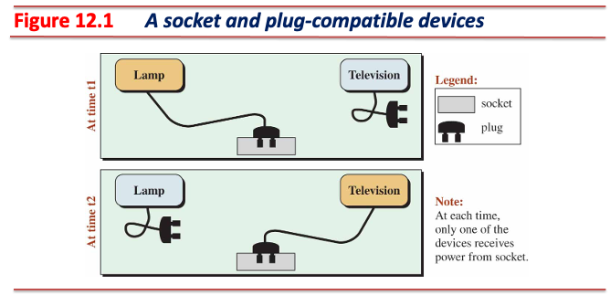
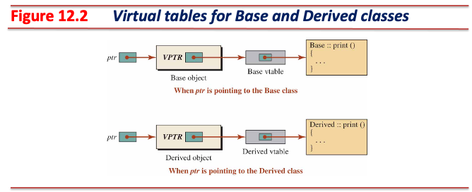
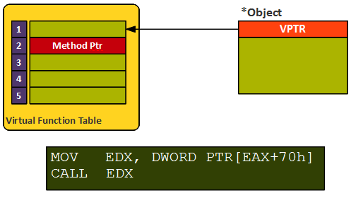
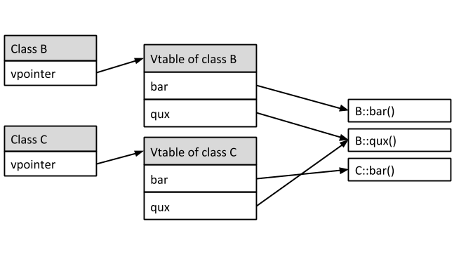
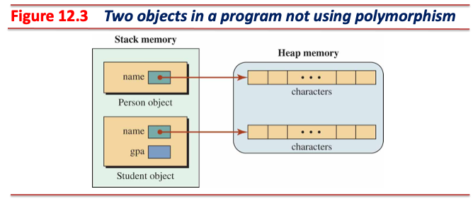
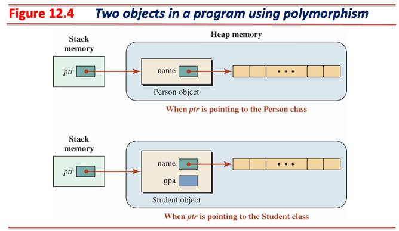
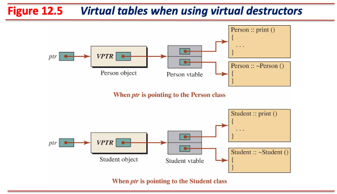
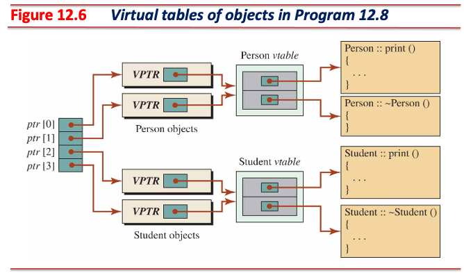

# 다형성 (Polymorphism)

## 실세계에서의 다형성 예시: Plug-compatible Objects



* 두 개의 전자기기 (램프, 텔레비전)는 **표준 플러그**를 **표준 소켓**에 꽂을 수 있음
  * At time t1: 램프를 소켓에 연결
  * At time t2: 텔레비전을 소켓에 연결
* 각 전자기기는 소켓으로부터 **동일한 전원**을 공급받아 서로 다른 일을 수행
  * 램프는 전기를 공급 받아 빛을 냄
  * 텔레비전은 전기를 공급 받아 화면에 영상을 표시하고 스피커를 통해 소리를 재생함

---

## 프로그래밍에서의 다형성

* 객체의 **실제 형**에 따라 **같은 인터페이스**로 **다양한 동작**을 실행할 수 있는 기능
  * 실제 형: 전자기기의 유형
  * 같은 인터페이스: 전자기기의 표준 플러그
  * 다양한 동작: 동일한 전원을 공급받는 전자기기는 서로 다른 일을 수행

### 다형성을 사용하기 위한 조건

* 기반 클래스 형 포인터 혹은 레퍼런스
  * 예시에서의 **표준 소켓**
  * 포인터는 여러 형 객체를 가리킬 수 있어야 함
* 상속 계층 (inheritance hierarchy)에 속하는 호환 객체 (exchangeable ojbects)
  * 예시에서의 **표준 플러그**
  * 기반 클래스 형 포인터는 호환 객체를 가리킬 수 있음
* 가상 함수 (virtual functions)
  * 예시에서의 **동일한 전원**
  * 가상 함수는 자기 자신을 호출한 객체의 **실제 형**에 맞는 함수를 찾아 호출할 수 있음

---

### 파생 클래스 형 객체의 실체화

* 파생 클래스 형 객체를 생성하면 아래 주어진 절차에 따라 메모리를 할당:
  1. 최상위 클래스 (기반 클래스이자 모든 클래스들이 이를 상속받음)의 데이터 멤버를 메모리에 점유한다.
  2. 첫 번째 파생 클래스 (immediate derived class, first-level derived class)의 데이터 멤버를 메모리에 점유한다.
  3. 두 번째 파생 클래스 (second-level derived class)의 데이터 멤버를 메모리에 점유한다.
  4. ...

```text
+------------+  <-- Base Address
| T0 members |    --> Base Class member (Size: sizeof(T0))
+------------+  <-- Base Address + sizeof(T0)
| T1 members |    --> 1st level member (Size: sizeof(T1))
+------------+  <-- Base Address + sizeof(T0) + sizeof(T1)
| T2 members |    --> 2nd level member (Size: sizeof(T2))
+------------+  <-- Base Address + sizeof(T0) + sizeof(T1) + sizeof(T2)
| ...        |
+------------+  <-- Base Address + ∑(sizeof(Ti)) (i = 0 to n - 1)
| Tn members |    --> n-level member (Size: sizeof(Tn))
+------------+  <-- Base Address + ∑(sizeof(Ti)) (i = 0 to n)
```

* **기반 클래스 형 포인터는 기반 클래스를 상속한 모든 클래스 형 객체를 가리킬 수 있음**
  * 기반 클래스로부터 파생된 모든 객체는 **기반 클래스 영역**을 포함
  * 기반 클래스 형 포인터가 파생 클래스 형 객체를 가리키면 **기반 클래스 영역**만 가리킴

---

### 불완전한 다형성 - 일반 함수 오버라이드 (Non-virtual Function Override)

```cpp
#include <iostream>

class Base {
 public:
  void print() const { std::cout << "In the base class" << std::endl; }
};

class Derived : public Base {
 public:
  void print() const { std::cout << "In the derived class" << std::endl; }
};

int main() {
  Base* ptr = new Base();
  ptr->print();
  delete ptr;
  ptr = new Derived();
  ptr->print();
  delete ptr;
  return 0;
}
```

* `ptr`은 기반 클래스 형 포인터
* 컴파일러는 `ptr->print()` 문장을 처리할 때 **포인터의 형**을 보고 `Base::print()` 호출
  * 가리키는 대상과 관계 없이 컴파일 시점에 호출할 대상이 결정됨

---

### 완전한 다형성 - 가상 함수 오버라이드 (Virtual Function Override)

```cpp
#include <iostream>

class Base {
 public:
  virtual void print() const { std::cout << "In the base class" << std::endl; }
};

class Derived : public Base {
 public:
  void print() const override {
    std::cout << "In the derived class" << std::endl;
  }
};

int main() {
  Base* ptr = new Base();
  ptr->print();
  delete ptr;
  ptr = new Derived();
  ptr->print();
  delete ptr;
  return 0;
}
```

* 가상 함수는 **런타임 시점에 함수를 호출한 객체의 실제 형에 따라 함수를 선택할 수 있도록 설계됨**

---

## 가상 함수 (Virtual Functions)

* 기반 클래스에서 선언되고 파생 클래스에서 재정의 (override)될 수 있는 함수
* 가상 테이블과 가상 포인터의 도움을 받아 런타임 시점에 호출될 함수를 결정할 수 있음

### 가상 테이블 (Virtual Tables, Vtables)

* 상속 계층 구조에 속한 클래스가 가상 함수를 사용할 경우 생성되는 테이블
  * 컴파일 시점에 생성됨
  * 만약 가상 함수를 사용하지 않는다면 가상 테이블은 생성되지 않음
* 객체가 호출한 함수가 가상 함수라면, 객체의 실제 형에 해당하는 가상 테이블을 참조
  * 가상 테이블은 객체가 실제로 호출할 수 있는 가상 함수들을 기록한 **함수 포인터 테이블**
  * **런타임 시점**에 호출될 함수를 결정할 수 있음



---

### 가상 포인터 (Virtual Pointers, Vptr)

* 가상 테이블은 상속 계층 구조에 속한 모든 클래스마다 생성됨
* 각 클래스마다 가상 테이블을 참조할 수 있도록 가상 포인터가 **객체 내에 생성됨**
  * 컴파일러에 의해 런타임 시점에 추가되는 포인터
    * 컴파일러가 컴파일 시점에 가상 포인터를 설정하는 코드를 생성
    * 런타임 시스템은 컴파일러가 만들어 놓은 코드를 처리
  * 클래스에 속하는 것이 아닌 **객체에만 존재하는 포인터**
* 가상 포인터는 해당 객체의 형에 해당하는 가상 테이블을 가리키도록 설정됨
* **실체화된 객체의 가장 낮은 메모리 번지에 가상 포인터가 위치함**



---

### 가상 함수 사용 방법

#### 기반 클래스 가상 함수

* 함수 선언부에 `virtual` 키워드 사용
  * 함수의 정의와 선언을 분리할 경우, 선언부에만 `virtual` 키워드 사용

#### 파생 클래스 가상 함수

* 기반 클래스의 가상 함수를 **재정의**하여 사용
  * 파생 클래스의 함수 시그니처는 기반 클래스의 가상 함수의 시그니처와 동일해야 함
* 함수 선언부에 `virtual` 또는 `override` 키워드 사용
  * 함수의 정의와 선언을 분리할 경우, 선언부에만 `virtual` 또는 `override` 키워드 사용

```cpp
class Animal {
 public:
  // This is a virtual function in the base class with no parameters
  virtual void move() const { /* ... */ }
};

class Cat : public Animal {
 public:
  // `override` is used to ensure that the derived class function is overriding
  // a virtual function from the base class. In this case, the function
  // signature `move()` matches the base class function (`move()`).

  // This function correctly overrides the base class's `move` function.
  void move() const override { /* ... */ }  // Ok
};
```

---

#### 파생 클래스에서의 가상 함수 재정의

* **`virtual` 키워드를 사용하는 것 보다는 `override` 키워드를 사용할 것을 적극 권장**

```cpp
class Animal {
 public:
  // This is a virtual function in the base class with no parameters
  virtual void move() const { /* ... */ }
};

class Dog : public Animal {
 public:
  // Error: `override` is used to ensure that the derived class function is
  // overriding a virtual function from the base class. In this case, the
  // function signature `move(int, int)` does not match the base class
  // function (`move()`). When function signatures don't match, the
  // `override` keyword triggers a compile-time error, preventing accidental new
  // function declaration.
  //
  // If `virtual` is used instead of `override` without matching the base class
  // function, this would declare a new virtual function in the derived class
  // instead of overriding the base class function.
  void move(int x, int y) const override { /* ... */ }  // Error
};
```

---

### 가상 함수 동작 예시

* 가상 테이블은 **기반 클래스에서의 가상 함수 선언 순서대로 함수 포인터를 엔트리에 삽입**
  * 가상 테이블은 컴파일 시점에 생성되고, 가상 포인터는 런타임 시점에 객체 내부에 설정됨

```cpp
#include <iostream>

class B {
 public:
  virtual void bar();  // vtable[0]
  virtual void qux();  // vtable[1]
};

void B::bar() { std::cout << "This is B's implementation of bar"; }
void B::qux() { std::cout << "This is B's implementation of qux"; }

class C : public B {
 public:
  // Class C's vtable entry at index 1 is assigned to C::bar during compile time
  void bar() override;
};

void C::bar() { std::cout << "This is C's implementation of bar"; }
```



---

### 다형성에서의 기반 클래스

```cpp
#include <iostream>

class A {
  // A does not have a virtual function.
};

class B : public A {
 public:
  virtual void print() {  // Declares a virtual function.
    std::cout << "B's print" << std::endl;
  }
};

class C : public B {
 public:
  void print() override {  // Overrides the virtual function.
    std::cout << "C's print" << std::endl;
  }
};

int main() {
  B* obj = new C();
  obj->print();  // Calls C's print() (dynamic binding).
}
```

* 일반 상속 관계라면 기반 클래스는 `A`
* **다형성에서의 기반 클래스는 `B`**
  * 가상 함수를 선언한 클래스
  * 다형성을 사용하기 위해서는 `B` 형 포인터를 사용해야 함

---

### 일반 오버라이드 함수와 가상 오버라이드 함수 간 동작 비교

#### 일반 함수

```cpp
#include <iostream>

class Base {
 public:
  void NormalFunction() { std::cout << "Base normal function" << std::endl; }
};

class Derived : public Base {
 public:
  void NormalFunction() { std::cout << "Derived normal function" << std::endl; }
};

int main() {
  Base* ptr = new Derived();
  ptr->NormalFunction();
  delete ptr;
}
```

* 컴파일 시점에서의 `ptr->NormalFunction()` 문장 처리:
  * 일반 함수이므로 `Base::NormalFunction()`을 호출하도록 결정
    * 함수의 주소를 바로 참조하여 호출
  * 정적 바인딩 (static binding)

---

#### 가상 함수

```cpp
#include <iostream>

class Base {
 public:
  virtual void VirtualFunction() {
    std::cout << "Base virtual function" << std::endl;
  }
};

class Derived : public Base {
 public:
  void VirtualFunction() override {
    std::cout << "Derived virtual function" << std::endl;
  }
};

int main() {
  Base* ptr = new Derived();
  ptr->VirtualFunction();
  delete ptr;
}
```

* 컴파일 시점에서의 `ptr->VirtualFunction()` 문장 처리:
  * 가상 함수이므로 호출할 함수를 결정할 수 없음
    * `vptr` → `vtable` → 가상 테이블의 함수 포인터를 호출
    * `VirtualFunction`은 기반 클래스에서 0번째 인덱스에 존재
    * 가상 테이블의 0번째 인덱스의 함수 포인터를 호출하도록 처리
  * 동적 바인딩 (dynamic binding)

---

### 생성자와 소멸자

* 생성자는 가상화 불가
  * 생성자는 클래스마다 이름이 다름
    * 오버라이드 불가
  * 생성자를 가상화할 경우, 파생 클래스 형 객체 생성 시 생성자 호출 순서가 깨질 수 있음
  * **가상 포인터는 객체가 실체화되는 시점에 객체 내에 할당**
    * 가상 생성자는 가상 테이블을 참조할 수 없는 상태

* **소멸가는 가상화 가능**
  * 소멸자도 클래스마다 이름이 다르지만, 객체의 소멸 시점에 런타임이 자동으로 호출
  * 객체 소멸 시점에는 가상 포인터도 객체 내에 설정되어 있음
  * **클래스 설계 시 가상 함수를 사용할 경우 반드시 가상 소멸자를 사용해야 함**

---

#### 다형성을 사용하지 않는 상황에서의 소멸

* 기반 클래스 `Person`
  * `std::string` 형 데이터 멤버 `name`
* 파생 클래스 `Student`
  * 상속 받은 `std::string` 형 데이터 멤버 `name`과 `double` 형 데이터 멤버 `gpa`



* 각 클래스 형 객체가 스택 영역에 할당되었다가 소멸될 경우 소멸자에 의해 올바르게 자원 반환
  * 만약 파생 클래스 형 객체가 소멸되어야 한다면, 런타임 시스템에 의해 소멸자가 자동 호출됨
    * 파생 클래스 형 소멸자 호출 → 기반 클래스 형 소멸자 호출
  * 메모리 누수 (memory leak) 없음

---

#### 다형성을 사용하는 상황에서의 소멸



```cpp
Person* ptr = new Student();
// do something...
delete ptr;   // It does not deletes Student because ptr type is `Person*`
```

* 기반 클래스 형 포인터는 스택 영역, 파생 클래스 형 객체는 힙 영역 할당
* 기반 클래스 형 포인터가 파생 클래스 형 객체를 가리키는 상황에서, 포인터 삭제 시 문제 발생
  * 컴파일 시점에 `ptr`의 형을 확인해 해당 형의 소멸자 (`~Person()`)가 호출되도록 결정 
  * 힙 영역의 파생 클래스 객체는 **기반 클래스 멤버**만 소멸 (**메모리 누수**)

---

* 다형성을 사용하는 상황에서의 안전한 자원 해제 방법
  * 기반 클래스 형 포인터로 호환 객체를 동적 할당하여 가리키고 삭제하는 경우
  * 소멸자를 가상화하여 런타임 시스템이 소멸자를 호출할 때 **가상 테이블**을 참조하도록 해야 함



* 가상 소멸자 또한 가상 테이블에 인덱싱됨
  * 객체 소멸 시점에는 객체 내부에 가상 포인터가 존재하며, 가상 소멸자를 사용할 수 있음
  * 클래스마다 소멸자의 이름은 다르지만, 소멸 시점에 런타임 시스템에 의해 자동 호출됨
    * 소멸 시점에 호출되는 특별한 멤버 함수는 소멸자 뿐이므로, 이름은 중요하지 않음

---

### 가상 소멸자를 사용한 다형성 예시

* person.hpp

```cpp
#pragma once

#include <string>

class Person {
  std::string name_;

 public:
  explicit Person(const std::string& name);
  virtual ~Person();           // vtable[0]

  virtual void print() const;  // vtable[1]
};
```

---

* person.cc

```cpp
#include "person.hpp"

#include <iostream>
#include <string>

Person::Person(const std::string& nm) : name_(nm) {
  std::cout << "Person's ctor" << std::endl;
}

Person::~Person() { std::cout << "Person's dtor" << std::endl; }

void Person::print() const { std::cout << "Name: " << name_ << std::endl; }
```

---

* student.hpp

```cpp
#pragma once

#include <string>

#include "person.hpp"  

class Student : public Person {
  double gpa_;

 public:
  Student(const std::string& name, double gpa);

  // Note that a virtual destructor, despite having a different name, is a
  // special member function that is automatically called by the system at the
  // time of destruction. It is also managed in the virtual table (vtable) by an
  // index, just like other virtual functions.
  //
  // Class Student's vtable entry at index 0 is assigned to Student::~Student
  // during compile time
  ~Student() override;

  // Class Student's vtable entry at index 1 is assigned to Student::print
  // during compile time
  void print() const override;
};
```

---

* student.cc

```cpp
#include "student.hpp"  

#include <iostream>
#include <string>

Student::Student(const std::string& nm, double gp) : Person(nm), gpa_(gp) {
  std::cout << "Student's ctor" << std::endl;
}

Student::~Student() { std::cout << "Student's dtor" << std::endl; }

void Student::print() const {
  Person::print();
  std::cout << "GPA: " << gpa_ << std::endl;
}
```

---

* main.cc

```cpp
#include "student.hpp"  

int main() {
  Person* ptr = new Person("Lucie");
  std::cout << "Person Information";
  ptr->print();
  std::cout << std::endl;
  delete ptr;

  ptr = new Student("John", 3.9);
  std::cout << "Student Information";
  ptr->print();
  std::cout << std::endl;
  delete ptr;
  return 0;
}
```

---

### 배열에서의 다형성



* 여러 개의 호환 객체를 동시에 사용하여 다형성 사용
  * 이전 실습 코드에서 main.cc 부분만 배열을 사용하도록 수정

---

* main.cc

```cpp
#include <iostream>

#include "student.hpp"  

int main() {
  Person* ptr[4];
  ptr[0] = new Student("Joe", 3.7);
  ptr[1] = new Student("John", 3.9);
  ptr[2] = new Person("Bruce");
  ptr[3] = new Person("Sue");
  for (int i = 0; i < 4; ++i) {
    ptr[i]->print();
    std::cout << std::endl;
  }
  for (int i = 0; i < 4; ++i) delete ptr[i];
  return 0;
}
```

---

### 다른 객체지향 프로그래밍 언어에서의 다형성

* C++에서 다형성을 사용하기 위한 조건 3가지
  * 기반 클래스 형 포인터 혹은 기반 클래스 형 레퍼런스
  * 호환 객체
  * 가상 함수
* Java에서의 모든 메서드는 기본적으로 가상 메서드

#### 가상 함수의 비용

* 일반 함수는 컴파일 시점에 호출할 대상이 결정되어 비용이 발생하지 않음
* 가상 함수는 컴파일 시점에 호출할 대상을 결정하지 못하므로 비용 발생
  * `vptr` → `vtable` → 가상 테이블의 함수 포인터를 호출하도록 명령어 생성

---

## 정적 바인딩 (Static Binding)과 동적 바인딩 (Dynamic Binding)

* 함수는 두 개의 개체 (entities)로 구분되어 있음
  * 함수 호출과 함수 정의
  * 함수 호출은 실제로 함수가 실행되는 구체적인 행위
    * 각 호출은 전달인자 형태와 실행 시점에 따라 다른 결과를 초래할 수 있음
  * 함수 호출과 함수 정의는 서로 분리하여 관리
    * 함수 정의는 함수가 호출될 때 실행될 동작을 기술
    * 함수 호출은 해당 동작을 언제, 어떻게 실행할지 결정하는 별개의 역할 담당
* 바인딩은 함수 호출과 함수 정의를 어떻게 연관할 것인지를 의미
* 일반 함수는 하나의 정의를 갖고 있음
  * 함수 호출 시 대상이 되는 함수 정의가 하나이므로, 호출 대상이 명확함
* 가상 함수는 여러 개의 정의를 가질 수 있음
  * 함수 호출 시 대상이 되는 함수 정의가 여러개일 수 있으므로, **올바른 호출 대상을 찾아야 함**
* 바인딩은 런타임 시점에 발생하는 함수 호출이 정확히 어떤 함수 정의와 연관되는지 결정하는 과정

---

### 정적 바인딩

* 컴파일 시점에 함수 호출과 함수 정의 간 연관을 확정
  * 컴파일 시점 바인딩 (compile-time binding)
  * 조기 바인딩 (early binding)
* 함수 호출 대상이 일반 함수 (클래스의 멤버 함수나 전역 함수)인 경우
  * 컴파일 시점에 어떤 함수가 호출될지 명확하게 결정됨

```cpp
Person person;
person.print();   // Person::print()

Student student;
student.print();  // Student::print()
```

---

### 동적 바인딩

* 런타임 시점에 함수 호출과 함수 정의 간 연관을 확정
  * 런타임 시점 바인딩 (run-time binding)
  * 지연 바인딩 (late binding)
* 아래와 같은 경우는 컴파일 시점에 호출될 함수를 결정할 수 없음

```cpp
int user_input;
std::cin >> user_input;
Base* ptr;
if (user_input == 1)
  ptr = new Base();
else
  ptr = new Derived();
ptr->func();  // In this case, we don't know which `func` will be invoked on 
              // compile-time
```

* 컴파일 시점에 호출될 함수를 연관하지 못하는 경우는 동적 바인딩
* C++의 가상함수는 동적 바인딩 상황에서 올바른 함수를 호출할 수 있도록 **지원**
  * 가상 함수를 사용한 동적 바인딩은 런타임 시점의 객체 형에 따라 호출할 함수 결정
  * 가상 함수를 사용한 동적 바인딩은 다형성 (run-time polymorphism)

---

## Appendix A. `vptr`의 유무에 따른 객체 크기 비교

```cpp
#include <iostream>

class NoVirtual {
 public:
  int a;
  double b;
};

class WithVirtual {
 public:
  int a;
  double b;
  virtual void func() {}  // declare a virtual function using a virtual keyword
};

int main() {
  NoVirtual no_virtual_obj;
  WithVirtual with_virtual_obj;

  std::cout << "Size of NoVirtual object: " << sizeof(no_virtual_obj)
            << " bytes" << std::endl;
  std::cout << "Size of WithVirtual object: " << sizeof(with_virtual_obj)
            << " bytes" << std::endl;

  return 0;
}
```

---

## Appendix B. 가상 테이블의 포인터와 실제 멤버 함수 포인터 간 비교

* test.hpp
```cpp
#pragma once

#include <iostream>

class Base {
 public:
  virtual void Show() { std::cout << "Base::Show called" << std::endl; }
  virtual void Display() { std::cout << "Base::Display called" << std::endl; }
};

class Derived : public Base {
 public:
  void Show() override { std::cout << "Derived::Show called" << std::endl; }
  virtual void Print() { std::cout << "Derived::Print called" << std::endl; }
};

// Helper function to get the virtual function pointer from vtable
typedef void (*FuncPtr)();  // Function pointer type definition

FuncPtr GetVirtualFunctionPointer(Base* obj, int index) {
  // Retrieves vptr from the object and returns the function pointer
  // from the vtable at the specified index
  return reinterpret_cast<FuncPtr*>(*reinterpret_cast<void**>(obj))[index];
}
```

---

* main.cc

```cpp
#include <iostream>

#include "test.hpp"

int main() {
  // Get the function pointers from the vtable for the Base class using index
  Base base_obj;
  FuncPtr base_vtable_show = GetVirtualFunctionPointer(&base_obj, 0);
  FuncPtr base_vtable_display = GetVirtualFunctionPointer(&base_obj, 1);

  // Get the function pointers from the vtable for the Derived class using index
  Derived derived_obj;
  FuncPtr derived_vtable_show = GetVirtualFunctionPointer(&derived_obj, 0);
  FuncPtr derived_vtable_display = GetVirtualFunctionPointer(&derived_obj, 1);
  FuncPtr derived_vtable_print = GetVirtualFunctionPointer(&derived_obj, 2);

  // Compare the pointers for the Base class
  std::cout << "Base class vtable function pointers:" << std::endl;
  std::cout << "Show function pointer from vtable(" << (void*) base_vtable_show
            << "):";
  base_vtable_show();
  std::cout << "Display function pointer from vtable("
            << (void*) base_vtable_display << "):";
  base_vtable_display();

  // Compare the pointers for the Derived class
  std::cout << "\nDerived class vtable function pointers:" << std::endl;
  std::cout << "Show function pointer from vtable("
            << (void*) derived_vtable_show << "):";
  derived_vtable_show();
  std::cout << "Display function pointer from vtable("
            << (void*) derived_vtable_display << "):";
  derived_vtable_display();
  std::cout << "Print function pointer from vtable("
            << (void*) derived_vtable_print << "):";
  derived_vtable_print();
  return 0;
}
```
