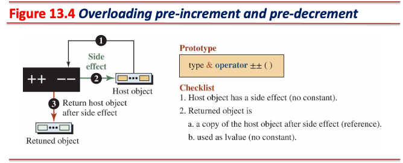
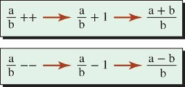
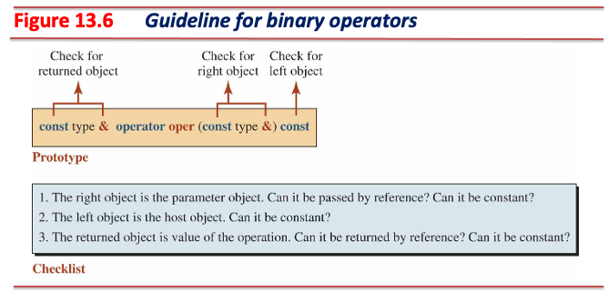
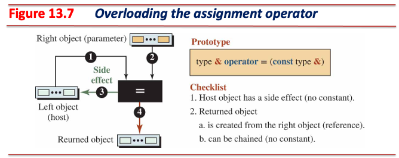
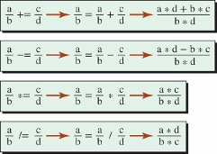

# [연산자 오버로딩 (Operator Overloading)](https://en.cppreference.com/w/cpp/language/operators)

* **C++는 기본 자료형을 위한 연산자를 클래스 형 객체에 사용할 수 있도록 재정의할 수 있음**
  * 분수를 표현하는 `Fraction`형 클래스 객체 `fr1`, `fr2`가 존재한다고 가정
  * 두 객체를 서로 더하고자 할 때, 멤버 함수 호출을 통해 계산할 수 있음
    * `fr1.add(fr2)`
  * 덧셈 이항 연산자 (`+`)를 `Fraction`형 클래스에서 재정의할 경우 아래와 같이 사용 가능
    * `fr1 + fr2`
    * **훨씬 직관적이며 가독성을 향상시킬 수 있음**

---

## C++ 연산자들의 재정의 가능성 (Overloadability)

### Non-overloadable

| Operator  | Arity  | Name               | Overloadability  |
|-----------|--------|--------------------|------------------|
| `::`      | primary| scope              | Non-overloadable |
| `.`       | postfix| member selector    | Non-overloadable |
| `.*`      | unary  | ptr to member      | Non-overloadable |
| `?:`      | ternary| conditional        | Non-overloadable |
| `&&`      | binary | logical and        | Non-overloadable |
| `\|\|`    | binary | logical or         | Non-overloadable |

* Additional non-overloadable operators (special operators)
  * `sizeof`, `typeid`, `alignof`, `noexcept`, `decltype`
  * `new`, `delete`
  * `const_cast`, `static_cast`, `dynamic_cast`, `reinterpret_cat`
  * `throw`

---

### Not Recommended

| Operator  | Arity  | Name               | Overloadability                   |
|-----------|--------|--------------------|-----------------------------------|
| `&`       | unary  | address-of         | Overloadable (But not recommended)|
| `,`       | binary | comma              | Overloadable (But not recommended)|
| `->`      | postfix| member access      | Overloadable (But not recommended)|

* 이미 연산자의 역할이 명확해 재정의할 필요가 없는 연산자들
* 상기 명령어들은 재정의할 경우 코드의 가독성을 해치고 혼란을 야기할 수 있음
  * 재정의하지 않는 것을 권장

---

## 오버로딩 원칙 (Overloading Principles)

* Precedence
  * 연산자 고유의 우선순위 변경 불가

* Associativity
  * 연산자 고유의 결합방향 변경 불가

* Commutativity
  * 연산자 고유의 교환 법칙 변경 불가
    * C++의 덧셈 연산자는 교환 법칙 보장
    * 재정의된 덧셈 연산자 또한 교환 법칙을 반드시 보장해야 함

* Arity
  * 연산자 고유의 피연산자 수 변경 불가

* No New operators
  * 새로운 연산자 추가 불가
    * C++에서 사용중인 연산자 중 재정의 가능성이 있는 연산자들만 재정의 가능

* No Combination
  * C++에서 사용중인 두 개 이상의 연산자를 조합해 새로운 연산자 정의 불가

---

## 연산자 함수 (Operator Function)

* 연산자 오버로드 (재정의)를 하기 위해 클래스 내 다음과 같은 형태로 멤버 함수 정의 필요


* `operator`
  * 고정된 (reserved) 이름
* `symbol`
  * 재정의할 연산자 표기
  * e.g., `operator*`
* 연산자 재졍의 시 멤버 함수를 사용해야 하는 경우와, 비멤버 함수를 사용해야 하는 경우가 있음

---

## `Fraction` 클래스에서의 연산자 재정의

### 단항 연산자 (Guideline for Unary Operators)


* 피연산자가 하나인 연산자
* 피연산자는 **호스트 객체**
* 호스트 객체와 반환 객체를 고려하여 재정의

---

#### 단항 연산자 - 양수 (Plus), 음수 (Minus) 연산자


* 양수, 음수 연산자는 부수효과가 없음
* 연산 평가 결과는 부호가 결정된 객체의 값 (*rvalue*)

---


```cpp
// Declaration of + operator
const Fraction operator+() const; 
// Definition of plus operator
const Fraction Fraction::operator+() const {
  Fraction temp(+numer_, denom_);  // a new object
  return temp;
}
// Declaration of - operator
const Fraction operator-() const;
// Definition for minus operator
const Fraction Fraction::operator-() const {
  Fraction temp(-numer_, denom_);  // a new object   
  return temp;
}
```

---

#### 단항 연산자 - 전위 증가 (Pre-increment), 전위 감소 (Pre-decrement) 연산자



* 전위 증가, 전위 감소 연산자는 부수 효과가 발생
* 연산 평가 결과는 **수정된 호스트 객체의 참조 (*lvalue*)**
  * `++++++x`, `----x` 등의 표현이 가능해야 함

---


```cpp
// Declaration of pre-increment operator
Fraction& operator++();
// Definition pre-increment operator
Fraction& Fraction::operator++() {
  numer_ = numer_ + denom_;
  this->Normalize();
  return *this;
}

// Declaration of pre-decrement operator
Fraction& operator--();
// Definition pre-decrement operator
Fraction& Fraction::operator--() {
  numer_ = numer_ - denom_;
  this->Normalize();
  return *this;
}
```

---

#### 단항 연산자 - 후위 증가 (Post-increment), 후위 감소 (Post-decrement) 연산자


* 후위 증가, 후위 감소 연산자는 부수 효과가 발생
* 연산 평가 결과는 **원본 호스트 객체의 복사본 (*rvalue*)**
* 전위 증가, 전위 감소 연산자와 서로 구분하기 위해 **불필요한 (dummy) 정수형 매개변수** 사용
  * 실제 연산에 사용되지 않는 매개변수
  * 컴파일 시점에 후위 증가, 후위 감소를 구분하기 위해서만 사용
  * **반드시 정수형 매개변수여야 하며**, 매개변수 이름은 생략 가능

---



```cpp
// Declaration of post-increment operator
const Fraction operator++(int);  // uses a dummy integer parameter 
// Definition post-increment operator
const Fraction Fraction::operator++(int) {  // the dummy parameter's name is opt.
  Fraction temp(numer_, denom_);
  ++(*this);
  return temp;
}

// Declaration of post-decrement operator
const Fraction operator--(int);  // uses a dummy integer parameter
// Definition post-decrement operator
const Fraction Fraction::operator--(int) {  // the dummy parameter's name is opt.
  Fraction temp(numer_, denom_);
  --(*this);
  return temp;
}
```

---

### 이항 연산자 (Guideline for Binary Operators)



* 피연산자가 두 개인 연산자
* 하나의 피연산자는 **호스트 객체**이며, 다른 하나의 피연산자는 **매개변수 객체**
* 호스트 객체와 반환 객체, 매개변수를 고려하여 재정의
* **좌측 피연산자와 우측 피연산자의 역할 (role)이 다른 경우, 멤버 함수로 오버로드해야 함**
  * e.g., 좌측 피연산자는 *lvalue*, 우측 피연산자는 *rvalue*인 경우
* **좌측 피연산자와 우측 피연산자의 역할이 같은 경우, 비멤버 함수로 오버로드해야 함**

---

#### 이항 연산자 - 대입 (Assignment) 연산자



* 좌측 피연산자 (호스트 객체)는 *lvalue*, 우측 피연산자 (매개변수)는 *rvalue*
* 좌측 피연산자는 부수 효과가 발생
* 우측 피연산자는 대입 과정 중 수정되어서는 안 되므로, 상수여야 함
* 연산 평가 결과는 **수정된 호스트 객체의 참조 (*lvalue*)**
  * `x = y = z`
    * 값 반환 형태로 연산자를 재정의해도 결과는 동일하게 동작하나, 불필요한 복사 생성자가 호출됨
  * `(x = y) = z`
    * 괄호를 사용해 표현식의 평가 우선순위를 변경해도 기대한 대로 동작해야 함
    * 상수 반환 형태로 연산자를 재정의하면 위와 같은 경우를 처리하지 못함

---

* **대입 전 호스트 객체와 매개변수가 같은지 반드시 확인해야 함**
  * 확인하지 않으면 호스트 객체의 값이 대입 전 제거될 수 있음

```cpp
#include <iostream>

class MyClass {
  int* data_;

 public:
  MyClass(int value) { data_ = new int(value); }
  ~MyClass() { delete data_; }

  MyClass& operator=(const MyClass& other) {
    if (this == &other) return *this;

    delete data_;
    data_ = new int(*other.data_);
    return *this;
  }

  int data() { return *data_; }
};

int main() {
  MyClass mc(10);
  mc = mc;  // It will be converted to the following code: mc.operator=(mc)
  std::cout << mc.data() << std::endl;
  return 0;
}
```

---


```cpp
// Declaration of assignment operator
Fraction& operator=(const Fraction& right)
// Definition of assignment operator
// left operand: the host object, right operand: the parameter
Fraction& Fraction::operator=(const Fraction& right) {
  if (*this != right) {  // or check in another way
    numer_ = right.numer_;
    denom_ = right.denom_;
  }
  return *this;
}
```

---

#### 이항 연산자 - 복합 대입 (Compound Assignment) 연산자



* 구현 원리는 대입 연산자와 동일

---

```cpp
// Declaration of += operator
Fraction& operator+=(const Fraction& right)
// Definition of += operator
Fraction& Fraction::operator+=(const Fraction& right) {
  numer_ = numer_ * right.denom_ + denom_ * right.numer_;
  denom_ = denom_ * right.denom_;
  Normalize();
  return *this;
}

// Declaration of -= operator
Fraction& operator-=(const Fraction& right)
// Definition of -= operator
Fraction& Fraction::operator-=(const Fraction& right) {
  numer_ = numer_ * right.denom_ - denom_ * right.numer_;
  denom_ = denom_ * right.denom_;
  Normalize();
  return *this;
}
```

---

```cpp
// Declaration of *= operator
Fraction& operator*=(const Fraction& right)
// Definition of *= operator
Fraction& Fraction::operator*=(const Fraction& right) {
  numer_ = numer_ * right.numer_;
  denom_ = denom_ * right.denom_;
  Normalize();
  return *this;
}

// Declaration of /= operator
Fraction& operator/=(const Fraction& right)
// Definition of /= operator
Fraction& Fraction::operator/=(const Fraction& right) {
  numer_ = numer_ * right.denom_;
  denom_ = denom_ * right.numer_;
  Normalize();
  return *this;
}
```

---

## 기타 연산자 (Other Operators)

### 스마트 포인터 (Smart Pointers)

* 특정 지역에서 동적으로 객체를 할당한 후 예기치 못한 상황으로 해당 지역을 벗어날 수 있음
  * 할당한 객체가 소멸되지 않으면 메모리 누수가 발생할 수 있음

```cpp
int calc_with_dynamic_fraction_object() {
  // let's assume that this function is too complex; there are many conditions
  bool cond1 = true, cond2 = true, cond3 = false;
  Fraction* ptr = new Fraction(2, 5);
  if (!cond1) return 1;
  if (!cond2) return 2;
  if (!cond3) return 3;
  delete ptr;
  return 0;
}
```

---


* **스마트 포인터는 특정 지역에서 동적 할당한 객체가 해당 지역을 벗어날 때 자동으로 소멸됨을 보장**
* 클래스 내 데이터 멤버가 포인터를 사용할 경우, 두 연산자 재정의 필요
  * 간접 (역참조) 연산자 (indirection operator, `*`)
  * 멤버 선택 연산자 (member-selector operator, `->`)

---

```cpp
class Fraction;  // Forward declaration for the type you want to use

class SmartPtr {
  Fraction* ptr_;

 public:
  explicit SmartPtr(Fraction* p) : ptr_(p) {}
  ~SmartPtr() { delete ptr_; }
  Fraction& operator*() const { return *ptr_; }
  Fraction* operator->() const { return ptr_; }
};

int main() {
  SmartPtr sp(new Fraction(2, 5));
  (*sp).print();
  sp->print();  // `sp` is a stack instance; it's dtor will auto-invoke!
}
```

---

### 배열 클래스 (Array Class)

* 첨자 연산을 필요로 하는 클래스 구현 시 첨자 (subscript) 연산자 재정의 필요
  * 클래스가 내부적으로 문자열 또는 리스트와 같이 배열처럼 사용되는 데이터를 사용하는 경우
* 첨자 연산자는 이항 연산자
  * 좌측 피연산자는 배열의 이름 역할 수행
  * 우측 피연산자는 배열의 인덱스 역할 수행

---


* 접근자 (accessor)와 변경자 (mutator)를 같이 구현해야 함
  * 접근자는 부수 효과가 발생하지 않음 (*rvalue*로 평가됨)
  * 변경자는 부수 효과 발생 (*lvalue*로 평가됨)

---

```cpp
#include <cassert>
#include <iostream>

class Array {
  double* ptr_;
  int size_;

 public:
  explicit Array(int s) : size_(s) { ptr_ = new double[size_]; }
  ~Array() { delete[] ptr_; }

  // Accessor
  double operator[](int index) const {
    if (index < 0 || index >= size_) {
      std::cerr << "Index is out of range. Program terminates.";
      assert(false);
    }
    return ptr_[index];
  }

  // Mutator
  double& operator[](int index) {
    if (index < 0 || index >= size_) {
      std::cerr << "Index is out of range. Program terminates.";
      assert(false);
    }
    return ptr_[index];
  }
};

int main() {
  Array arr(3);
  arr[0] = 22.31;
  arr[1] = 78.61;
  arr[2] = 65.22;
  for (int i = 0; i < 3; i++)
    std::cout << "Value of arr [" << i << "]: " << arr[i] << std::endl;
  return 0;
}
```

---

### 펑터 (Functor)

* 함수 호출 연산자를 재정의하여 **함수의 상태를 유지하는 함수 객체를 생성할 수 있음**
  * 객체로부터 함수를 호출할 수 있는 형태
  * 객체 내 데이터 멤버에 유지하고자 하는 정보 보관

```cpp
#include <iostream>
#include <limits>

class Smallest {
  int value_;

 public:
  Smallest() : value_(std::numeric_limits<int>::max()) {}

  // function call operator
  int operator()(int next) {
    if (next < value_) value_ = next;
    return value_;
  }
};

int main() {
  Smallest smallest;
  std::cout << "Smallest so far: " << smallest(100)
            << std::endl;  // Functor CAN keep their state.
  std::cout << "Smallest so far: " << smallest(50) << std::endl;
  std::cout << "Smallest so far: " << smallest(30) << std::endl;
  return 0;
}
```
