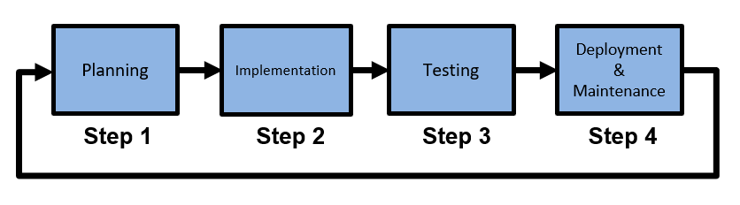
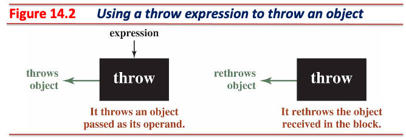
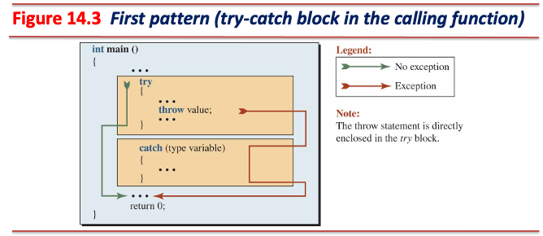
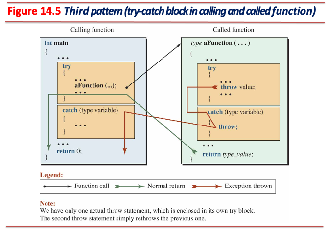
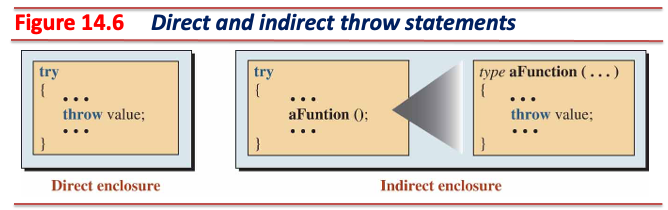

# 예외 처리 (Exception Handling)

## 예외 (Exception)

* 예외는 오류의 한 종류이지만, 발생 빈도가 다른 오류들에 비해 낮아 예외라고 표현함
* 일반적인 오류와 예외는 프로그램 지속성 (fault tolerance) 관점에서 **차이**가 있음:
  * 일반적인 오류 (e.g., 논리 오류)는 잘못된 동작을 수행할 수 있으나 중지되지는 않음
  * **예외는 발생 즉시 프로그램이 중단됨**
* 프로그램에 발생할 수 있는 오류들을 미리 확인하여 수정하는 과정을 테스팅이라고 함
  * 개발 프로세스 중 가장 중요한 절차 중 하나
  * C++는 [GoogleTest](https://github.com/google/googletest)를 사용해 테스팅 수행



---

## 고전적인 오류 처리 (Error Handling) 방법

### Let Run-Time Environment Abort the Program

* 오류 처리가 **전혀 고려되지 않은 형태**
* 예외 발생 시 프로그램은 즉시 종료됨
* 프로그램 종료 시 원인에 대한 내용을 전혀 반환하지 않음
  * 고전적인 오류 처리 방법들 중 **가장 열등한 방법**

```cpp
#include <iostream>

int main() {
  int numer, denom, result;
  for (int i = 0; i < 5; ++i) {
    std::cout << "Enter an integer: ";
    std::cin >> numer;
    std::cout << "Enter another integer: ";
    std::cin >> denom;
    result = numer / denom;  // The statement that may create exception
    std::cout << "The result of division is: " << result << std::endl;
  }
  return 0;
}
```

---

### Ask Run-Time Environment to Abort the Program

* 기초적인 수준의 오류 처리가 사용됨
* 예외 발생 시 프로그램은 즉시 종료되나, 최소한 종료되는 이유를 설명하는 형태

```cpp
#include <iostream>
#include <cassert>

int main() {
  int numer, denom, result;
  for (int i = 0; i < 5; ++i) {
    std::cout << "Enter an integer: ";
    std::cin >> numer;
    std::cout << "Enter another integer: ";
    std::cin >> denom;
    if (!denom) {
      std::cerr << "No division by zero. Program is aborted." << std::endl;
      assert(false);
    }
    result = numer / denom;
    std::cout << "The result of division is: " << result << std::endl;
  }
  return 0;
}
```

---

### Use Error Checking

* 조금 더 발전된 수준의 오류 처리가 사용됨
* 예외 발생 시 프로그램 종료를 방지할 수 있음
* 코드 상에 **오류를 처리하는 코드와 일반 코드가 혼재되어 있음**
  * **오류를 처리하는 코드와 일반 코드가 서로 연관되어 있을 수 있음**
  * 가독성, 유지 보수성, 재사용성 감소
  * 복잡성 증가
  * **테스트 코드 적용이 어려움**

```cpp
#include <iostream>

int main() {
  int numer, denom, result;
  for (int i = 0; i < 5; ++i) {
    std::cout << "Enter an integer: ";
    std::cin >> numer;
    std::cout << "Enter another integer: ";
    std::cin >> denom;
    if (!denom) {
      std::cerr << "Division cannot be done is this case." << std::endl;
      continue;
    }
    result = numer / denom;
    std::cout << "The result of division is: " << result << std::endl;
  }
  return 0;
}
```

---

### Using Function Return Value for Error Checking

* 고전적인 오류 처리 방법 중에서 **가장 권장되는 방법**
* 수행되는 모든 문장은 **반드시 함수 내부에 존재하여야 한다**는 특징을 활용한 방법
  * 함수 외부에 있는 것들은 문장이 아닌 선언 (declarations) 또는 정의 (definitions)
    * 컴파일 시점에 처리됨
* 런타임 시 발생하는 오류들 (run-time errors)은 반드시 특정 함수 내에서 발생하게 됨
* 특정 함수 안에 수행해야 할 연산들을 작성한 뒤, 반환값을 통해 오류 발생 유무를 판별하는 방법
* 함수 반환 값을 사용한 오류 검사를 사용하는 대표적인 예는 `main` 함수
  * `main` 함수는 반환 값 (e.g., `return 0`)을 통해 런타임 시스템에 프로그램 상태를 반환
* **함수는 오류 정보만을 반환해야 하는 한계점 존재**

---

* 런타임 시스템에 전달되는 값을 확인하는 방법

```cpp
#include <iostream>

int main() {
  int n;
  std::cin >> n;
  return n;
}
```

* 프로그램 실행 후 터미널에 `echo $?`를 입력
  * 직전에 실행된 명령어 (e.g., `./run`)의 종료 상태 (exit status)를 확인할 수 있음
  * 프로그램이 명령어에 의해 실행되면 종료될 때 반환 값을 런타임 시스템으로 전달
  * 런타임 시스템은 전달 받은 반환 값을 터미널의 `$?` 변수에 저장

---

```cpp
#include <iostream>

int quotient(int numer, int denom) { return !denom ? -1 : numer / denom; }

int main() {
  int numer, denom, result;
  for (int i = 0; i < 5; ++i) {
    std::cout << "Enter an integer: ";
    std::cin >> numer;
    std::cout << "Enter another integer: ";
    std::cin >> denom;
    result = quotient(numer, denom);
    if (result == -1)  // if the numer = 4, the denom = -4, what is the result?
      std::cerr << "Error, division by zero." << std::endl;
    else
      std::cout << "The result of division is: " << result << std::endl;
  }
  return 0;
}
```

---

## C++에서의 예외 처리

* 앞서 살펴본 고전적인 오류 처리 방법들은 한계들이 존재했음
  * 특히 **예외** 상황을 처리하는 데 여러 한계점이 있었음
    * 일반 코드와 예외 처리 코드의 혼재된 형태
    * 반환 값에 의존하는 형태인 함수를 사용
* 예외 처리는 한계를 보완하여 더욱 효율적으로 예외를 처리할 수 있도록 고안한 기능

---

### Try-Catch Block


* C++ 예외 처리에서의 기본 구조이며, 두 개의 절 (clauses)로 구성됨
  * `try` 절에는 예외 발생 가능성이 있는 문장들을 작성
  * `catch` 절에는 `try` 절에서 발생한 예외를 처리할 수 있는 문장들을 작성
    * 런타임 시스템은 `try` 절 문장들을 수행하다가 예외가 발생하면 즉시 `catch` 절로 이동
    * 예외 정도에 따라 프로그램을 지속할 것인지 중단할 것인지 결정할 수 있음
  * Try-catch 블록은 한 개 이상의 `catch` 절을 사용할 수 있음

---

### `throw` 연산의 두 가지 형태



#### `throw expression`

* 예외를 발생시킬 때 사용
  * 표현식은 예외로 던져질 (`catch` 절로 전달할) 객체 또는 값을 나타냄
  * 다양한 형태의 표현식이 올 수 있음
    * e.g., 생성자 호출, 이미 존재하는 객체, 기본 형 리터럴, 함수 호출의 결과 값, etc.

#### `throw`

* 이미 던져진 예외가 존재하며, 이를 그대로 전달할 때 사용
  * 예외 전파 형태에서 사용

---

* 두 형태의 `throw` 문은 끝에 세미콜론을 붙여 문장 형태로 사용함
* **반환 값이 없음**
  * `throw` 문은 표현식의 내용을 `catch` 절의 예외 객체로 전달함
    * 전달하는 과정에서 부수 효과가 발생
    * 예외 객체에서 발생하는 비용을 최소화하기 위해 `const` 참조 사용 권장
* 상황에 따라 여러 개의 `catch` 절을 활용할 수 있음
  * 고전적인 오류 처리 방법보다 효율적인 방법으로 예외 처리 가능

#### 간단한 형태의 예외 처리 예시

```cpp
#include <iostream>
#include <stdexcept>

int main() {
  int a, b;
  std::cin >> a >> b;
  try {
    if (!b) throw std::runtime_error("Division by zero error");  // ctor
    std::cout << a / b;
  } catch (const std::runtime_error& e) {  // side effect; to reduce the cost
    std::cerr << "Caught an exception: " << e.what() << std::endl;
  }
  return 0;
}
```

---

### Try-catch 블록의 세 가지 형태

#### 1. Try-catch 블록이 하나의 함수 안에 존재



* 예외 발생과 처리를 둘 다 책임지는 형태

---

#### Using a Try-Cath Block

```cpp
#include <iostream>

int main() {
  int numer, denom, result;
  for (int i = 0; i < 5; ++i) {
    std::cout << "Enter an integer: ";
    std::cin >> numer;
    std::cout << "Enter another integer: ";
    std::cin >> denom;
    try {
      if (!denom)
        throw 0;
      result = numer / denom;
      std::cout << "The result of division is: " << result << std::endl;
    } catch (int x) {  // side-effect
      std::cerr << "No division by zero." << std::endl;
    }
  }
  return 0;
}
```

---

#### 2. Try-catch 블록이 하나의 함수 안에 존재하면서 다른 함수에서 발생한 예외를 처리


* **예외를 발생하는 함수가 `try` 절 안에 위치함을 주목할 것**
* 이 형태는 예외를 발생하는 부분과 예외를 처리하는 부분이 분리된 형태
  * 주로 외부 함수를 이용해야 할 때 사용하는 형태
    * 외부 함수의 구현은 모르더라도 해당 함수의 예외 형태들만 파악하면 예외 처리 가능
  * 예외 발생부는 함수 구현 안에 포함되어 있으므로, 함수로부터 발생하는 예외만 책임지면 됨
  * C++ 라이브러리 함수들은 대부분 이러한 형태로 작성되어 있음

---

#### Detecting an Exception Thrown by a Function

```cpp
#include <iostream>

int quotient(int numer, int denom) {
  if (!denom) throw 0;
  return numer / denom;
}

int main() {
  int numer, denom, result;
  for (int i = 0; i < 5; ++i) {
    std::cout << "Enter an integer: ";
    std::cin >> numer;
    std::cout << "Enter another integer: ";
    std::cin >> denom;
    try {
      std::cout << "Result: " << quotient(numer, denom) << std::endl;
    } catch (int e) {
      std::cerr << "Division by zero cannot be performed." << std::endl;
    }
  }
  return 0;
}
```

---

#### 3. Try-catch 블록 양쪽에 존재하며, 호출된 함수에서 발생한 예외를 함수 호출 측으로 전달



* 예외 발생과 처리의 책임을 호출할 함수와 함수 호출 측 양쪽에 분담하는 형태

---

* Try-catch 블록의 세 가지 형태 중 2번 형태와 3번 형태는 비슷하지만 주요한 차이점이 있음
  * 2번 형태
    * 호출한 함수에서 예외 발생 시 즉시 함수 호출 측으로 예외를 던짐
  * 3번 형태
    * 호출한 함수에서 예외 발생 시 `catch` 절에서 전처리를 한 후 함수 호출 측으로 예외 전달
    * 예외로 인해 해당 함수가 종료될 때, **종료 전에 반드시 수행되어야 할 작업들 처리 가능**
      * e.g., 동적 할당된 객체들의 소멸, 외부 객체로의 메세지 전달, etc.

---

### `throw` 문장의 위치



* `throw` 문장은 `try` 절과 인접해야 함
  * `throw` 문장이 `try` 절 내부에 존재할 경우, 직접적으로 `try` 절 안에 인접한 상태
  * `throw` 문장이 `try` 절 외부에 존재할 경우, 간접적으로 `try` 절에 인접한 상태
    * e.g., `try` 절에서 호출한 함수 내에 `throw` 문이 존재하는 경우

---

### 감춰진 `throw` 문장

* 라이브러리 함수 혹은 외부 함수 (e.g., 오픈 소스 라이브러리)는 대부분 구현이 감춰져 있음
  * 외부로 공개되는 정보는 해당 함수의 선언이 담겨 있는 헤더 파일
* **헤더 파일 내에 해당 함수가 예외를 발생하는지 표현되어 있음**
  * 예외 가능성이 있는 함수 호출 시 try-catch 블록을 사용하여 호출해야 함
  * 만약 try-catch 블록 미사용 시 호출한 함수에서 발생할 예외를 처리할 수 없음
    * 프로그램은 즉시 종료됨

---

### 다중 `catch` 절


* 예외를 `catch` 절에서 받으려면 `throw` 문의 표현식 형과 `catch` 절의 형이 일치해야 함
  * e.g., `int` 형 `catch` 절은 오직 `int` 형 표현식을 사용한 예외만 처리할 수 있음
* 만약 모든 종류의 예외를 처리할 수 있는 `catch` 절이 필요하다면, 제네릭 (generic)을 사용
  * `catch (...)`

```cpp
try {
  // do something
} catch (const int x) {  // Specific type catch
  // do something
} catch (...) {  // Ellipsis (...) means any exception type
  // do something
}
```
