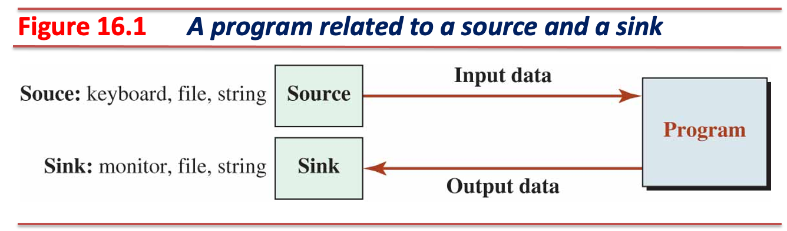
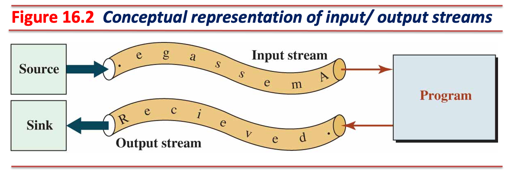
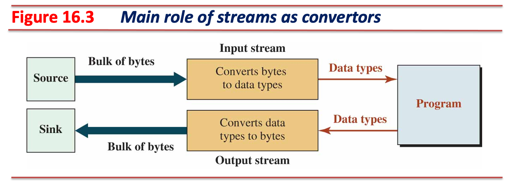
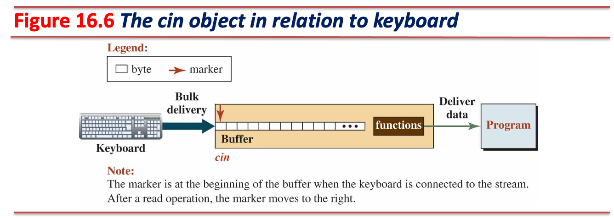

# 입출력 스트림 (Input / Output Streams)



* 프로그램 내 스트림 클래스를 사용해 인스턴스화하여 사용하는 객체
* 프로그램이 메모리로부터 데이터를 읽어오거나 메모리로 데이터를 내보낼 때 사용하는 인터페이스
  * 외부 소스 (external source)
    * 데이터를 생성 또는 제공하는 역할
    * 외부 소스가 데이터를 메모리로 전달하면 프로그램은 입력 스트림을 사용해 이를 읽어옴
  * 외부 싱크 (external sink)
    * 데이터를 소비 또는 처리하는 역할
    * 프로그램이 출력 스트림을 사용해 데이터를 메모리로 전달하면 외부 싱크는 이를 읽어옴
* 소스와 싱크는 크게 세 가지로 구분
  * 임시 소스 또는 싱크 (temporary source or sink) - 키보드 입력과 모니터 (콘솔 화면)
  * 영구 소스 또는 싱크 (permanent source or sink) - 파일
  * 내부 소스 또는 싱크 (internal source or sink) - C++ 문자열

---

## 스트림



* 소스, 싱크는 프로그램에 직접 연결할 수 없음
* **중재자 (mediator)를 통해 데이터를 주고받아야 함**
* 입출력 스트림은 소스, 싱크와 프로그램 간 중재자 역할 수행
  * 입력 스트림 (input stream)은 소스와 프로그램 간 중재 역할
  * 출력 스트림 (output stream)은 싱크와 프로그램 간 중재 역할
* 입출력 스트림은 양방향으로 데이터를 주고받을 수 있음
  * e.g., 파일 스트림 (file stream)
* 소스, 싱크와 프로그램 간 데이터 전달은 **컴퓨터 메모리**를 통해 이루어짐
* **메모리에 저장되는 데이터는 이진 (binary) 형태**이므로 바이트 열 형태로 표현

---

## 데이터 표현 (Data Representation)



* 소스와 싱크는 **바이트 열 (a sequence of bytes)** 형태로 데이터를 표현
  * 데이터를 **의미 없이** 바이트 단위로 순차적으로 나열한 형태
  * e.g., `0x41810000`
* 프로그램은 형 (type)을 사용해 데이터를 표현
  * 프로그램 내에서 데이터를 **추상적**으로 표현하기 위한 표현 방법
  * 바이트 열로 표현된 데이터를 **의미 있는** 형태로 표현
  * e.g., `0x41810000`를 프로그램에서 IEEE 754 단정도 부동 소수점으로 표현하면 `16.125`
* **스트림은 소스, 싱크와 프로그램 간 데이터 흐름을 관리하는 중간 계층**
  * 입력 스트림은 소스가 생성한 데이터를 읽어 프로그램이 이해할 수 있는 형태로 변환 후 읽어옴
  * 출력 스트림은 프로그램이 데이터를 내보낼 때 싱크가 이해할 수 있는 형태로 변환 후 내보냄

---

### 스트림 버퍼 (Buffer of Streams)


* 메모리 상에서 관리되는 스트림이 사용하는 중간 저장소
  * 소스는 입력 스트림 버퍼로 데이터를 보내고, 싱크는 출력 스트림 버퍼로부터 데이터를 읽어옴
* 스트림은 메모리로부터 데이터를 읽어오거나 메모리로 데이터를 내보낼 때 **항상 이진 데이터를 사용**
  * 입력 스트림은 스트림 버퍼로부터 이진 데이터를 읽어와 프로그램에서 요구하는 형으로 **변환**
  * 출력 스트림은 프로그램이 내보낼 데이터를 이진 데이터로 **변환** 후 스트림 버퍼로 내보냄
* 스트림은 텍스트 또는 이진 데이터를 처리할 수 있음
* 소스와 싱크는 스트림과 **동일한 데이터 형식을 처리하도록 설정**해야 함
  * 중간 계층인 스트림이 **데이터를 올바르게 변환**하여 가져오거나 내보내도록 하기 위함
  * e.g., 소스가 텍스트 데이터를 사용하면 입력 스트림도 텍스트 데이터를 처리하도록 설정
* 스트림은 텍스트 데이터 처리가 기본값이며, 필요에 따라 이진 데이터를 처리하도록 설정 가능
  * 스트림 클래스로부터 인스턴스화할 때 설정 가능

---

## 스트림 클래스 (Stream Classes)


### `std::ios`

* 가상 기반 클래스이며, 모든 입출력 클래스가 상속받는 데이터 멤버와 멤버 함수가 구현되어 있음
* 추상 클래스이므로, 인스턴스화 불가

---

### `std::istream`, `std::ostream`, `std::iostream`

* 콘솔 스트림 (console streams) 객체를 위한 클래스
* 키보드로부터 입력받거나 데이터를 모니터 (콘솔 화면)으로 내보내는 데 필요한 스트림
  * 임시 소스와 임시 싱크를 사용

### `std::ifstream`, `std::ofstream`, `std::fstream`

* 파일 스트림 (file streams) 객체를 위한 클래스
* 파일로부터 입력받거나 데이터를 파일로 내보내는 데 필요한 스트림
  * 영구 소스와 영구 싱크를 사용

### `std::istringstream`, `std::ostringstream`, `std::stringstream`

* 문자열 스트림 (string streams) 객체를 위한 클래스
* 문자열로부터 입력받거나 데이터를 문자열로 내보내는 데 필요한 스트림
  * 내부 소스와 내부 싱크를 사용

---

## 스트림 사용을 위한 다섯 단계

1. 스트림 객체를 생성한다.
2. 객체 생성 시 연결하고자 하는 대상 (소스, 싱크)와 연결한다.
3. 스트림을 통해 데이터를 읽어오거나 (입력 스트림) 데이터를 내보낸다 (출력 스트림).
4. 더 이상 스트림을 사용하지 않는다면 연결했던 대상 (소스, 싱크)와 연결을 해제한다.
5. 스트림 객체를 소멸한다.

## 스트림 객체의 특성 (Characteristics of Stream Objects)

* **복사 생성자와 대입 연산자가 없음**
  * 스트림 객체는 내부 상태를 갖고 있음 (e.g., 스트림 버퍼, 버퍼를 가리키는 포인터, etc.)
  * 스트림 객체를 복사 또는 대입할 경우 **데이터 불일치** 또는 **리소스 충돌**이 발생할 수 있음
  * 스트림 객체는 함수로의 값 전달 또는 함수의 반환 값으로 사용할 수 없음
* 스트림 객체는 사용할 때마다 내부 상태가 변하므로 `const` 한정자를 같이 사용할 수 없음
  * 데이터를 입력받거나 출력할 때 스트림 버퍼와 이를 가리키는 포인터가 갱신됨
  * 만약 입출력 과정 중에 오류가 발생할 경우 이를 스트림 내부 상태에 기록함

---

## 스트림 상태 (Stream State)


* 스트림 객체들은 데이터를 읽어오거나 내보내는 과정 중에 실패할 수 있음
* 이러한 실패를 관리할 수 있도록 스트림 객체 내에 상태들을 보관
  * `std::ios` 클래스 내에 상태 관련 데이터 멤버 및 멤버 함수가 구현되어 있음
  * `std::ios` 클래스를 상속한 스트림 클래스는 상태 관련 데이터 멤버와 멤버 함수 사용 가능

---

### 스트림 상태 데이터 멤버

| Constants          | Input Stream                  | Output Stream              |
|--------------------|-------------------------------|----------------------------|
| `std::ios::eofbit` | No more characters to extract.| Not applicable.            |
| `std::ios::failbit`| An invalid read operation.    | An invalid write operation.|
| `std::ios::badbit` | Stream integrity is lost.     | Stream integrity is lost.  |
| `std::ios::goodbit`| Everything is fine.           | Everything is fine.        |

```cpp
namespace std {
namespace ios_base {
typedef /*implementation defined*/ iostate;

static constexpr iostate goodbit = 0;
static constexpr iostate badbit  = /* implementation defined */
static constexpr iostate failbit = /* implementation defined */
static constexpr iostate eofbit  = /* implementation defined */

// A data member 'state' can be used with bit masking as following:
iostate state = eofbit | failbit;
}  // ios_base
}  // std
```

---

* `std::ios::eofbit`
  * 입력 스트림에만 적용되는 생태 비트
  * 입력 스트림이 소스의 끝 (EOF, end of file)에 도달했을 때 설정됨
  * EOF에서 읽기 작업은 **실패**하므로 `eofbit`와 `failbit` 둘 다 설정됨
    * `failbit`가 설정됐다면 **`eofbit`가 설정됐는지, 다른 이유 때문인지 확인 필요**
* `std::ios::failbit`
  * 작업 수행 시 내부 논리적인 오류가 발생할 경우 설정됨
    * e.g., EOF에서 데이터 읽기, 문자 데이터를 다른 형태 (e.g., 실수형)로 읽기
  * 스트림 무결성 (integrity)에는 문제가 없는 상태이므로, **스트림 복구 후 재사용 가능**
    * 만약 발생한 오류로 인해 스트림 무결성이 깨졌다면 `badbit`가 동시에 설정될 수 있음
    * `badbit`가 설정된 스트림은 재사용 불가
* `std::ios::badbit`
  * 스트림의 무결성이 깨진 경우 설정됨
    * 메모리 부족으로 인하여 스트림 작업이 중단되는 경우
    * 스트림 내부에서 변환 작업 중 오류 발생으로 인하여 실패하는 경우
    * 스트림 사용 도중 예외가 발생한 경우 (e.g., 디스크 오류로 인한 스트림 작업 실패)
  * **스트림은 더 이상 사용할 수 없는 상태**이며, 스트림을 새로 생성해야 함
* `std::ios::goodbit`
  * `eofbit`, `failbit`, `badbit`가 모두 설정되어 있지 않다면 설정됨
  * 스트림을 사용할 수 있는 정상 상태

---

### 스트림 상태 멤버 함수

| Functions        | Return values                                                |
|------------------|--------------------------------------------------------------|
| `bool eof()`     | `true` if `eofbit` is set; `false` otherwise                 |
| `bool fail()`    | `true` if `failbit` or `badbit` is set; `false` otherwise    |
| `bool bad()`     | `true` if `badbit` is set; `false` otherwise                 |
| `bool good()`    | `true` if the stream is in good condition; `false` otherwise |
| `void clear()`   | It cleans all three bits (sets to zero)                      |
| `bool operator()`| `true` if `goodbit` is set; `false` otherwise                |

---

* Testing the `std::cin` state

```cpp
#include <iostream>
#include <string>

void verbose() {
  static int i = 1;
  std::cout << "verbose() has been called " << i++ << std::endl;
  std::cout << "  eofbit: " << std::cin.eof() << std::endl;
  std::cout << "  failbit: " << std::cin.fail() << std::endl;
  std::cout << "  badbit: " << std::cin.bad() << std::endl;
  std::cout << "  goodbit: " << std::cin.good() << std::endl << std::endl;
}

int main() {
  // We're using the pipe redirection and a simple text file as an input:
  // $ cat in
  // 123
  // abc
  // $ ./run <in

  // If the stream is not good, std::cin instance evaluates `nullptr`
  for (int i; std::cin >> i; verbose())
    std::cout << "Read integer: " << i << std::endl;

  // Recover the stream (integer data expected, but it wat not - logic error)
  if (!std::cin) {
    verbose();
    std::cin.clear();
  }

  for (std::string str; std::cin >> str; verbose())
    std::cout << "Read string: " << str << std::endl;

  verbose();  // If you want to use std::cin more, you need to recover it again
  return 0;
}
```

---

## 콘솔 스트림 (Console Streams)

* `std::istream`, `std::ostream`, `std::iostream` 클래스로부터 실체화된 객체
* `<iostream>` 헤더를 포함하면 콘솔 스트림 객체를 사용할 수 있음
  * 콘솔 스트림 객체는 프로그램 실행 시 전역 객체로 자동 생성됨

  ```cpp
  // iostream.h
  #include <ios>
  #include <streambuf>
  #include <istream>
  #include <ostream>
  
  namespace std {
    extern istream cin;
    extern ostream cout;
    extern ostream cerr;  // unbuffered
    extern ostream clog;  // buffered
  
    extern wistream wcin;
    extern wostream wcout;
    extern wostream wcerr;
    extern wostream wclog;
  }
  ```

---

### `std::cin`



* `std::istream`형 객체이며, 프로그램 실행 시 콘솔 입력 (키보드)과 연결됨
* 프로그램 종료 시 런타임 시스템에 의해 키보드와의 연결이 자동으로 끊어진 뒤 소멸됨
* **시스템이 객체 생성, 소스와의 연결, 소스와의 연결 해제, 객체 소멸을 담당함**
  * 사용자는 생성된 스트림 객체를 사용해 데이터를 처리하기만 하면 됨

---

### `std::cout`, `std::cerr`, `std::clog`


* `std::ostream`형 객체이며, 프로그램 실행 시 콘솔 출력 (모니터)과 연결됨
* 프로그램 종료 시 런타임 시스템에 의해 모니터와의 연결이 자동으로 끊어진 뒤 소멸됨
* **시스템이 객체 생성, 싱크와의 연결, 싱크와의 연결 해제, 객체 소멸을 담당함**
  * 사용자는 생성된 스트림 객체를 사용해 데이터를 처리하기만 하면 됨

---

### 콘솔 스트림 객체의 특징

* `std::cout` 객체와 `std::cin` 객체는 **동기화되어 있음**
  * `std::cout` 출력 결과는 바로 싱크로 전달되는 것이 아닌 스트림 버퍼에 **임시 보관**
  * `std::cin` 입력 시 `std::cout` 버퍼의 모든 데이터를 플러시 (flush)하도록 동작
    * 플러시가 되어야 스트림 버퍼에 있는 데이터가 싱크로 전달되는 구조
  * 동기화되지 않을 경우 아래와 같은 문제가 발생할 수 있음:

  ```cpp
  std::cout << "Enter a number: "; // not displayed on the screen
  std::cin >> number;              // waiting for user input without any guides
  ```

  * 입출력이 빈번한 상황에서 동기화된 콘솔 스트림 객체를 사용하는 것은 **성능 저하**의 원인이 됨
    * 출력 스트림 버퍼를 플러시할 때마다 **비용** 발생
  * `std::cin` 객체를 다음과 같이 설정하면 `std::cout` 객체과의 동기화를 끊을 수 있음:
  
  ```cpp
  std::cin.tie(nullptr);
  ```

* 출력 콘솔 스트림 객체의 출력 재정의
  * `std::cout` 객체는 운영 체제의 표준 출력 스트림 (`stdout`)에 연결됨
    * 출력 재정의 가능
  * `std::cerr`, `std::clog` 객체는 운영 체제의 표준 오류 스트림 (`stderr`)에 연결됨
    * 출력 재정의 불가
    * 오류 메세지 또는 로깅 메세지가 표준 출력과 혼재될 가능성을 배제하기 위함

---

* `std::cerr`과 `std::clog`의 차이
  * `std::cerr` 객체는 프로그램에서 발생한 오류 메세지를 즉시 출력하는 용도로 사용
    * 스트림 버퍼에 데이터를 보관하지 않고 즉시 싱크로 내보냄
  * `std::clog` 객체는 프로그램의 디버깅 또는 로깅 메세지를 출력하는 용도로 사용
    * 스트림 버퍼에 데이터를 보관한 뒤, 버퍼가 플래시 조건을 만족하면 싱크로 내보냄

* 출력 버퍼 플래시 조건
  * 명시적으로 플러시를 사용한 경우

  ```cpp
  std::clog << "A log message";
  std::clog.flush(); // flust the buffer explicitly
  ```

  * 스트림이 닫힐 때

  ```cpp
  #include <iostream>

  int main() {
    std::clog << "A log message"; // buffered
    return 0;  // the std::clog will be destroyed and the buffer will flush 
  }
  ```

  * 출력 스트림 버퍼가 가득 찬 경우

---

### 콘솔 스트림 멤버 함수

* Testing the `get` and `put` functions

```cpp
#include <cctype>  // std::toupper
#include <iostream>

int main() {
  int x;
  std::cout << "Enter five characters (no spaces): ";
  for (int i = 0; i < 5; ++i) {
    x = std::cin.get();  // Using int get(void)
    std::cout << x << " ";
  }

  std::cin.ignore();  // consume a '\n' from the input stream buffer

  std::cout << "\nEnter a multi-line text and EOF as the last line."
            << std::endl;
  char prev = '\n';
  for (char c; std::cin.get(c); prev = c) {  // Using istream& get(char& c)
    // Using ostream& put(char& c);
    std::cout.put(prev == ' ' || prev == '\n' ? std::toupper(c) : c);
  }
  return 0;
}
```

---

* Testing `getline`

```cpp
#include <iostream>
#include <string>

int main() {
  char buffer1[20];        // For std::cin.get(char*, int)
  char buffer2[20];        // For std::cin.getline(char*, int)
  std::string str_buffer;  // For std::getline

  // 1. Using std::cin.get(char* s, int n)
  std::cout << "Enter a string (max 19 characters, stops at newline but "
               "doesn't remove it): ";
  std::cin.get(buffer1, 20);  // Reads up to 19 characters, stops at '\n' but
                              // leaves it in the buffer
  std::cout << "You entered (std::cin.get): " << buffer1 << "\n";

  std::cin.ignore();  // Optional: Clear the newline left in the buffer to avoid
                      // issues in further input

  // 2. Using std::cin.getline(char* s, int n, char delim = '\n')
  std::cout << "Enter another string (max 19 characters, stops at newline "
               "(default delimiter) and removes it): ";
  std::cin.getline(buffer2, 20);  // Reads up to 19 characters, stops at
                                  // delimiter, and removes it
  std::cout << "You entered (std::cin.getline): " << buffer2 << "\n";

  // 3. Using std::getline with std::string (non-member function but similar)
  std::cout << "Enter another string (no size limit): ";
  std::getline(std::cin, str_buffer);  // Reads the entire line, removes '\n',
                                       // and adjusts size dynamically
  std::cout << "You entered (std::getline): " << str_buffer << "\n";
  return 0;
}
```

---

### 삽입, 추출 연산자

```cpp
std::istream& operator>>(type& x); 
std::ostream& operator<<(type& x); 
```

* 기본 자료형 (fundamental data types)에 대해 삽입 또는 추출 가능
  * `type`에 사용될 수 있는 형들:
    * `bool`, `char`, `short` `int`, `long`, `float`, `double`, `void*`
    * `long double` (비표준이지만 사용 가능)
    * 정수형은 `signed`, `unsigned` 모두 사용 가능

* `std::cin >> x` 표현은 `std::cin.operator>>(x)` 표현으로 평가
  * 입력 스트림 버퍼로부터 `x` 형을 계산하기 위해 필요한 바이트 수만큼 읽어옴
  * 읽어온 데이터를 `x`형으로 변환
    * 변환 실패 시 입력 스트림 객체의 `failbit` 설정
    * e.g., 읽어온 데이터는 숫자 (`0x41 ~ 0x50`)인데 변환 대상이 문자열인 경우
  * 변환된 데이터를 `x`로 전달

* `std::cout << y` 표현은 `std::cout.operator<<(y)` 표현으로 평가
  * `y`를 바이트 열로 변환
    * e.g., 정수형 데이터 `123`은 `1`, `2`, `3`으로 변환
  * 변환된 바이트 열을 출력 스트림 버퍼로 내보냄

---

### 추출 연산자를 사용해 문자열 입력 시 주의 사항

* C-문자열 입력 시 `char`형 배열 공간이 충분해야 함
  * `char`형 배열의 크기보다 C-문자열 길이가 더 길 경우 런타임 오류 발생

  ```cpp
  char buf[100];
  std::cin >> bur;  // C-String, the buffer size must be enough
  ```

* C++ 문자열 입력 시 `std::string`형 객체가 내부적으로 크기를 자동 관리
  * C-문자열보다 안전하게 데이터를 읽어오지만, C-문자열을 읽을 때보다 비용 발생
  * C++ 문자열을 줄 단위로 읽어와야 할 경우, 비멤버 함수 `getline`을 사용할 것

  ```cpp
  std::string str;
  std::cin >> str;  // str can read a word from the buffer
  std::getline(std::cin, str); // str can read a sentence from the buffer
  std::getline(std::cin, str, ':');  // str can read data until meet the ':'
  ```

---

## 파일 스트림 (File Streams)


* 콘솔 스트림의 소스는 키보드, 싱크는 모니터였다면, 파일 스트림의 소스와 싱크는 파일
* 콘솔 스트림에서의 데이터 멤버와 멤버 함수를 모두 사용할 수 있음
  * `std::ifstream` 클래스는 `std::istream` 클래스로부터 상속
  * `std::ofstream` 클래스는 `std::ostream` 클래스로부터 상속
  * `std::fstream` 클래스는 `std::iostream` 클래스로부터 상속
* 파일 스트림 클래스는 스트림 객체 생성 및 소스, 싱크와 연결하는 멤버 함수가 추가됨
  * 콘솔 스트림 객체는 시스템이 자동으로 스트림 객체 생성, 연결, 연결 해제, 소멸 수행
  * 파일 스트림 객체는 사용자가 직접 스트림 객체 생성, 연결, 연결 해제, 소멸을 수행해야 함

---

### 파일 스트림 사용 방법

* `<fstream>` 헤더 파일을 포함하면 파일 스트림 객체를 사용할 수 있음

```cpp
#include <fstream>

std::ifstream input_stream;
std::ofstream output_stream; 
std::fstream input_output_stream;
```

* 생성된 객체는 **소스, 싱크와 연결된 상태가 아니므로** 연결 작업을 수행해야 사용할 수 있음

#### 파일 스트림 객체 생성 후 소스, 싱크 연결

* `open` 멤버 함수 사용 시 연결할 소스와 싱크를 전달인자로 전달
* 스트림 객체는 하나의 소스 또는 싱크와 연결할 수 있음

```cpp
input_stream.open("input.txt");
output_stream.open("output.txt");
input_output_stream.open("input_output.txt");
```

---

#### 파일 스트림 객체 연결 상태 확인

* `is_open()` 멤버 함수를 사용해 지정한 소스, 싱크와 연결되었는지 확인 가능
  * 반환 값은 `bool` 형
  * 연결에 성공한 경우 `true` 반환
  * 연결에 실패한 경우  `false` 반환
    * e.g., `open()` 멤버 함수의 매개변수로 넘겨준 파일이 존재하지 않음, 권한이 없음, etc.

```cpp
input_stream.is_open();
output_stream.is_open();
input_output_stream.is_open();
```

#### 파일 스트림 객체 연결 해제 후 소멸

* 더 이상 스트림 객체를 사용하지 않는다면 `close` 멤버 함수를 통해 연결을 해제할 수 있음
* 전달인자는 필요하지 않음

```cpp
input_stream.close();
output_stream.close();
input_output_stream.close();
```

* 소스, 싱크와 연결 해제된 스트림 객체는 일반 변수와 마찬가지로 범위를 벗어나면 소멸됨
  * 만약 동적 할당으로 스트림 객체를 생성했다면 명시적으로 제거해야 함

---

* Testing the five steps of file stream operations

```cpp
#include <cassert>
#include <fstream>
#include <iostream>

int main() {
  // 1. Instantiation of an ofstream object (not opened yet)
  std::ofstream ofstr;
  // 2. Creation of a file and connecting it to the ofstream object
  ofstr.open("file_stream_example.txt");
  if (!ofstr.is_open()) {  // opt. Testing opening success
    std::cerr << "file_stream_example.txt cannot be opened!";
    assert(false);
  }
  // 3. Writing to the file using overloaded insertion operator
  for (int i = 1; i <= 10; ++i) ofstr << i * 10 << " ";
  // 4. Disconnection of the file_stream_example.txt from the ofstream object
  ofstr.close();

  // 1. Instantiation of an ifstream object (not opened yet)
  std::ifstream ifstr;
  // 2. Connection of the existing file to the ifstream object
  ifstr.open("file_stream_example.txt");
  if (!ifstr.is_open()) {  // opt. Testing opening success
    std::cerr << "file_stream_example.txt cannot be opened!";
    assert(false);
  }
  // 3. Reading from the ifstream object and writing to the cout object
  for (int i = 1; i <= 10; ++i) {
    int data;
    ifstr >> data;
    std::cout << data << " ";
  }
  // 4. Disconnection of the file_stream_example.txt from the ifstream object
  ifstr.close();
  // 5. The ofstream and ifstream objects are destroyed after return statement
  return 0;
}
```

---

### 파일 열기 모드 (Opening Modes)

* `std::ios` 클래스에 정의되어 있음
* 다른 스트림 객체들도 사용 가능하나, 일반적으로 파일 스트림 객체에서 사용
  * 콘솔 객체와 문자열 객체는 시스템에 의해 암묵적으로 연결됨

| Constant          | Explanation                                                    |
|-------------------|----------------------------------------------------------------|
| `std::ios::app`   | Seek to the end of stream **before each write** (append).      |
| `std::ios::binary`| Open in binary mode (**default is text**).                     |
| `std::ios::in`    | Open for reading (**default mode of `std::ifstream` object**). |
| `std::ios::out`   | Open for writing (**default mode of `std::ofstream` object**). |
| `std::ios::trunc` | **Discard the contents** of the stream when opening (truncate).|
| `std::ios::ate`   | Seek to the end of stream **immediately after open** (at end). |

---


* `std::ifstream` 객체의 기본 열기 모드는 `std::ios::in`
  * 객체는 파일을 읽기 전용 (`std::ios::in`)으로 사용
  * 파일이 존재하지 않으면 파일 열기에 실패함
* `std::ofstream` 객체의 기본 열기 모드는 `std::ios::out | std::ios::trunc`
  * 객체는 파일을 쓰기 전용 (`std::ios::out`)으로 사용
  * 파일이 존재하지 않으면 파일을 새로 생성
  * **파일이 존재한다면 파일의 내용 초기화** (`std::ios::trunc`)
* `std::fstream` 객체의 기본 열기 모드는 `std::ios::in | std::ios::out`
  * 객체는 파일을 읽거나 쓸 수 있음 (`std::ios::in | std::ios::out`)
  * 파일이 존재하지 않으면 파일 열기에 실패함
  * **파일이 존재한다면 파일의 내용을 유지함**
* `std::ios::ate`는 필요에 따라 읽기 또는 쓰기 위치를 조정할 수 있음
* `std::ios::app`은 쓰기 작업만 가능하며, 쓰기 작업마다 연결된 파일의 끝에 데이터를 추가함

---

* Appending to a file

```cpp
#include <cassert>
#include <fstream>
#include <iostream>

int main() {
  std::ofstream ofstr;
  ofstr.open("file_stream_example.txt", std::ios::out | std::ios::app);
  if (!ofstr.is_open()) {
    std::cerr << "file_ex2.txt cannot be opened!";
    assert(false);
  }
  ofstr << "\nHello world!";
  ofstr.close();
  return 0;
}
```

---

### 파일 스트림 객체의 기타 멤버 함수

* 다음 함수들은 콘솔 클래스에 선언되어 있으나 파일 스트림 객체에서 유용하게 사용할 수 있음

| Function                 | Explanation                                                  |
|------------------------------|------------------------------------------------------------------|
| `int gcount() const`         | Counts characters extracted in the last input                  |
| `std::istream& unget()`           | Puts back the last character extracted from the stream         |
| `std::istream& putback(char c)`   | Same as `unget` but requires a specific character to be put back |
| `int peek()`                 | Looks at the next character without extracting it              |
| `std::istream& ignore(int n = 1, int d = eof)` | Ignores `n` characters or up to a specified delimiter `d`      |

---

* Using the `unget` function

```cpp
#include <cassert>
#include <fstream>
#include <iostream>

int main() {
  const std::string filename = "data.txt";
  {
    std::ofstream file(filename);  // std::ios::out | std::ios::trunc
    file << "We have 7, 12, 23, and 442 in this file.";
    file.close();
  }  // std::ofstream will be removed automatically

  std::ifstream ifstr("data.txt", std::ios::in);
  if (!ifstr.is_open()) {
    std::cerr << "The file data.txt cannot be opened for reading!";
    assert(false);
  }
  ifstr.ignore(3);  // Skip 'W', 'e', and ' '
  std::cout << "Characters extracted so far: " << ifstr.gcount() << std::endl;
  for (char ch; ifstr.get(ch);) {
    if (std::isdigit(ch)) {
      ifstr.unget();
      int n;
      ifstr >> n;
      std::cout << n << " ";
    }
  }
  ifstr.close();
  return 0;
}
```

---

### 순차 접근과 임의 접근 (Sequential vs. Random Access)

* 파일은 연속적인 바이트의 집합
* 파일 스트림 객체를 사용해 파일 읽기 작업을 수행하면 파일의 내용이 대량으로 스트림 버퍼로 복사됨
* 파일 스트림 객체를 사용해 파일 쓰기 작업을 수행하면 스트림 버퍼에 임시 보관됨
* **스트림 버퍼에 있는 내용을 대상으로 순차적으로 처리하거나 임의 접근하여 처리할 수 있음**
  * 각 파일 스트림 객체는 하나의 조정자가 존재함
  * `std::ifstream` 형 객체의 조정자는 파일에서 읽어올 위치를 가리킴
  * `std::ofstream` 형 객체의 조정자는 파일로 내보낼 위치를 가리킴
  * `std::fstream` 형 객체의 조정자는 파일에서 읽어올 위치와 파일로 내보낼 위치를 가리킴

---

### 임의 접근을 위한 멤버 함수와 위치 조정 변수


| Input functions                   | Output functions                 |
|---------------------------------------|---------------------------------------|
| `int tellg()`                         | `int tellp()`                         |
| `istream& seekg(int pos)`             | `ostream& seekp(int pos)`             |
| `istream& seekg(int off, std::ios::seekdir dir)` | `ostream& seekp(int off, std::ios::seekdir dir)` |

* 접두사 `g`와 `p`는 각각 입력의 `get`, 출력의 `put`을 의미
* `std::ios_base::seekdir`
  * `seekg()` 함수는 위치 조정 변수를 사용해 스트림 버퍼 내 작업 위치를 조정할 수 있음
  * `std::ios::beg`: 스트림 버퍼의 시작을 가리킴
  * `std::ios::end`: 스트림 버퍼의 마지막을 가리킴 (실제 데이터 바로 뒤를 가리킴)
  * `std::ios::cur`: 스트림 버퍼 내 조정자의 현재 위치

---

* Using direction values

```cpp
#include <fstream>
#include <iostream>

int main() {
  const std::string filename = "seekg_example.txt";

  std::ofstream out_file(filename);
  out_file << "abcdefghij";  // 10 characters
  out_file.close();

  std::ifstream in_file(filename);

  // Move to 3rd character (2nd index) using ios::beg
  in_file.seekg(2, std::ios::beg);
  std::cout << "Character at position 2 (from start): "
            << static_cast<char>(in_file.peek()) << "\n";

  // Move 2 characters forward from the current position using ios::cur
  in_file.seekg(2, std::ios::cur);
  std::cout << "Character 2 positions ahead: "
            << static_cast<char>(in_file.peek()) << "\n";

  // Move to 2 characters before the end using ios::end
  in_file.seekg(-2, std::ios::end);
  std::cout << "Second last character: " << static_cast<char>(in_file.peek())
            << "\n";
  in_file.close();
  return 0;
}
```

---

* Printing location and value of characters

```cpp
#include <fstream>
#include <iostream>

int main() {
  const std::string filename = "tellg_example.txt";

  std::ofstream out_file(filename);
  out_file << "Hello";
  out_file.close();

  std::ifstream in_file(filename, std::ios::in);
  // Getting characters and their locations
  while (in_file) {
    std::cout << in_file.tellg() << '(' << static_cast<char>(in_file.get())
              << ')' << std::endl;
    std::cout << "  failbit: " << in_file.fail() << std::endl;
  }
  in_file.close();
  return 0;
}
```

---

* Changing a space to a new-line

```cpp
#include <fstream>
#include <iostream>

int main() {
  const std::string filename = "sentence.txt";

  std::ofstream out_file(filename);
  out_file << "There are wonderful things to do in life.";
  out_file.close();

  std::fstream fstr(filename, std::ios::in | std::ios::out);
  for (char ch; fstr.get(ch);) {
    if (std::isspace(ch)) {
      ch = '\n';
      fstr.seekp(-1, std::ios::cur);
      fstr.put(ch);
    }
    std::cout << ch;
  }
  fstr.close();
  return 0;
}
```

---

* Finding the size of a file
  * `std::ios::end`는 실제 데이터의 다음 공간을 가리키고 있음
  * `std::ios::app`은 **쓰기 전용**이므로 읽기 함수 (`tellg()`, `seekg()`) 사용 불가

```cpp
#include <fstream>
#include <iostream>

int main() {
  const std::string filename = "sentence.txt";
  std::fstream fstr(filename, std::ios::in | std::ios::out | std::ios::ate);
  std::cout << "File size: " << fstr.tellg();
  fstr.close();
  return 0;
}
```

```shell
There       // 5 + 1('\n')
are         // 3 + 1('\n')
wonderful   // 9 + 1('\n')
things      // 6 + 1('\n')
to          // 2 + 1('\n')
do          // 2 + 1('\n')
in          // 2 + 1('\n')
life.       // 5           => 41
```
