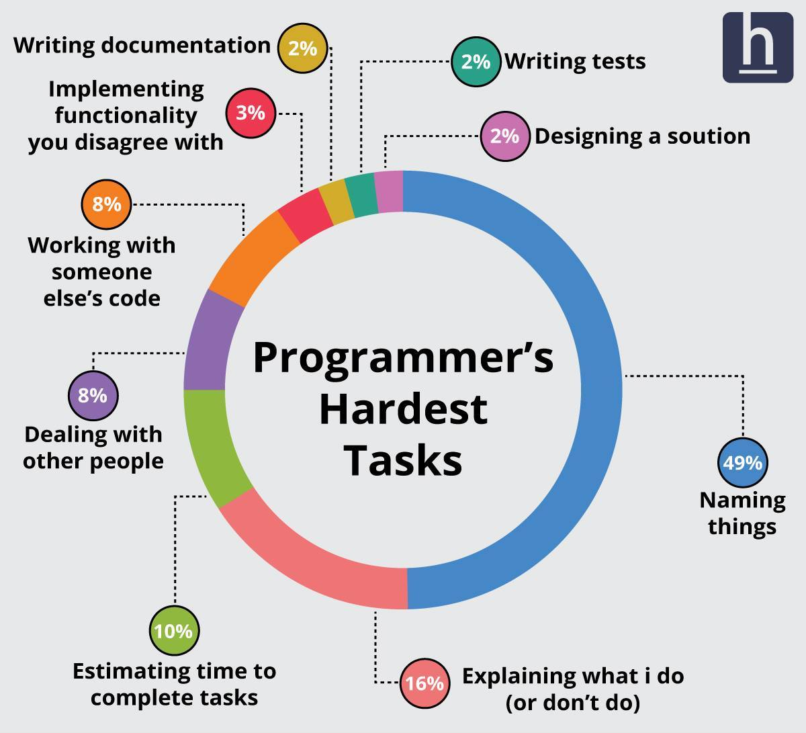
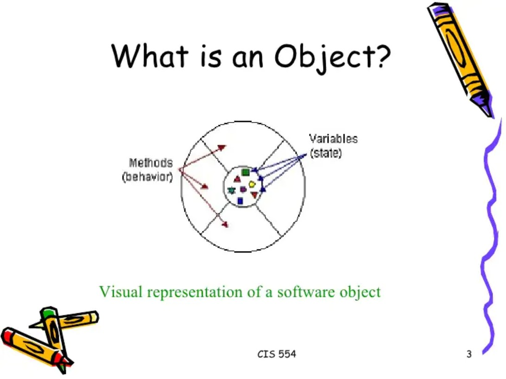
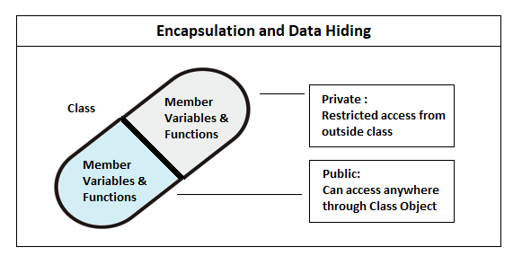
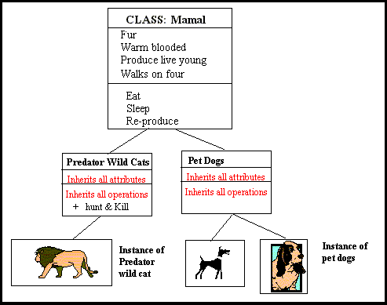

# C++ Tutorial
## 04 - 객체지향프로그래밍
###### [뒤로가기](/tutorial/#index)
---

### 등장 배경
* 절차지향프로그래밍 방법은 데이터 흐름(flow)에 기반한 방법
    * Top-Down
* 소프트웨어의 규모가 커짐에 따라 절차지향프로그래밍 방법 기반의 소프트웨어 설계 및 구현은 효율적이지 못한 방법이 됨
    * 함수(procedure) 단위로 소프트웨어를 구조화하는 구조적프로그래밍 방법이 등장하게 됨
* 함수는 데이터 처리부를 하나의 단위로써 구조화할 수 있으나, 데이터는 구조화할 수 없음
    * 절차지향프로그래밍과 구조적프로그래밍은 둘 다 전역 이름 영역(`namespace`)를 사용함에 따라 이름(변수명, 함수명 등) 포화상태에 빠짐

        

    * 데이터의 형태에 따라 다른 동작을 수행하는 함수들이 많아지면서 전달인자가 무엇인가에 따라, 또는 전달인자가 적절한 형태인가를 검사하는 코드가 늘어나게 됨
        * 만약 더하는 기능을 함수로 따로 분리했다고 가정하면, 전달인자의 형태에 따라 적절한 함수를 호출해야 함

            `int sum_int(int a, int b); double sum_double(double a, double b); ...`
* 소프트웨어의 규모가 커짐에 따라 데이터 처리를 구조화하는 것 뿐만 아니라, <b>데이터 구조화</b>에 대한 필요성도 높아짐

### 객체지향프로그래밍(Object-Oriented Programming)
* 큰 문제를 작은 문제(함수)로 쪼개어 주어진 문제를 해결하는 Top-Down 방식이 아닌, 작은 문제를 해결할 수 있는 <b>객체</b>를 만들고 해당 객체들을 조합해 큰 문제를 해결하는 Bottom-Up 방식
    * 객체 설계 시 객체 간 독립성이 높다면(loose coupling), 코드 수정 시 상대적으로 작은 범위의 코드만을 수정하면 되며, 재사용에 용이함
    * 객체 설계 시 객체 간 독립성이 낮다면(strong coupling), 코드 수정 시 상대적으로 큰 범위의 코드를 수정해야 함과 동시에 재사용에 제약이 많음
* <b>높은 독립성을 갖는 객체를 설계</b>(작은 문제)하고, <b>객체들 간 유기적인 상호작용 기반의 프로그램 동작 논리를 구성</b>(큰 문제)하는 방법으로 개발 기간 및 유지관리 비용을 비약적으로 절약할 수 있게 됨

#### 객체(<i>object</i>)
* 프로그램으로 구현할 실세계에 존재하는 특정 대상

    

#### 추상화(<i>abstraction</i>)
* 실세계에 존재하는 특정 대상을 관찰해 이를 잘 표현할 수 있는 <b>공통되면서 핵심적인 특징들을 도출</b>하는 과정
    * 여기서 말하는 핵심적인 특징이란, 실세계에 존재하는 대상을 프로그램화할 때 반드시 필요한 부분들을 의미
    * 추상화를 통해 도출한 특징들은 프로그램 동작 시 꼭 필요한 요소이며, 그 외 특징들은 프로그램에서 불필요한 요소들임
* 추상화를 통해 도출한 특징들은 크게 속성(attribute)과 행위(behavior)로 나눌 수 있음
    * Attribute는 <i>member variable</i>
    * Behavior는 <i>method</i>
* 특정 대상으로부터 추상화한 결과물(속성들과 행위들) 중에서 관련있는 것 끼리 묶어놓은 것을 캡슐화(<i>encapsulation</i>)라고 함
    * 예를 들어, 자동차를 추상화했다고 가정하면, 여러 속성들과 행위들을 도출할 수 있음
        * 속성에는 자동차의 속도, 주유량, 주행거리, ... 등이 있음
        * 행위에는 감속, 가속, 조향, ... 등이 있음
    * 이때, 가속 행위와 관련있는 속성들을 묶는 것을 캡슐화라고 할 수 있음 
* 캡슐화한 것들을 하나로 묶는(실세계에 존재하는 대상으로부터 추상화한 결과) 추상적인 주체를 클래스(`class`)라고 함
    * 여러 캡슐화한 것들은 결국 하나의 공통된 주제를 갖고 탄생한 것들이며, 이를 묶을 수 있는 큰 범주가 클래스임

#### 인스턴스(<i>instance</i>)
* 클래스로부터 <b>실체화(클래스에 명세된 내용을 기반으로 메모리에 할당된)</b>된 것
    * 클래스는 실세계에 존재하는 대상으로부터 추상화한 결과물이므로 추상적(눈에 보이지 않는 개념 수준)임
    * 객체는 클래스를 기반으로 실체화
    * 자동차라는 클래스가 있을 때, <b>Genesis G90, Volvo XC90</b> 등은 객체

#### 객체, 클래스, 인스턴스
* 객체(<i>object</i>)는 <b>프로그램으로 구현할 실세계에 존재하는 특정 대상</b>이고, 클래스(<i>class</i>)는 <b>객체를 프로그램으로 구현하기 위한 설계도</b>이며, 인스턴스(<i>instance</i>)는 <b>클래스를 기반으로 메모리에 할당된 실체</b>다. 

#### 캡슐화(<i>encapsulation</i>)
* 추상화를 통해 도출된 특징들 중에서 <b>서로 관련있는 속성과 행위</b>를 묶는 것
* 캡슐화에서 가장 중요한 것은 <b>외부에서 접근이 필요한 부분을 제외한 모든 부분들을 외부에서 접근하지 못 하도록 숨겨야 함</b>
    * Information hiding

        
    
    * 캡슐화 과정을 거치면 클래스 내부 구현의 응집도(<i>cohesion</i>)를 높여 다른 외부 클래스와의 결합도(<i>coupling</i>)를 낮출 수 있음
        * High cohension, loose coupling

* 객체지향 언어에서는 일반적으로 접근제한자(<i>access modifier</i>)를 제공하며, 종류는 아래와 같음:
    * `public`: 클래스 외부에서 제한 없이 접근 가능
    * `private`: 클래스 외부에서 접근 불가
    * `protected`: 상속한 하위 클래스에서만 접근 가능

#### 상속(<i>inheritance</i>)
* 객체지향의 핵심 기능 중 하나로, 특정 클래스의 모든 특징들을 물려 받는 것

    

    * `Predator_wild_cats` 클래스와 `Pet_dogs` 클래스는 `Mammal` 클래스로부터 상속 받았음
    * `Predator_wild_cats` 클래스와 `Pet_dogs` 클래스는 `Mammal` 클래스의 <i>child class</i>
    * `Mammal` 클래스는 `Predator_wild_cats` 클래스와 `Pet_dogs` 클래스의 <i>parent class</i>

* 상속 관계는 계층형(hierachical) 구조를 형성하며, 계층 구조의 아래 쪽으로 내려갈수록 구체화(specialize)되고 계층 구조의 위 쪽으로 올라갈수록 일반화(generalize)된다고 표현
* 클래스가 구체화될수록 인스턴스 고유의 특징들이 더 많이 포함되며, 일반화될수록 

[WIP]

####

###### [처음으로](#c-tutorial)
###### [뒤로가기](/tutorial/#index)
---
